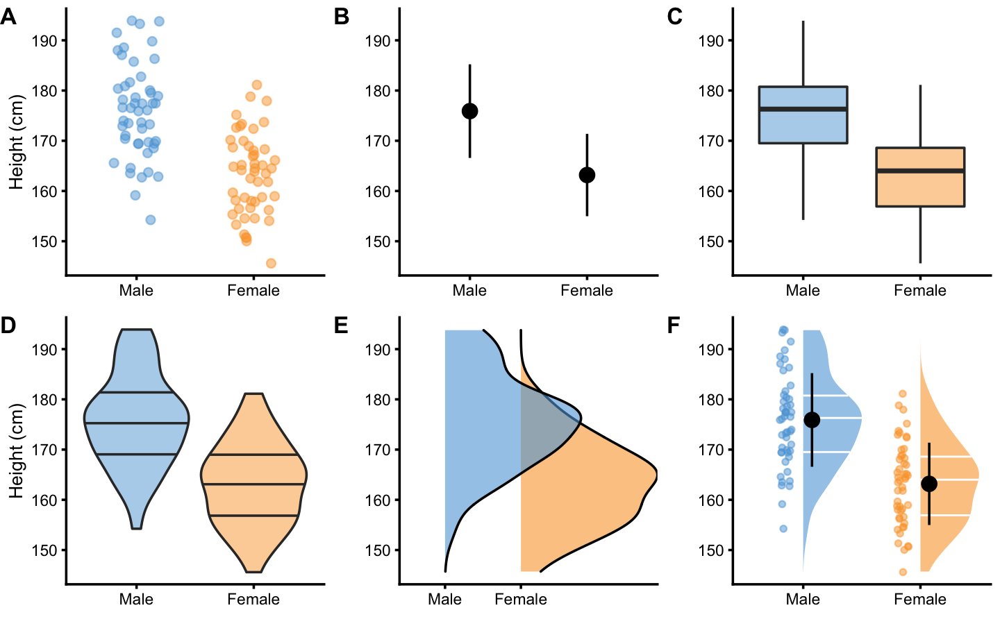
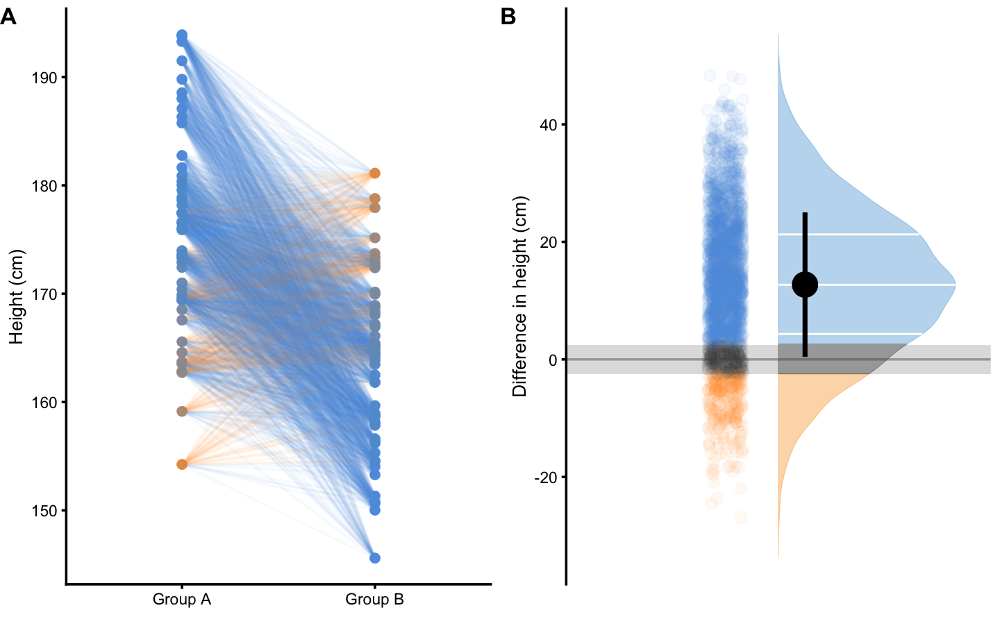
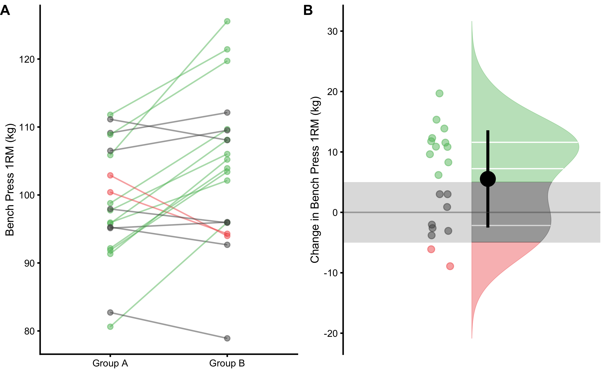

# Description

Description provides *quantitative summary* of the acquired data sample. These quantitative summaries are termed *descriptive statistics* or *descriptive estimators* and are usually broken down into two main categories: *measures of central tendency*, and *measures of spread / dispersion*. The stance taken in this book is that descriptive statistics involve *all* quantitative summaries (or *aggregates*) that are used to describe data without making predictive or causal claims. For example, *linear regression* between two variables can be used as a descriptive tool if the aim is to measure *linear association* between two variables, but it can be also used in predictive and causal tasks. *Effect sizes* such as `change`, `percent change` or `Cohen's d` represent descriptive statistics used to compare two or more groups, and are commonly used in causal tasks to estimate *average causal effect* of the treatment.     

To provide further explanation of the descriptive statistics, three common descriptive tasks in sport science are given as examples: (1) comparing two independent groups, (2) comparing two dependent groups, (3) measuring association between two variables.  

## Comparing two independent groups

Imagine we carried collection of body height measurements and we obtained N=100 observations using N=50 female and N=50 male subjects. Collected data is visualized in Figure \@ref(fig:common-techniques-to-visualize-independent-groups). 

(\#fig:common-techniques-to-visualize-independent-groups)(ref:common-techniques-to-visualize-independent-groups-caption)

(ref:common-techniques-to-visualize-independent-groups-caption) **Common techniques to visualize independent groups observations**. Before any analysis takes place, it is always a good practice to visualize the data first. Ideally, we want to visualize the complete data set, rather than only provide descriptive summaries, such as means. **A.** Simple scatter-plot with jitter to avoid overlap between the points. **B.** Mean and standard deviation as error bars. **C.** Box-plot. Horizontal line represents median, or 50th percentile, whereas boxes represent 25th and 75th percentile. Vertical lines usually represent min and max, although they can extend up to 1.5xIQR (inter-quartile range) with point outside of that interval plotted as *outliers*. **D.** Violin plots representing double-side density plots with 25th, 50th and 75th percentile lines. **E.** Density plots indicating sample distribution. **F.** Raincloud plot [@allenRaincloudPlotsMultiplatform2019; @allenRaincloudplotsTutorialsCodebase2018] which combine kernel density plots as *clouds* with accompanying 25th, 50th and 75th percentile lines, mean±SD error bars and jittered points as *rain*

Commonly provided descriptive statistics for each group can be found in the Table \@ref(tab:common-descriptive-statistics-or-estimators). `Mean`, `median` and `mode` are common measures of central tendencies. *Standard deviation* (`SD`), *median absolute difference* (`MAD`), *inter-quartile range* (`IQR`), `min`, `max` and `range` are common measures of spread or dispersion. *Percent coefficient of variation* (`% CV`) is also a measure of dispersion, but *standardized*[^standardization_explanation] which allows comparison of variables that are on different scales. *Skewness* (`skew`) is usually described as a measure of a symmetry. A perfectly symmetrical data set will have a skewness of 0. `Kurtosis` measures the tail-heaviness of the distribution. More in depth discussion of descriptive estimators, particularly *robust estimators* [@rousseletDifferencesMeansRobust2017; @wilcoxDataAnalysesWhen2018; @wilcoxGuideRobustStatistical2017; @wilcoxIntroductionRobustEstimation2016] is beyond the topic of this short overview.

[^standardization_explanation]: *Standardization* is the process of putting different variables on the same scale. This allows for easier comparison, as well as graphing using a common axis. For example, variables are usually standardized by using Z-Score ($z_{i} = \frac{x_{i} - \overline{x}}{SD_{x}}$) which has a mean of zero and a standard deviation of 1.  

(ref:common-descriptive-statistics-or-estimators-caption) **Common descriptive statistics or estimators**

<table>
<caption>(\#tab:common-descriptive-statistics-or-estimators)(ref:common-descriptive-statistics-or-estimators-caption)</caption>
 <thead>
  <tr>
   <th style="text-align:left;"> Estimator </th>
   <th style="text-align:right;"> Male </th>
   <th style="text-align:right;"> Female </th>
  </tr>
 </thead>
<tbody>
  <tr>
   <td style="text-align:left;"> n </td>
   <td style="text-align:right;"> 50.00 </td>
   <td style="text-align:right;"> 50.00 </td>
  </tr>
  <tr>
   <td style="text-align:left;"> mean (cm) </td>
   <td style="text-align:right;"> 175.90 </td>
   <td style="text-align:right;"> 163.18 </td>
  </tr>
  <tr>
   <td style="text-align:left;"> SD (cm) </td>
   <td style="text-align:right;"> 9.32 </td>
   <td style="text-align:right;"> 8.20 </td>
  </tr>
  <tr>
   <td style="text-align:left;"> % CV </td>
   <td style="text-align:right;"> 5.30 </td>
   <td style="text-align:right;"> 5.02 </td>
  </tr>
  <tr>
   <td style="text-align:left;"> median (cm) </td>
   <td style="text-align:right;"> 176.30 </td>
   <td style="text-align:right;"> 164.00 </td>
  </tr>
  <tr>
   <td style="text-align:left;"> MAD (cm) </td>
   <td style="text-align:right;"> 9.52 </td>
   <td style="text-align:right;"> 8.86 </td>
  </tr>
  <tr>
   <td style="text-align:left;"> IQR (cm) </td>
   <td style="text-align:right;"> 11.24 </td>
   <td style="text-align:right;"> 11.67 </td>
  </tr>
  <tr>
   <td style="text-align:left;"> mode (cm) </td>
   <td style="text-align:right;"> 176.26 </td>
   <td style="text-align:right;"> 164.94 </td>
  </tr>
  <tr>
   <td style="text-align:left;"> min (cm) </td>
   <td style="text-align:right;"> 154.24 </td>
   <td style="text-align:right;"> 145.59 </td>
  </tr>
  <tr>
   <td style="text-align:left;"> max (cm) </td>
   <td style="text-align:right;"> 193.90 </td>
   <td style="text-align:right;"> 181.12 </td>
  </tr>
  <tr>
   <td style="text-align:left;"> range (cm) </td>
   <td style="text-align:right;"> 39.66 </td>
   <td style="text-align:right;"> 35.53 </td>
  </tr>
  <tr>
   <td style="text-align:left;"> skew </td>
   <td style="text-align:right;"> 0.08 </td>
   <td style="text-align:right;"> 0.08 </td>
  </tr>
  <tr>
   <td style="text-align:left;"> kurtosis </td>
   <td style="text-align:right;"> -0.53 </td>
   <td style="text-align:right;"> -0.69 </td>
  </tr>
</tbody>
</table>

### Sample `mean` as the simplest statistical model

In the [Introduction] of this book, statistical models are defined as "Small Worlds" or simplifications of the complex and uncertain reality. From this perspective, sample `mean` can be considered the simplest statistical model. With this estimator we are representing all of the data points with one quantitative summary (i.e. *aggregate*). However, how do we choose an estimate that represents the sample the best? Estimate that has the minimal *error* is selected as the *optimal* representative. Error is defined using a *loss function* that penalizes difference between the model estimate or prediction ($\hat{y_i}$) and observations ($y_i$) (Equation \@ref(eq:loss-function)). The difference between model prediction ($\hat{y_i}$) and observations ($y_i$) is called *residual*.

\begin{equation}
  Loss \: function = f(observed, predicted)
  (\#eq:loss-function)
\end{equation}

Two most common loss functions are *absolute loss* (also referred to as $L1$) (Equation \@ref(eq:absolute-loss)) and *quadratic loss* (also referred to as *squared errors* or $L2$) (Equation \@ref(eq:quadratic-loss)). Please refer to section [Sample `mean` as the simplest predictive model] in [Prediction] chapter for more examples.

\begin{equation}
  absolute \: loss = \mid{\hat{y_i} - y_i\mid}
  (\#eq:absolute-loss)
\end{equation}

\begin{equation}
  quadratic \: loss = (\hat{y_i} - y_i)^2
  (\#eq:quadratic-loss)
\end{equation}

*Cost function* is an *aggregate* of the loss function (Equation \@ref(eq:cost-function)). 

\begin{equation}
  Cost \: function = f(Loss \: function (observed, predicted))
  (\#eq:cost-function)
\end{equation}

Since loss function is defined on a data point (i.e. $y_i$), we need to aggregate losses into a single metric. This is done with a cost function, usually using `sum` or `mean`.

One such cost function is *root-mean-square-error* (`RMSE`) (Equation \@ref(eq:rmse-equation)). `RMSE` takes the square root of the mean of the quadratic loss (note the $(\hat{y_i} - y_i)^2$ in the `RMSE` equation, which represent quadratic loss). `RMSE` thus represents a measure of the *model fit*, or how good the model fits the data. Lower `RMSE` means lower error and thus a better fit.

\begin{equation}
  RMSE = \sqrt{\frac{1}{n}\Sigma_{i=1}^{n}(\hat{y_i} - y_i)^2}
  (\#eq:rmse-equation)
\end{equation}

By using body height data from the female group, we can *search* for a body height estimate that minimizes the `RMSE` (Figure \@ref(fig:sample-mean-as-the-simplest-statistical-model)). That body height estimate would be considered the best representative of the sample, and thus the simplest statistical model. 

(\#fig:sample-mean-as-the-simplest-statistical-model)(ref:sample-mean-as-the-simplest-statistical-model-caption)

(ref:sample-mean-as-the-simplest-statistical-model-caption) **Sample mean as the simplest statistical model.** **A.** Dashed line represents the estimate, in this case the `mean` of the sample. Vertical line represent residuals between estimate and observed values. **B.** Each estimate has a `RMSE` value. Central tendency estimate with the lowest `RMSE` value is the sample `mean`. **C.** Similar to panel A, this panel depicts residuals for a central tendency estimate with higher `RMSE`

As the result of this search, the body height estimate that minimizes the error is 163.18cm, and accompanying RMSE is equal to 8.12cm. As it can be read from the Table \@ref(tab:common-descriptive-statistics-or-estimators), this optimal body height estimate is equal to calculated sample `mean`. Standard deviation of the sample is equal to `RMSE`[^standard_deviation_vs_RMSE]. From statistical modeling perspective, sample mean can be considered sample estimate that minimizes the sample `SD`, and sample `SD` can be seen as the measure of the model fit. 

This search for the optimal estimate that minimizes the cost function can be expanded to other statistical models. For example, linear regression can be seen as a search for the line that minimizes `RMSE`. This approach of estimating model parameters or estimators belongs to the family of *ordinary least squares* (OLS) methods, although there are other approaches such as *maximum likelihood estimation* (MLE) which will be discussed in [Statistical inference] section [@foremanDataSmartUsing2014]. The solutions to some of these models can be found *analytically*[^mean_as_analytic_solution], but for some there is no analytic solution and *computational* approaches must be utilized. These computation approaches are referred to as *optimization algorithms*. The example given here involves only one parameter that needs to be optimized, in this case body height estimate, but real-life problems involve numerous parameters. The simple search through parameters *state-space* would take forever when it comes to problems involving more than only a few parameters. Algorithms that solve this computational problems are numerous, out of which the most popular ones are *gradient descent*, and *Markov Chain Monte-Carlo* (MCMC), which is utilized in *Bayesian inference* (will be discussed in [Bayesian perspective] section). 

[^mean_as_analytic_solution]: The analytic solution for the central tendency estimate that minimizes `SD` is, of course, the sample `mean` ($\frac{1}{n}\Sigma_{i=1}^{n}y_i$). 

The take-home message from this short interlude is that even the simple descriptive statistics can be seen as statistical models. 

If we take another cost function, for example *mean absolute error* (`MAE`) (Equation \@ref(eq:mae-equation)) and if we *optimize* so that the sample central tendency estimate minimizes MAE, we will get `median` estimator. 

\begin{equation}
  MAE = \frac{1}{n}\Sigma_{i=1}^{n}\mid{\hat{y_i} - y_i\mid}
  (\#eq:mae-equation)
\end{equation}

We will expand this discussion about loss functions, cost functions, and performance metrics in [Sample `mean` as the simplest predictive model] section. For more information please check the package *Metrics* [@R-Metrics] and the following references [@botchkarevNewTypologyDesign2019; @chaiRootMeanSquare2014; @willmottAdvantagesMeanAbsolute2005; @barronGeneralAdaptiveRobust2019]. 

[^standard_deviation_vs_RMSE]: As can be noticed, `RMSE` and `SD` are not exactly the same. This is because a sample `SD` equation uses $n-1$ instead of $n$: $SD = \sqrt{\frac{1}{n-1}\Sigma_{i=1}^{n}(y_i -\bar{y})^2}$, where $\bar{y}$ represents the `mean`. Remember that $\hat{y_i}$ represents the model estimate. In this case model estimate $\hat{y_i}$ and sample `mean` $\bar{y}$ are the same. Sample `SD` uses $n-1$ since this represents *unbiased* estimator of the *population* `SD`. More about this topic will be covered in [Statistical inference] section.  

### Effect Sizes

Besides describing groups, we are often interested in comparing them. In order to achieve this task, a collection of estimators termed *effect size statistics* are utilized. Effect size can be defined in a *narrow sense* or in a *broad sense*. Briefly, the narrow sense refers to a family of standardized measures such as `Cohen’s d`, while the broad sense refers to any measure of interest, standardized or not. The approach to effect size statistics in this book is thus in a broad sense of the definition, in which all group comparison estimators are considered effect sizes statistics. In order to estimate effect sizes, one group needs to be considered *baseline* or *control*. The most common effect size statistics can be found in the Table \@ref(tab:effect-size-statistics-for-estimating-differences-between-two-independent-groups) where female body height is considered baseline and compared with male body height. 

(ref:effect-size-statistics-for-estimating-differences-between-two-independent-groups-caption) **Effect size statistics for estimating differences between two independent groups**

<table class="table" style="margin-left: auto; margin-right: auto;">
<caption>(\#tab:effect-size-statistics-for-estimating-differences-between-two-independent-groups)(ref:effect-size-statistics-for-estimating-differences-between-two-independent-groups-caption)</caption>
 <thead>
  <tr>
   <th style="text-align:right;"> Difference (cm) </th>
   <th style="text-align:right;"> SDdiff (cm) </th>
   <th style="text-align:right;"> % CVdiff </th>
   <th style="text-align:right;"> % Difference </th>
   <th style="text-align:right;"> Ratio </th>
   <th style="text-align:right;"> Cohen's d </th>
   <th style="text-align:right;"> CLES </th>
   <th style="text-align:right;"> OVL </th>
  </tr>
 </thead>
<tbody>
  <tr>
   <td style="text-align:right;"> 12.73 </td>
   <td style="text-align:right;"> 12.41 </td>
   <td style="text-align:right;"> 97.55 </td>
   <td style="text-align:right;"> 7.8 </td>
   <td style="text-align:right;"> 1.08 </td>
   <td style="text-align:right;"> 1.45 </td>
   <td style="text-align:right;"> 0.85 </td>
   <td style="text-align:right;"> 0.47 </td>
  </tr>
</tbody>
</table>

`Difference`, or `mean difference` (`mean diff`) is calculated by subtracting group `means`. Using body height as an example, the `mean diff` between males and females is calculated by using the following equation \@ref(eq:mean-difference-equation):

\begin{equation}
  \begin{split}
    mean_{difference} &= mean_{males} - mean_{females} \\
    mean_{males} &= \frac{1}{n}\Sigma_{i=1}^{n}male_i  \\
    mean_{females} &= \frac{1}{n}\Sigma_{i=1}^{n}female_i
  \end{split}
  (\#eq:mean-difference-equation)
\end{equation}

`% CVdiff`, or percent coefficient of variation of the difference is the standard deviation of the difference (`SDdiff` - explained shortly) divided by `mean diff` (Equation \@ref(eq:diff-percent-cv-equation)):

\begin{equation}
  \%\;CV_{difference} = 100\times\frac{SD_{difference}}{mean_{difference}}
  (\#eq:diff-percent-cv-equation)
\end{equation}

`% Difference`, or `mean percent difference` is calculated by dividing `mean diff` with the `mean` of the baseline group, in this case the female group, multiplied by 100 (Equation \@ref(eq:percent-diff-equation)):

\begin{equation}
  mean_{\% difference} = 100\times\frac{mean_{difference}}{mean_{females}}
  (\#eq:percent-diff-equation)
\end{equation}

`Mean ratio`, as its name suggests, is simple ratio between the two `means` (Equation \@ref(eq:mean-ratio-equation)):

\begin{equation}
  mean_{ratio} = \frac{mean_{males}}{mean_{females}}
  (\#eq:mean-ratio-equation)
\end{equation}

`Cohen's d` represent standardized effects size and thus preferable effect size statistic. For this reason, `Cohen's d` is commonly written as ES, short of effect size. `Cohen's d` for the independent groups is calculated by dividing `mean diff` (Equation \@ref(eq:mean-difference-equation)) with `pooled standard deviation` (\@ref(eq:cohen-diff-equation)).

\begin{equation}
  Cohen's\;d = \frac{mean_{difference}}{SD_{pooled}}
  (\#eq:cohen-diff-equation)
\end{equation}

`Pooled standard deviation` represents *combined* standard deviations from two groups (Equation \@ref(eq:pooled-SD-equation)).

\begin{equation}
  SD_{pooled} = \sqrt{\frac{(n_{males} - 1) SD_{males}^2 + (n_{females} - 1) SD_{females}^2}{n_{males}+n_{females} - 2}}
  (\#eq:pooled-SD-equation)
\end{equation}

Why `Cohen's d` should be used instead of other effect size estimators can be demonstrated by a simple example, coming from a study by @buchheit3015Intermittent2014. In this study, authors examined the relationship between the performance in the *YoYo Intermittent Recovery Test Level 1* (YoYoIR1) and the *30-15 Intermittent Fitness Test* (30-15IFT), and compared the *sensitivity* of both tests to the training. Although this study used two dependent groups (Pre-training and Post-training), the rationale can be applied to the topic of estimating effect sizes between the two independent groups. Table \@ref(tab:perc-change-vs-cohensd) contains Pre-training results and the effect sizes estimated with `percent change`[^percent_change] and `Cohen's d`. 

[^percent_change]: `Percent change` is the same estimator as `percent difference`, but applied to difference between the two dependent groups (see section [Comparing dependent groups]).

(ref:perc-change-vs-cohensd-caption) **Training intervention effect sizes for YoYoIR1 and 30-15IFT.** Modified from @buchheit3015Intermittent2014

<table>
<caption>(\#tab:perc-change-vs-cohensd)(ref:perc-change-vs-cohensd-caption)</caption>
 <thead>
  <tr>
   <th style="text-align:left;"> Test </th>
   <th style="text-align:left;"> Pre-training </th>
   <th style="text-align:left;"> % Change </th>
   <th style="text-align:right;"> Cohen's d </th>
  </tr>
 </thead>
<tbody>
  <tr>
   <td style="text-align:left;"> YoYoIR1 </td>
   <td style="text-align:left;"> 1031 ± 257 m </td>
   <td style="text-align:left;"> 35 % </td>
   <td style="text-align:right;"> 1.2 </td>
  </tr>
  <tr>
   <td style="text-align:left;"> 30-15IFT </td>
   <td style="text-align:left;"> 17.4 ± 1.1 kmh/h </td>
   <td style="text-align:left;"> 7 % </td>
   <td style="text-align:right;"> 1.1 </td>
  </tr>
</tbody>
</table>

Since YoYoIR1 and 30-15IFT utilize different scales (total meters covered and velocity reached respectively), `percent change` estimator is not a good choice to compare the effect sizes between the two tests[^large_effects]. Since `Cohen's d` is standardized estimator, it should be used when comparing tests or measures that are at different scales. 

[^large_effects]: However, let's admit that we would rather report estimators of higher value, particularly if we are biased toward a specific test. "Athletes improved on average for 35%" sounds much more appealing than 7%, even if the effects estimated using `Cohen's d` are the same.

After estimating effect sizes, the question that naturally follows up is the question of *magnitude*. In other words - "how big is the effect?". Since `Cohen's d` is standardized estimator, it allows for establishment of qualitative magnitude thresholds. Based on the original work by Cohen [@cohenStatisticalPowerAnalysis1988], Hopkins [@hopkinsNewViewStatistics2006; @hopkinsProgressiveStatisticsStudies2009] suggested the following magnitudes of effect (Table (\@ref(tab:magnitudes-of-effect)). According to the Table (\@ref(tab:magnitudes-of-effect), the body height difference between males and females would be considered *large*, as well as changes in both YoYoIR1 and 30-15IFT. 

(ref:magnitudes-of-effect-caption) **Magnitudes of effect**

<table class="table" style="margin-left: auto; margin-right: auto;">
<caption>(\#tab:magnitudes-of-effect)(ref:magnitudes-of-effect-caption)</caption>
 <thead>
  <tr>
   <th style="text-align:left;"> Magnitude of effect </th>
   <th style="text-align:left;"> Trivial </th>
   <th style="text-align:left;"> Small </th>
   <th style="text-align:left;"> Moderate </th>
   <th style="text-align:left;"> Large </th>
   <th style="text-align:left;"> Very Large </th>
   <th style="text-align:left;"> Nearly Perfect </th>
  </tr>
 </thead>
<tbody>
  <tr>
   <td style="text-align:left;"> Cohen's d </td>
   <td style="text-align:left;"> 0 - 0.2 </td>
   <td style="text-align:left;"> 0.2 - 0.6 </td>
   <td style="text-align:left;"> 0.6 - 1.2 </td>
   <td style="text-align:left;"> 1.2 - 2.0 </td>
   <td style="text-align:left;"> 2.0 - 4.0 </td>
   <td style="text-align:left;"> &gt; 4.0 </td>
  </tr>
</tbody>
</table>

`Cohen's d`, as well as associated magnitudes of effect, are commonly hard to interpret by non-statistically trained professionals (e.g. coaches). @mcgrawCommonLanguageEffect1992 suggested *common language effect size* (`CLES`) estimator instead, which could be more intuitive to understand. `CLES` represents the probability that an observation sampled at random from one group will be greater than an observation sampled at random from other group. For example, if we take random male and random female from our two groups and repeat that 100 times[^simulation_drawing], how many times a male would be taller than a female (Figure \@ref(fig:drawing-random-hundred-pairs))? 

[^simulation_drawing]: In other words, we are drawing 100 paired samples from the two independent groups. This makes the drawn 100 observations paired or dependent. 

(\#fig:drawing-random-hundred-pairs)(ref:drawing-random-hundred-pairs-caption)

(ref:drawing-random-hundred-pairs-caption) **Drawing random 100 pairs to estimate probability of males being taller than females.** **A.** Scatterplot of 100 pairs drawn at random from two samples. Since we are comparing paired males and females, lines can be drawn between each of 100 draws. Blue line indicates taller male, while orange line indicates taller female. **B.** Distribution of the difference between males and females for each of 100 pairs drawn

By using simple counting from 100 random paired samples, males are taller in 85 cases, or 85%. By using probability, that is equal to 0.85. In other words, if I blindfoldedly, randomly select a male and a female from the two groups and if I bet that the male is taller, I would be correct 85% of the time.  

`CLES` can be estimated using *brute-force* computational method, or *algebraic* method. Brute-force method involves generating all possible pair-wise combinations from two groups, and in our example that is equal to $50 \times 50 = 2500$ cases, and then simply counting in how many cases males are taller than females. This method can become very computationally intensive for groups with large sample number. Algebraic method, on the other hand, assumes normal distribution of the observations in the groups, and estimates *standard deviation of the difference* (`SDdiff`) (Equation \@ref(eq:sd-diff)). Note that standard deviation of the all pairwise differences estimated with brute-force method would be very similar to algebraically derived `SDdiff`. 

\begin{equation}
  SD_{difference} = \sqrt{SD_{males}^{2} + SD_{females}^{2}}
  (\#eq:sd-diff)
\end{equation}

Algebraically, `CLES` is then derived assuming normal distribution (where mean of the distribution is equal to `mean diff` between the groups, and standard deviation of the distribution is equal to `SDdiff`) by calculating probability of the difference scores higher than zero (see Figure \@ref(fig:drawing-random-hundred-pairs)B for a visual representation). Table \@ref(tab:effect-size-statistics-for-estimating-differences-between-two-independent-groups) contains algebraically computed CLES estimate.  

`CLES` equivalent is utilized as a performance metric in class prediction tasks, termed *area under curve* (`AUC`), where 0.5 is a predictive performance equal to a random guess, and 1 is perfect predictive separation between the two classes [@jamesIntroductionStatisticalLearning2017; @kuhnAppliedPredictiveModeling2018]. 

*Overlap* (`OVL`) estimator represents the overlap between the two sample distributions. Providing that samples are identical, the `OVL` is equal to 1. Providing there is complete separation between the two samples, then `OVL` is equal to 0 (Figure \@ref(fig:Cohen-CLES-OVL)A). `OVL` can be estimated with brute-force computational methods (which doesn't make assumptions regarding sample distribution) and with algebraic methods that make normality assumptions. 

Since `Cohen's d`, `CLES` and `OVL` are mathematically related, it is possible to convert one to another (assuming normal distribution of the samples and equal `SD` between the two groups for the `OVL` estimation). Figure \@ref(fig:Cohen-CLES-OVL)B depicts relationship between the `Cohen's d`, `CLES`, and `OVL`. Figure \@ref(fig:Cohen-CLES-OVL)C depicts relationship between the `CLES` and `OVL`.

(\#fig:Cohen-CLES-OVL)(ref:Cohen-CLES-OVL-caption)

(ref:Cohen-CLES-OVL-caption) **Relationship between the `Cohen's d`, `CLES`, and `OVL`.** **A.** Visual display of the samples of varying degrees of separations, and calculated `Cohen's d`, `CLES`, and `OVL`. **B.** Relationship between the `CLES` and `OVL` to the `Cohen's d`. **C.** Relationship between the `CLES` and `OVL`

Table \@ref(tab:magnitudes-of-effect-CLES-OVL) contains `Cohen's d` magnitudes of effect with accompanying estimated `CLES` and `OVL` thresholds. 

(ref:magnitudes-of-effect-CLES-OVL-caption) **Magnitudes of effect for `CLES` and `OVL` estimated using `Cohen's d`**

<table class="table" style="margin-left: auto; margin-right: auto;">
<caption>(\#tab:magnitudes-of-effect-CLES-OVL)(ref:magnitudes-of-effect-CLES-OVL-caption)</caption>
 <thead>
  <tr>
   <th style="text-align:left;"> Magnitude of effect </th>
   <th style="text-align:left;"> Trivial </th>
   <th style="text-align:left;"> Small </th>
   <th style="text-align:left;"> Moderate </th>
   <th style="text-align:left;"> Large </th>
   <th style="text-align:left;"> Very Large </th>
   <th style="text-align:left;"> Nearly Perfect </th>
  </tr>
 </thead>
<tbody>
  <tr>
   <td style="text-align:left;"> Cohen's d </td>
   <td style="text-align:left;"> 0 - 0.2 </td>
   <td style="text-align:left;"> 0.2 - 0.6 </td>
   <td style="text-align:left;"> 0.6 - 1.2 </td>
   <td style="text-align:left;"> 1.2 - 2.0 </td>
   <td style="text-align:left;"> 2.0 - 4.0 </td>
   <td style="text-align:left;"> &gt; 4.0 </td>
  </tr>
  <tr>
   <td style="text-align:left;"> CLES </td>
   <td style="text-align:left;"> 0.50 - 0.56 </td>
   <td style="text-align:left;"> 0.56 - 0.66 </td>
   <td style="text-align:left;"> 0.66 - 0.80 </td>
   <td style="text-align:left;"> 0.80 - 0.92 </td>
   <td style="text-align:left;"> 0.92 - 1.00 </td>
   <td style="text-align:left;"> 1.00 </td>
  </tr>
  <tr>
   <td style="text-align:left;"> OVL </td>
   <td style="text-align:left;"> 1.00 - 0.92 </td>
   <td style="text-align:left;"> 0.92 - 0.76 </td>
   <td style="text-align:left;"> 0.76 - 0.55 </td>
   <td style="text-align:left;"> 0.55 - 0.32 </td>
   <td style="text-align:left;"> 0.32 - 0.05 </td>
   <td style="text-align:left;"> 0.00 </td>
  </tr>
</tbody>
</table>

### The Smallest Effect Size Of Interest

According to @cohenStatisticalPowerAnalysis1988, the qualitative magnitude thresholds from Table \@ref(tab:magnitudes-of-effect-CLES-OVL) are "arbitrary conventions, recommended for use only when no better basis for estimating the effect size is available" (p. 12). But what if practitioners *a priori* know what is the *minimal important* effect size and are interested in judging the *practical* or *clinical significance* [@sainaniClinicalStatisticalSignificance2012] of the results (in this case difference between the groups)? In other words, the *smallest effect size of interest* (SESOI)[^SESOI_ROPE].

[^SESOI_ROPE]: Other term for SESOI that is commonly used is *region of practical equivalence* (ROPE) [@kruschkeBayesianDataAnalysis2018; @kruschkeBayesianNewStatistics2018].

There is no single way to approach definition and estimation of SESOI, but it usually tends to be based on either the known *measurement error* (ME) (e.g. the minimum *detectable* effect size), or the effect size that is large enough to be practically meaningful (e.g. the minimal *important* difference, or the smallest worthwhile change) [@anvariUsingAnchorBasedMethods2019; @hopkinsHowInterpretChanges2004; @hopkinsIndividualResponsesMade2015; @kingPointMinimalImportant2011; @lakensEquivalenceTestingPsychological2018; @turnerDataAnalysisStrength2015; @swintonStatisticalFrameworkInterpret2018; @caldwellBasicStatisticalConsiderations2019]. In this book, statistical models and estimators that utilize SESOI are referred to as *magnitude-based*. 

To introduce magnitude-based estimators, consider ±2.5cm to be body height SESOI[^SESOI_Range], or the difference that would be practically significant. In other words, individuals with height difference within ±2.5cm would be considered practically equivalent (from the minimal important effect perspective), or it might be hard to detect this difference with a quick glance (from minimum detectable effect perspective). 

[^SESOI_Range]: SESOI has two thresholds: *lower* and *upper*, or negative and positive. In this example these thresholds are -2.5cm and +2.5cm. This makes SESOI range equal to 5cm, which is calculated as $SESOI_{upper} - SESOI_{lower}$. This range can also be referred to as *equivalence range*.

The simplest magnitude-based statistics would be `mean diff` divided by SESOI (`Difference to SESOI`) (Equation \@ref(eq:diff-to-SESOI)). This estimator, similar to other standardized estimators (e.g. `Cohen's d`) allows comparison of variables at different scales, but it would also give more insight into differences from practical significance perspective. 

\begin{equation}
  Difference\;to\;SESOI = \frac{mean_{difference}}{SESOI_{upper} - SESOI_{lower}}
  (\#eq:diff-to-SESOI)
\end{equation}

Second magnitude-based statistic is `SDdiff` divided by SESOI (`SDdiff to SESOI`) (Equation \@ref(eq:SD-diff-to-SESOI)). This estimator, similar to `% CVdiff`, would answer how variable are the differences compared to SESOI.   

\begin{equation}
  SDdiff\;to\;SESOI = \frac{SD_{difference}}{SESOI_{upper} - SESOI_{lower}}
  (\#eq:SD-diff-to-SESOI)
\end{equation}

Similarly, `CLES` estimator can become magnitude-based by utilizing SESOI. Rather than being interested in probability of a random male being taller than a random female (out of the two sample groups), we might be interested in estimating how probable are *lower*, *equivalent*, and *higher* (or usually defined as *harmful*, *trivial*, and *beneficial*) differences defined by SESOI. Practically equivalent (trivial) differences are differences ranging from $SESOI_{lower}$ to $SESOI_{upper}$, while everything over $SESOI_{upper}$ is higher (or beneficial) difference and everything lower than $SESOI_{lower}$ is lower (or harmful) difference. 

Using brute-force computational method and drawing all pair-wise combinations from the two groups (50x50 = 2500 cases), and using ±2.5cm SESOI as a *practically equivalent* difference[^symmetrical_SESOI], we can estimate probabilities of lower (`pLower`), equivalent (`pEquivalent`) and higher difference (`pHigher`) by calculating *proportion* of cases within each magnitude band (Figure \@ref(fig:pairwise-comparison)). 

[^symmetrical_SESOI]: It is assumed here that SESOI is *symmetrical* in both positive and negative directions. This makes the equivalent difference ranging from -2.5cm to +2.5cm. SESOI doesn't necessary needs to be symmetrical in both positive and negative directions.

(\#fig:pairwise-comparison)(ref:pairwise-comparison-caption)

(ref:pairwise-comparison-caption) **Pairwise comparison of males and females to estimate probability of lower, equivalent, and higher magnitude of difference. A.** Scatterplot of all pair-wise combinations (50x50 = 2500), drawn at random out of two samples. Since we are comparing paired males and females, lines can be drawn between each of 2500 draws. Blue line indicates males taller than females higher than SESOI, equivalent lines indicates pairs with a height difference less or equal to SESOI, while orange line indicates females taller than males higher than SESOI. **B.** Distribution of the differences between males and females for all 2500 pair-wise combinations. Grey band indicates SESOI. Surface of the distribution over SESOI (blue color) indicates probability of randomly selected male being taller than a randomly selected female (`pHigher`), with a height difference of at least SESOI magnitude. Surface of the distribution under SESOI (orange color) indicates probability of randomly selected female being taller than a randomly selected female (`pLower`), with a height difference of at least SESOI magnitude. Grey surface area indicates probability of randomly selecting male and female with a height difference within SESOI band (`pEquivalent`)

Table \@ref(tab:table-magnitude-based-diff) contains estimated probabilities of observing lower, equivalent, and higher differences in height between the randomly selected male and female using brute-force computational method and algebraic method. These estimates answer the following question "If I compare random male and random female from my sample, how probable are lower/equivalent/higher magnitudes of difference in height?". Asking such a magnitude-based question regarding the random individual difference represents a form of prediction question and predictive task. In this book, such questions are answered with *magnitude-based prediction* approaches. 

(ref:table-magnitude-based-diff-caption) **Estimated probabilities of observing lower, equivalent, and higher differences in height**

<table>
<caption>(\#tab:table-magnitude-based-diff)(ref:table-magnitude-based-diff-caption)</caption>
 <thead>
  <tr>
   <th style="text-align:left;"> Method </th>
   <th style="text-align:right;"> pLower </th>
   <th style="text-align:right;"> pEquivalent </th>
   <th style="text-align:right;"> pHigher </th>
  </tr>
 </thead>
<tbody>
  <tr>
   <td style="text-align:left;"> brute-force </td>
   <td style="text-align:right;"> 0.110 </td>
   <td style="text-align:right;"> 0.096 </td>
   <td style="text-align:right;"> 0.794 </td>
  </tr>
  <tr>
   <td style="text-align:left;"> algebraic </td>
   <td style="text-align:right;"> 0.111 </td>
   <td style="text-align:right;"> 0.095 </td>
   <td style="text-align:right;"> 0.794 </td>
  </tr>
</tbody>
</table>

It is common to represent means as *systematic component* or *fixed effect* (e.g. `mean difference`), and variability around the mean (i.e. `SDdiff`) as *stochastic component* or *random effect*. It is unfortunate that the common statistical modeling and analysis, particularly in sport science, takes the stance of approaching and treating between-individual variation as *random error*. The approach suggested in this book complements *group-based* or *average-based* statistics with magnitude-based predictions that aim to help in answering individual-based questions, common to sport practitioners. Table \@ref(tab:magnitude-based-estimators-diff) contains discussed magnitude-based estimators that can complement common effect size statistics (Table \@ref(tab:effect-size-statistics-for-estimating-differences-between-two-independent-groups)) when comparing two independent groups. 

(ref:magnitude-based-estimators-diff-caption) **Magnitude-based effect size statistics for estimating difference between two independent groups**

<table class="table" style="margin-left: auto; margin-right: auto;">
<caption>(\#tab:magnitude-based-estimators-diff)(ref:magnitude-based-estimators-diff-caption)</caption>
 <thead>
  <tr>
   <th style="text-align:right;"> SESOI lower (cm) </th>
   <th style="text-align:right;"> SESOI upper (cm) </th>
   <th style="text-align:right;"> Difference to SESOI </th>
   <th style="text-align:right;"> SDdiff to SESOI </th>
   <th style="text-align:right;"> pLower </th>
   <th style="text-align:right;"> pEquivalent </th>
   <th style="text-align:right;"> pHigher </th>
  </tr>
 </thead>
<tbody>
  <tr>
   <td style="text-align:right;"> -2.5 </td>
   <td style="text-align:right;"> 2.5 </td>
   <td style="text-align:right;"> 2.55 </td>
   <td style="text-align:right;"> 2.48 </td>
   <td style="text-align:right;"> 0.11 </td>
   <td style="text-align:right;"> 0.09 </td>
   <td style="text-align:right;"> 0.79 </td>
  </tr>
</tbody>
</table>

## Comparing dependent groups

As an example of dependent or paired groups descriptive analysis, let's consider the simple *Pre-test* and *Post-test* design. We have given training intervention to a group of N=20 males involving bench-press training. Training intervention involved performing bench pressing two times a week for 16 weeks. One-repetition-maximum (1RM) in the bench press was performed before (Pre-test) and after (Post-test) training intervention. Table \@ref(tab:bench-press-1RM-pre-post) contains individual Pre-test and Post-test scores, as well as the Change in the bench press 1RM. 

(ref:bench-press-1RM-pre-post-caption) **Individual Pre and Post scores, as well as Change in the bench press 1RM**

<table>
<caption>(\#tab:bench-press-1RM-pre-post)(ref:bench-press-1RM-pre-post-caption)</caption>
 <thead>
  <tr>
   <th style="text-align:left;"> Athlete </th>
   <th style="text-align:right;"> Pre-test (kg) </th>
   <th style="text-align:right;"> Post-test (kg) </th>
   <th style="text-align:right;"> Change (kg) </th>
  </tr>
 </thead>
<tbody>
  <tr>
   <td style="text-align:left;"> Athlete 01 </td>
   <td style="text-align:right;"> 111.80 </td>
   <td style="text-align:right;"> 121.42 </td>
   <td style="text-align:right;"> 9.62 </td>
  </tr>
  <tr>
   <td style="text-align:left;"> Athlete 02 </td>
   <td style="text-align:right;"> 95.95 </td>
   <td style="text-align:right;"> 102.13 </td>
   <td style="text-align:right;"> 6.18 </td>
  </tr>
  <tr>
   <td style="text-align:left;"> Athlete 03 </td>
   <td style="text-align:right;"> 105.87 </td>
   <td style="text-align:right;"> 125.56 </td>
   <td style="text-align:right;"> 19.69 </td>
  </tr>
  <tr>
   <td style="text-align:left;"> Athlete 04 </td>
   <td style="text-align:right;"> 98.79 </td>
   <td style="text-align:right;"> 109.67 </td>
   <td style="text-align:right;"> 10.87 </td>
  </tr>
  <tr>
   <td style="text-align:left;"> Athlete 05 </td>
   <td style="text-align:right;"> 95.81 </td>
   <td style="text-align:right;"> 108.11 </td>
   <td style="text-align:right;"> 12.30 </td>
  </tr>
  <tr>
   <td style="text-align:left;"> Athlete 06 </td>
   <td style="text-align:right;"> 95.27 </td>
   <td style="text-align:right;"> 92.67 </td>
   <td style="text-align:right;"> -2.60 </td>
  </tr>
  <tr>
   <td style="text-align:left;"> Athlete 07 </td>
   <td style="text-align:right;"> 97.75 </td>
   <td style="text-align:right;"> 106.03 </td>
   <td style="text-align:right;"> 8.28 </td>
  </tr>
  <tr>
   <td style="text-align:left;"> Athlete 08 </td>
   <td style="text-align:right;"> 106.50 </td>
   <td style="text-align:right;"> 109.51 </td>
   <td style="text-align:right;"> 3.01 </td>
  </tr>
  <tr>
   <td style="text-align:left;"> Athlete 09 </td>
   <td style="text-align:right;"> 80.62 </td>
   <td style="text-align:right;"> 95.96 </td>
   <td style="text-align:right;"> 15.34 </td>
  </tr>
  <tr>
   <td style="text-align:left;"> Athlete 10 </td>
   <td style="text-align:right;"> 100.40 </td>
   <td style="text-align:right;"> 94.30 </td>
   <td style="text-align:right;"> -6.11 </td>
  </tr>
  <tr>
   <td style="text-align:left;"> Athlete 11 </td>
   <td style="text-align:right;"> 82.71 </td>
   <td style="text-align:right;"> 78.91 </td>
   <td style="text-align:right;"> -3.80 </td>
  </tr>
  <tr>
   <td style="text-align:left;"> Athlete 12 </td>
   <td style="text-align:right;"> 102.89 </td>
   <td style="text-align:right;"> 93.98 </td>
   <td style="text-align:right;"> -8.91 </td>
  </tr>
  <tr>
   <td style="text-align:left;"> Athlete 13 </td>
   <td style="text-align:right;"> 91.34 </td>
   <td style="text-align:right;"> 105.21 </td>
   <td style="text-align:right;"> 13.87 </td>
  </tr>
  <tr>
   <td style="text-align:left;"> Athlete 14 </td>
   <td style="text-align:right;"> 111.14 </td>
   <td style="text-align:right;"> 108.07 </td>
   <td style="text-align:right;"> -3.07 </td>
  </tr>
  <tr>
   <td style="text-align:left;"> Athlete 15 </td>
   <td style="text-align:right;"> 95.13 </td>
   <td style="text-align:right;"> 96.01 </td>
   <td style="text-align:right;"> 0.88 </td>
  </tr>
  <tr>
   <td style="text-align:left;"> Athlete 16 </td>
   <td style="text-align:right;"> 109.12 </td>
   <td style="text-align:right;"> 112.12 </td>
   <td style="text-align:right;"> 3.00 </td>
  </tr>
  <tr>
   <td style="text-align:left;"> Athlete 17 </td>
   <td style="text-align:right;"> 91.87 </td>
   <td style="text-align:right;"> 103.41 </td>
   <td style="text-align:right;"> 11.54 </td>
  </tr>
  <tr>
   <td style="text-align:left;"> Athlete 18 </td>
   <td style="text-align:right;"> 92.16 </td>
   <td style="text-align:right;"> 103.93 </td>
   <td style="text-align:right;"> 11.77 </td>
  </tr>
  <tr>
   <td style="text-align:left;"> Athlete 19 </td>
   <td style="text-align:right;"> 108.88 </td>
   <td style="text-align:right;"> 119.72 </td>
   <td style="text-align:right;"> 10.84 </td>
  </tr>
  <tr>
   <td style="text-align:left;"> Athlete 20 </td>
   <td style="text-align:right;"> 97.94 </td>
   <td style="text-align:right;"> 95.91 </td>
   <td style="text-align:right;"> -2.03 </td>
  </tr>
</tbody>
</table>

The results of this simple Pre-test and Post-test design can be described in multiple ways. Here, I will present the three most common approaches. 

### Describing groups as independent

The simplest analysis involve descriptive statistics assuming groups as independent. Table \@ref(tab:bench-press-data-independent-summary) contains descriptive statistics applied to Pre-test, Post-test and Change scores as independent. Figure \@ref(fig:bench-press-pre-post-raincloud) visualizes the scores using three raincloud plots.  

(ref:bench-press-data-independent-summary-caption) **Descriptive analysis of the Pre-test, Post-test, and Change as independent samples**

<table>
<caption>(\#tab:bench-press-data-independent-summary)(ref:bench-press-data-independent-summary-caption)</caption>
 <thead>
  <tr>
   <th style="text-align:left;"> Estimator </th>
   <th style="text-align:right;"> Pre-test </th>
   <th style="text-align:right;"> Post-test </th>
   <th style="text-align:right;"> Change </th>
  </tr>
 </thead>
<tbody>
  <tr>
   <td style="text-align:left;"> n </td>
   <td style="text-align:right;"> 20.00 </td>
   <td style="text-align:right;"> 20.00 </td>
   <td style="text-align:right;"> 20.00 </td>
  </tr>
  <tr>
   <td style="text-align:left;"> mean (kg) </td>
   <td style="text-align:right;"> 98.60 </td>
   <td style="text-align:right;"> 104.13 </td>
   <td style="text-align:right;"> 5.53 </td>
  </tr>
  <tr>
   <td style="text-align:left;"> SD (kg) </td>
   <td style="text-align:right;"> 8.70 </td>
   <td style="text-align:right;"> 11.08 </td>
   <td style="text-align:right;"> 8.05 </td>
  </tr>
  <tr>
   <td style="text-align:left;"> % CV </td>
   <td style="text-align:right;"> 8.83 </td>
   <td style="text-align:right;"> 10.64 </td>
   <td style="text-align:right;"> 145.46 </td>
  </tr>
  <tr>
   <td style="text-align:left;"> median (kg) </td>
   <td style="text-align:right;"> 97.84 </td>
   <td style="text-align:right;"> 104.57 </td>
   <td style="text-align:right;"> 7.23 </td>
  </tr>
  <tr>
   <td style="text-align:left;"> MAD (kg) </td>
   <td style="text-align:right;"> 8.64 </td>
   <td style="text-align:right;"> 11.94 </td>
   <td style="text-align:right;"> 8.46 </td>
  </tr>
  <tr>
   <td style="text-align:left;"> IQR (kg) </td>
   <td style="text-align:right;"> 11.64 </td>
   <td style="text-align:right;"> 13.60 </td>
   <td style="text-align:right;"> 13.77 </td>
  </tr>
  <tr>
   <td style="text-align:left;"> mode (kg) </td>
   <td style="text-align:right;"> 96.49 </td>
   <td style="text-align:right;"> 105.76 </td>
   <td style="text-align:right;"> 10.78 </td>
  </tr>
  <tr>
   <td style="text-align:left;"> min (kg) </td>
   <td style="text-align:right;"> 80.62 </td>
   <td style="text-align:right;"> 78.91 </td>
   <td style="text-align:right;"> -8.91 </td>
  </tr>
  <tr>
   <td style="text-align:left;"> max (kg) </td>
   <td style="text-align:right;"> 111.80 </td>
   <td style="text-align:right;"> 125.56 </td>
   <td style="text-align:right;"> 19.69 </td>
  </tr>
  <tr>
   <td style="text-align:left;"> range (kg) </td>
   <td style="text-align:right;"> 31.18 </td>
   <td style="text-align:right;"> 46.64 </td>
   <td style="text-align:right;"> 28.60 </td>
  </tr>
  <tr>
   <td style="text-align:left;"> skew </td>
   <td style="text-align:right;"> -0.26 </td>
   <td style="text-align:right;"> -0.05 </td>
   <td style="text-align:right;"> -0.16 </td>
  </tr>
  <tr>
   <td style="text-align:left;"> kurtosis </td>
   <td style="text-align:right;"> -0.73 </td>
   <td style="text-align:right;"> -0.28 </td>
   <td style="text-align:right;"> -1.28 </td>
  </tr>
</tbody>
</table>

(\#fig:bench-press-pre-post-raincloud)(ref:bench-press-pre-post-raincloud-caption)

(ref:bench-press-pre-post-raincloud-caption) **Raincloud plots of the Pre-test, Post-test and Change scores in the bench press 1RM. A. **Distribution of the Pre-test and Post-test scores. **B.** Distribution of the Change score

### Effect Sizes

Table \@ref(tab:change-effect-size) contains the most common effect size estimators utilized when describing change in the Pre-Post paired design. The terminology utilized in this book differentiates between the *difference* which is used in independent groups and the *change* which is used in paired or dependent groups

(ref:change-effect-size-caption) **Effect size statistics for estimating change in two dependent groups**

<table class="table" style="margin-left: auto; margin-right: auto;">
<caption>(\#tab:change-effect-size)(ref:change-effect-size-caption)</caption>
 <thead>
  <tr>
   <th style="text-align:right;"> Change (kg) </th>
   <th style="text-align:right;"> SDchange (kg) </th>
   <th style="text-align:right;"> % CVchange </th>
   <th style="text-align:right;"> % Change </th>
   <th style="text-align:right;"> Ratio </th>
   <th style="text-align:right;"> Cohen's d </th>
   <th style="text-align:right;"> CLES </th>
   <th style="text-align:right;"> OVL </th>
  </tr>
 </thead>
<tbody>
  <tr>
   <td style="text-align:right;"> 5.53 </td>
   <td style="text-align:right;"> 8.05 </td>
   <td style="text-align:right;"> 145.46 </td>
   <td style="text-align:right;"> 5.75 </td>
   <td style="text-align:right;"> 1.06 </td>
   <td style="text-align:right;"> 0.64 </td>
   <td style="text-align:right;"> 0.65 </td>
   <td style="text-align:right;"> 0.75 </td>
  </tr>
</tbody>
</table>

`Change`, or `mean change` is calculated by taking average of the change score (Equation \@ref(eq:mean-change-equation)). Change score is simple difference between Pre-test and Post-test.

\begin{equation}
  \begin{split}
    mean_{change} &= \frac{1}{n}\Sigma_{i=1}^{n}(post_{i}-pre_{i}) \\
    mean_{change} &= \frac{1}{n}\Sigma_{i=1}^{n}change_{i} \\
    change_{i} &= post_{i}-pre_{i}
  \end{split}
  (\#eq:mean-change-equation)
\end{equation}

`SDchange`, or standard deviation of the change is a simple standard deviation of the change (Equation \@ref(eq:SD-change-equation)). It represents a measure of dispersion of the change scores.

\begin{equation}
  SD_{change} = \sqrt{\frac{1}{n-1}\Sigma_{i=1}^{n}(change_i -mean_{change})^2}
  (\#eq:SD-change-equation)
\end{equation}

`% CVchange`, or percent coefficient of variation of the change is the `SDchange` divided by `mean change` (Equation \@ref(eq:CV-change-coeff)).

\begin{equation}
  \%\;CV_{change} = 100\times\frac{SD_{change}}{mean_{change}}
  (\#eq:CV-change-coeff)
\end{equation}

`% Change`, or `Mean percent change` is calculated by taking a mean of the ratio between the change and the Pre-test, multiplied by 100 (Equation \@ref(eq:percent-change-equation)).

\begin{equation}
  mean_{\% change} = 100\times\frac{1}{n}\Sigma_{i}^{n}\frac{change_{i}}{pre_{i}}
 (\#eq:percent-change-equation)
\end{equation}

`Mean ratio` represents mean of the Post-test to Pre-test scores ratios (Equation \@ref(eq:mean-ratio-paired-equation)).

\begin{equation}
  mean_{ratio} = \frac{1}{n}\Sigma_{i}^{n}\frac{post_{i}}{pre_{i}}
  (\#eq:mean-ratio-paired-equation)
\end{equation}

`Cohen's d` represents standardized effect size of the change. In the paired design, `Cohen's d` is calculated by dividing `mean change` with standard deviation of the Pre-test scores (`SDpre`) (Equation \@ref(eq:cohens-d-paired)).

\begin{equation}
  Cohen's\;d = \frac{mean_{change}}{SD_{pre}}
  (\#eq:cohens-d-paired)
\end{equation}

`CLES` for the paired groups represents probability of observing positive change. `OVL`, equally to the independent groups, represents overlap between the Pre-test and Post-test scores.  

Magnitude-based effect size estimators involve the use of SESOI and can be found on Table \@ref(tab:change-MB-stats). Similarly to magnitude-based effect size estimators with the independent groups, magnitude-based effect size estimators with the paired group involve `Change to SESOI`, `SDchange to SESOI` as well as proportions of lower (`pLower`), equivalent (`pEquivalent`) and higher (`pHigher`) change scores.    

(ref:change-MB-stats-caption) **Magnitude-based effect size statistics for estimating change between two dependent groups**

<table class="table" style="margin-left: auto; margin-right: auto;">
<caption>(\#tab:change-MB-stats)(ref:change-MB-stats-caption)</caption>
 <thead>
  <tr>
   <th style="text-align:left;"> SESOI (kg) </th>
   <th style="text-align:right;"> Change to SESOI </th>
   <th style="text-align:right;"> SDchange to SESOI </th>
   <th style="text-align:right;"> pLower </th>
   <th style="text-align:right;"> pEquivalent </th>
   <th style="text-align:right;"> pHigher </th>
  </tr>
 </thead>
<tbody>
  <tr>
   <td style="text-align:left;"> ±5 </td>
   <td style="text-align:right;"> 0.55 </td>
   <td style="text-align:right;"> 0.81 </td>
   <td style="text-align:right;"> 0.1 </td>
   <td style="text-align:right;"> 0.37 </td>
   <td style="text-align:right;"> 0.53 </td>
  </tr>
</tbody>
</table>

Figure \@ref(fig:bench-press-pair-change) depicts visually how proportions of lower, equivalent, and higher change scores are estimated. Same as with two independent groups, these proportions can be estimated using the brute-force method (i.e. simple counting of the change scores withing lower, trivial, and higher zones), or algebraic where `SDchange` is utilized and assumption of the normally distributed change scores is made. 

(\#fig:bench-press-pair-change)(ref:bench-press-pair-change-caption)

(ref:bench-press-pair-change-caption) **Visual analysis of the dependent groups scores using SESOI. A. **Scatter plot of Pre-test and Post-test scores. Green line indicates change higher than SESOI upper, grey line indicates change within SESOI band, and red line indicates negative change lower than SESOI lower. **B.** Distribution of the change scores. Green area represents proportion of change scores higher than SESOI upper, red area represents proportion of negative change scores lower than SESOI lower, and grey area indicates equivalent change, which is within SESOI band

It might be tempting to claim that this intervention is *causing* changes in the bench press 1RM, but we should be vary of doing that. It is important to keep in mind that the effect size estimators are used only descriptively without any causal connotation. To make causal claims, further criteria needs to be taken into account. This is discussed in more details in the [Causal inference] section of this book. 

## Describing relationship between two variables

So far, we have dealt with single variable descriptive statistics. However, we are often interested in relationship or *association* between two variables. One of these variables takes the role of the *dependent variable* (*outcome* or *target variable*) and the other of the *independent variable* (or *predictor variable*).

Let's assume we tested N=30 female soccer athletes by using two tests: (1) YoYoIR1 test (expressed in meters), and (2) *maximum aerobic speed* (MAS) test (expressed in km/h)[^YOYO_MAS_ROUNDING]. Variables in this example represent observations in each test (Table \@ref(tab:yoyo-mas-results)). 

[^YOYO_MAS_ROUNDING]: Since YoYoIR1 test is performed in 2x20m shuttles, the minimal increment is equal to 40m. For the MAS test the minimal increment is 0.5km/h.

(ref:yoyo-mas-results-caption) **Results of YoYoIR1 and MAS tests for N=30 female soccer athletes**

<table>
<caption>(\#tab:yoyo-mas-results)(ref:yoyo-mas-results-caption)</caption>
 <thead>
  <tr>
   <th style="text-align:left;"> Athlete </th>
   <th style="text-align:right;"> YoYoIR1 (m) </th>
   <th style="text-align:right;"> MAS (km/h) </th>
  </tr>
 </thead>
<tbody>
  <tr>
   <td style="text-align:left;"> Athlete 01 </td>
   <td style="text-align:right;"> 1640 </td>
   <td style="text-align:right;"> 15.5 </td>
  </tr>
  <tr>
   <td style="text-align:left;"> Athlete 02 </td>
   <td style="text-align:right;"> 1080 </td>
   <td style="text-align:right;"> 15.0 </td>
  </tr>
  <tr>
   <td style="text-align:left;"> Athlete 03 </td>
   <td style="text-align:right;"> 1440 </td>
   <td style="text-align:right;"> 15.0 </td>
  </tr>
  <tr>
   <td style="text-align:left;"> Athlete 04 </td>
   <td style="text-align:right;"> 1200 </td>
   <td style="text-align:right;"> 15.0 </td>
  </tr>
  <tr>
   <td style="text-align:left;"> Athlete 05 </td>
   <td style="text-align:right;"> 960 </td>
   <td style="text-align:right;"> 14.5 </td>
  </tr>
  <tr>
   <td style="text-align:left;"> Athlete 06 </td>
   <td style="text-align:right;"> 1120 </td>
   <td style="text-align:right;"> 15.0 </td>
  </tr>
  <tr>
   <td style="text-align:left;"> Athlete 07 </td>
   <td style="text-align:right;"> 1000 </td>
   <td style="text-align:right;"> 14.5 </td>
  </tr>
  <tr>
   <td style="text-align:left;"> Athlete 08 </td>
   <td style="text-align:right;"> 1440 </td>
   <td style="text-align:right;"> 15.0 </td>
  </tr>
  <tr>
   <td style="text-align:left;"> Athlete 09 </td>
   <td style="text-align:right;"> 640 </td>
   <td style="text-align:right;"> 14.0 </td>
  </tr>
  <tr>
   <td style="text-align:left;"> Athlete 10 </td>
   <td style="text-align:right;"> 1360 </td>
   <td style="text-align:right;"> 15.0 </td>
  </tr>
  <tr>
   <td style="text-align:left;"> Athlete 11 </td>
   <td style="text-align:right;"> 760 </td>
   <td style="text-align:right;"> 14.5 </td>
  </tr>
  <tr>
   <td style="text-align:left;"> Athlete 12 </td>
   <td style="text-align:right;"> 1240 </td>
   <td style="text-align:right;"> 15.0 </td>
  </tr>
  <tr>
   <td style="text-align:left;"> Athlete 13 </td>
   <td style="text-align:right;"> 1000 </td>
   <td style="text-align:right;"> 15.0 </td>
  </tr>
  <tr>
   <td style="text-align:left;"> Athlete 14 </td>
   <td style="text-align:right;"> 1600 </td>
   <td style="text-align:right;"> 15.5 </td>
  </tr>
  <tr>
   <td style="text-align:left;"> Athlete 15 </td>
   <td style="text-align:right;"> 1160 </td>
   <td style="text-align:right;"> 15.0 </td>
  </tr>
  <tr>
   <td style="text-align:left;"> Athlete 16 </td>
   <td style="text-align:right;"> 1520 </td>
   <td style="text-align:right;"> 15.0 </td>
  </tr>
  <tr>
   <td style="text-align:left;"> Athlete 17 </td>
   <td style="text-align:right;"> 1000 </td>
   <td style="text-align:right;"> 14.5 </td>
  </tr>
  <tr>
   <td style="text-align:left;"> Athlete 18 </td>
   <td style="text-align:right;"> 1000 </td>
   <td style="text-align:right;"> 14.5 </td>
  </tr>
  <tr>
   <td style="text-align:left;"> Athlete 19 </td>
   <td style="text-align:right;"> 1480 </td>
   <td style="text-align:right;"> 15.5 </td>
  </tr>
  <tr>
   <td style="text-align:left;"> Athlete 20 </td>
   <td style="text-align:right;"> 1280 </td>
   <td style="text-align:right;"> 15.0 </td>
  </tr>
  <tr>
   <td style="text-align:left;"> Athlete 21 </td>
   <td style="text-align:right;"> 1200 </td>
   <td style="text-align:right;"> 14.5 </td>
  </tr>
  <tr>
   <td style="text-align:left;"> Athlete 22 </td>
   <td style="text-align:right;"> 1200 </td>
   <td style="text-align:right;"> 14.5 </td>
  </tr>
  <tr>
   <td style="text-align:left;"> Athlete 23 </td>
   <td style="text-align:right;"> 1200 </td>
   <td style="text-align:right;"> 15.0 </td>
  </tr>
  <tr>
   <td style="text-align:left;"> Athlete 24 </td>
   <td style="text-align:right;"> 1120 </td>
   <td style="text-align:right;"> 14.5 </td>
  </tr>
  <tr>
   <td style="text-align:left;"> Athlete 25 </td>
   <td style="text-align:right;"> 1560 </td>
   <td style="text-align:right;"> 15.5 </td>
  </tr>
  <tr>
   <td style="text-align:left;"> Athlete 26 </td>
   <td style="text-align:right;"> 1120 </td>
   <td style="text-align:right;"> 14.5 </td>
  </tr>
  <tr>
   <td style="text-align:left;"> Athlete 27 </td>
   <td style="text-align:right;"> 1640 </td>
   <td style="text-align:right;"> 15.5 </td>
  </tr>
  <tr>
   <td style="text-align:left;"> Athlete 28 </td>
   <td style="text-align:right;"> 1280 </td>
   <td style="text-align:right;"> 15.0 </td>
  </tr>
  <tr>
   <td style="text-align:left;"> Athlete 29 </td>
   <td style="text-align:right;"> 1040 </td>
   <td style="text-align:right;"> 14.5 </td>
  </tr>
  <tr>
   <td style="text-align:left;"> Athlete 30 </td>
   <td style="text-align:right;"> 880 </td>
   <td style="text-align:right;"> 14.0 </td>
  </tr>
</tbody>
</table>

Descriptive statistics for YoYoIR1 and MAS test results can be found in the Table \@ref(tab:yoyo-mas-descriptive-stats). 

(ref:yoyo-mas-descriptive-stats-caption) **Descriptive statistics for YoYoIR1 and MAS test results**

<table>
<caption>(\#tab:yoyo-mas-descriptive-stats)(ref:yoyo-mas-descriptive-stats-caption)</caption>
 <thead>
  <tr>
   <th style="text-align:left;"> Estimator </th>
   <th style="text-align:right;"> YoYoIR1 </th>
   <th style="text-align:right;"> MAS </th>
  </tr>
 </thead>
<tbody>
  <tr>
   <td style="text-align:left;"> n </td>
   <td style="text-align:right;"> 30.00 </td>
   <td style="text-align:right;"> 30.00 </td>
  </tr>
  <tr>
   <td style="text-align:left;"> mean </td>
   <td style="text-align:right;"> 1205.33 </td>
   <td style="text-align:right;"> 14.85 </td>
  </tr>
  <tr>
   <td style="text-align:left;"> SD </td>
   <td style="text-align:right;"> 255.96 </td>
   <td style="text-align:right;"> 0.42 </td>
  </tr>
  <tr>
   <td style="text-align:left;"> % CV </td>
   <td style="text-align:right;"> 21.24 </td>
   <td style="text-align:right;"> 2.82 </td>
  </tr>
  <tr>
   <td style="text-align:left;"> median </td>
   <td style="text-align:right;"> 1200.00 </td>
   <td style="text-align:right;"> 15.00 </td>
  </tr>
  <tr>
   <td style="text-align:left;"> MAD </td>
   <td style="text-align:right;"> 296.52 </td>
   <td style="text-align:right;"> 0.74 </td>
  </tr>
  <tr>
   <td style="text-align:left;"> IQR </td>
   <td style="text-align:right;"> 410.00 </td>
   <td style="text-align:right;"> 0.50 </td>
  </tr>
  <tr>
   <td style="text-align:left;"> mode </td>
   <td style="text-align:right;"> 1131.68 </td>
   <td style="text-align:right;"> 15.00 </td>
  </tr>
  <tr>
   <td style="text-align:left;"> min </td>
   <td style="text-align:right;"> 640.00 </td>
   <td style="text-align:right;"> 14.00 </td>
  </tr>
  <tr>
   <td style="text-align:left;"> max </td>
   <td style="text-align:right;"> 1640.00 </td>
   <td style="text-align:right;"> 15.50 </td>
  </tr>
  <tr>
   <td style="text-align:left;"> range </td>
   <td style="text-align:right;"> 1000.00 </td>
   <td style="text-align:right;"> 1.50 </td>
  </tr>
  <tr>
   <td style="text-align:left;"> skew </td>
   <td style="text-align:right;"> -0.02 </td>
   <td style="text-align:right;"> -0.11 </td>
  </tr>
  <tr>
   <td style="text-align:left;"> kurtosis </td>
   <td style="text-align:right;"> -0.68 </td>
   <td style="text-align:right;"> -0.72 </td>
  </tr>
</tbody>
</table>

Visual analysis in Figure \@ref(fig:yoyo-mas-simple-scatterplot) depicts the association between these two tests using scatter plot. 

(\#fig:yoyo-mas-simple-scatterplot)(ref:yoyo-mas-simple-scatterplot-caption)

(ref:yoyo-mas-simple-scatterplot-caption) **Scatter plot between two variables. **Dashed line represents linear regression line

Table \@ref(tab:common-estimators-association) contains common estimators of the association between two variables. All estimators except *maximum information coefficient* (`MIC`) [@albaneseMinervaMinepyEngine2012; @reshefDetectingNovelAssociations2011] assumes linear relationship between two variables. It is thus important to visually analyze the association (see Figure \@ref(fig:yoyo-mas-simple-scatterplot)) before trusting numerical estimators. 

(ref:common-estimators-association-caption) **Common estimators of the association between two variables**

<table>
<caption>(\#tab:common-estimators-association)(ref:common-estimators-association-caption)</caption>
 <thead>
  <tr>
   <th style="text-align:right;"> Pearson r </th>
   <th style="text-align:right;"> R-squared </th>
   <th style="text-align:right;"> MIC </th>
  </tr>
 </thead>
<tbody>
  <tr>
   <td style="text-align:right;"> 0.86 </td>
   <td style="text-align:right;"> 0.74 </td>
   <td style="text-align:right;"> 0.55 </td>
  </tr>
</tbody>
</table>

The *Pearson product-moment correlation coefficient* (`Pearson's r`) is a measure of the strength of the linear relationship between two variables (Equation \@ref(eq:pearson-r)).

\begin{equation}
  r = \frac{{}\sum_{i=1}^{n} (x_i - \overline{x})(y_i - \overline{y})}
  {\sqrt{\sum_{i=1}^{n} (x_i - \overline{x})^2(y_i - \overline{y})^2}}
  (\#eq:pearson-r)
\end{equation}

`Pearson's r` is standardized measure that can take values ranging from -1 to +1, where 0 indicates no relationship, and -1 and +1 indicates perfect relationship. Negative `Pearson's r` value represents negative association (i.e. as one variable increases the other decreases), while positive `Pearson's r` value represents positive association (i.e., as one variable increases so does the other).

`R-squared` ($R^2$) represents *variance explained*, i.e. how much the *model* explains variance in the target variable. In this example the model is *linear regression*. `R-squared` is standardized measure of association that can take values ranging from zero (no association, or no variance explained) to 1 (perfect association, or all variance explained). `R-squared`, as its name suggests, represents Pearson's r squared, but for more complex models it can be calculated using variances or *mean squares* (`MS`) (Equation \@ref(eq:pearson-r)):

\begin{equation}
  \begin{split}
    R^2 &= \frac{MS_{model}}{MS_{total}} \\
    MS_{model} &= \frac{1}{n}\Sigma_{i=1}^{n}(\hat y_i - \overline y)^2 \\
    MS_{total} &= \frac{1}{n}\Sigma_{i=1}^{n}(y_i - \overline y)^2
  \end{split}
  (\#eq:r-squared)
\end{equation}

*Maximal information coefficient* (`MIC`) is a novel measure of the strength of the linear or non-linear association between two variables and belongs to the *maximal information-based non-parametric exploration* (MINE) class of statistics [@albaneseMinervaMinepyEngine2012; @reshefDetectingNovelAssociations2011]. `MIC` is standardized measure of association that can take values ranging from zero (no association) to 1 (perfect association). As opposed to `Pearson r`, `MIC` can *pick up* non-linear association between two variables. 

Statistical model, or *machinery* underlying `Pearson r` and `R-squared` is linear regression. Similar to a sample `mean` (see section [Sample `mean` as the simplest statistical model]), linear regression can be seen as *optimization algorithm* that tries to find a line that passes through the data with the minimal error [^OLS_MLE]. A solution to this problem can be found computationally or analytically[^COMP_VS_ANALYTIC]. Either way, the *coefficients* (or *parameters*) that need to be estimated in this example with two variables are `intercept` ($\hat{\beta}_0$), `slope  coefficient` ($\hat{\beta}_1$), and *residual error* ($\hat{\epsilon}$) (Equation \@ref(eq:linear-equation)).

[^OLS_MLE]: This approach, as already explained, belongs to the OLS approach. On the other hand, MLE tries to find a line that maximizes likelihood of the data. 

[^COMP_VS_ANALYTIC]: The benefit of using *squared errors* in OLS approaches, is that this *optimization* (or the search for parameters that minimize `RMSE` as a cost function in this case) can be done analytically. One of the drawbacks of using squared errors (or squared residuals) is sensitivity to *outliers*. Other regression approaches, such as *quantiles regression* or *ordinary least products* (OLP) for example, use different loss and cost functions. OLP regression will be utilized in the [Reliability] section of the book. 

\begin{equation}
  \hat{y}_i = \hat{\beta}_0 + \hat{\beta}_1 x_i + \hat{\epsilon}
  (\#eq:linear-equation)
\end{equation}

Table \@ref(tab:linear-reg-estimates) contains estimates for `intercept`, `slope`, and residual error. Residual error ($\epsilon$) is estimated by using *residual standard error* (`RSE`), which is similar to already discussed `RMSE`, but rather than dividing sum of square errors by $n$ observations, it is divided by $n-p$ (Equation \@ref(eq:rse-equation)). The $p$ is the number of model parameters, in this case 2 (`intercept` and one `slope coefficient`). 

\begin{equation}
  RSE = \sqrt{\frac{1}{n-p}\Sigma_{i=1}^{n}(y_i -\hat{y_i})^2}
  (\#eq:rse-equation)
\end{equation}

(ref:linear-reg-estimates-caption) Linear regression estimates for `intercept`, `slope coefficient`, and `RSE` when MAS is the target variable an YoYoIR1 is the predictor

<table>
<caption>(\#tab:linear-reg-estimates)(ref:linear-reg-estimates-caption)</caption>
 <thead>
  <tr>
   <th style="text-align:right;"> Intercept (km/h) </th>
   <th style="text-align:right;"> Slope </th>
   <th style="text-align:right;"> RSE (km/h) </th>
  </tr>
 </thead>
<tbody>
  <tr>
   <td style="text-align:right;"> 13.16 </td>
   <td style="text-align:right;"> 0.0014 </td>
   <td style="text-align:right;"> 0.22 </td>
  </tr>
</tbody>
</table>

Estimated parameters in the Table \@ref(tab:linear-reg-estimates) can be written using the linear equation format (Equation \@ref(eq:mas-equation)).

\begin{equation}
  MAS = 13.16 + 0.0014 \times YoYoIR1 \pm 0.22 \: km/h
  (\#eq:mas-equation)
\end{equation}

Slope coefficient of 0.0014 can be interpreted the following way: if YoYoIR1 increases by 500m, then MAS would increase by 500 x 0.0014 or 0.7km/h.   

Although measures of association between two variables, such as `Pearson's r` and `R-squared`, are symmetrical (meaning it doesn't matter which variable is predictor or target), one cannot reverse the linear regression equation to get YoYoIR1 from MAS as done in the Equation \@ref(eq:rse-equation). 

\begin{equation}
  \begin{split}
    MAS &= \hat{\beta}_0 + \hat{\beta}_1 \times YoYoIR1 \\
    YoYoIR1 &= \frac{-\hat{\beta}_0 + MAS}{\hat{\beta}_1} \\
    YoYoIR1 &= -\frac{\hat{\beta}_0}{\hat{\beta}_1} + \frac{1}{\hat{\beta}_1}\times MAS \\
    YoYoIR1 &= -9385.59 + 713.19 \times MAS
  \end{split}
  (\#eq:reverse-linear-equation)
\end{equation}

It can be seen that the reverse parameters from \@ref(eq:rse-equation) differ from the parameters in the Table \@ref(tab:reverse-estimates-table) which are estimated using YoYoIR1 as the target variable an MAS as the predictor variable. 

(ref:reverse-linear-reg-estimates-caption) Linear regression estimates for `intercept`, `slope coefficient`, and `RSE` when YoYoIR1 is the target variable an MAS is the predictor

<table>
<caption>(\#tab:reverse-estimates-table)(ref:reverse-linear-reg-estimates-caption)</caption>
 <thead>
  <tr>
   <th style="text-align:right;"> Intercept (m) </th>
   <th style="text-align:right;"> Slope </th>
   <th style="text-align:right;"> RSE (m) </th>
  </tr>
 </thead>
<tbody>
  <tr>
   <td style="text-align:right;"> -6589.82 </td>
   <td style="text-align:right;"> 524.93 </td>
   <td style="text-align:right;"> 133.84 </td>
  </tr>
</tbody>
</table>

This difference between reversed parameters and correctly estimated can be visually seen as non-identical linear regression lines in the Figure \@ref(fig:reverse-linear). 

(\#fig:reverse-linear)(ref:reverse-linear-caption)

(ref:reverse-linear-caption) **Regression line differs depending which variable is target or the outcome variable. **Dashed grey line represents regression line when MAS is the target variable. Grey line represents regression line when YoYoIR1 is the target variable. Since they are not identical, one cannot reverse the equation to predict YoYoIR1 from MAS score, when such equation is estimated by predicting MAS from YoYoIR1

Unfortunately, this is common practice in sport science. Rather than reversing parameters, one needs to fit, in this case, linear regression model again with the properly defined target and predictor variables. In certain scenarios, such as [Reliability] analysis, we do not know which variable represents predictor and which represents target or outcome. For this reason, different approaches to regression, such as *ordinary least products* (OLP) are utilized [@ludbrookLinearRegressionAnalysis2010; @ludbrookPrimerBiomedicalScientists2012; @ludbrookSPECIALARTICLECOMPARING1997; @ludbrookStatisticalTechniquesComparing2002; @mullineauxAssessmentBiasComparing1999]. These topics will be covered in the second part of this book.  

### Magnitude-based estimators

Similarly to independent and dependent group analysis, with association we might be interested in the practical significance of the results. In order to judge results from practical significance perspective, we need to define SESOI of both variables (i.e. YoYoIR1 and MAS). Using minimal test increment, SESOI for the YoYoIR1 test is defined as ±40m, and SESOI for the MAS test is defined as ±0.5km/h.

One question we might ask is whether the YoYoIR1 SESOI is associated with MAS SESOI. This can be answered with the `sensitivity` estimator (Equation \@ref(eq:practical-sensitivity)).

\begin{equation}
  \begin{split}
    Sensitivity &= \frac{(SESOI_{YoYoIR1_{upper}} - SESOI_{YoYoIR1_{lower}})\times\hat{\beta}_1}{SESOI_{MAS_{upper}}-SESOI_{MAS_{lower}}} \\
    Sensitivity &= \frac{(40 - -40)\times 0.0014}{0.5--0.5} \\
    Sensitivity &= \frac{(80)\times 0.0014}{1} \\
    Sensitivity &= \frac{0.11}{1} \\
    Sensitivity &= 0.11
  \end{split}
  (\#eq:practical-sensitivity)
\end{equation}

This means that the change in the YoYoIR1 test equal to SESOI will yield only a small proportion of SESOI in the MAS test. 

In the case where SESOI of the MAS test is unknown, using known SESOI of the YoYoIR1 test can be used to estimate it. This is done by using estimated $\hat{\beta}_1$ (`slope coefficient`), as demonstrated in the Equation \@ref(eq:mas-sesoi-equation).

\begin{equation}
  \begin{split}
    SESOI_{MAS_{upper}} &= \hat{\beta}_1\times SESOI_{YoYoIR1_{upper}} \\
    SESOI_{MAS_{upper}} &= 0.0014\times 40 \\
    SESOI_{MAS_{upper}} &= 0.06 \: km/h \\
    \\
    SESOI_{MAS_{lower}} &= \hat{\beta}_1\times SESOI_{YoYoIR1_{lower}} \\
    SESOI_{MAS_{lower}} &= 0.0014\times -40 \\
    SESOI_{MAS_{lower}} &= -0.06 \: km/h
    \end{split}  
    (\#eq:mas-sesoi-equation)
\end{equation}

Next magnitude-based question might be related to the practically significant strength of the association between two variables. For example, we would like to know if the residuals are higher or lower than the SESOI in the target variable (i.e. MAS, which is equal to ±0.5km/h). Figure \@ref(fig:sesoiscatterplot-mas-yoyo) depicts scatter plot between two variable (panel A) and residuals (panel B) utilizing SESOI in MAS as the grey area. 

(\#fig:sesoiscatterplot-mas-yoyo)(ref:sesoiscatterplot-mas-yoyo-caption)

(ref:sesoiscatterplot-mas-yoyo-caption) **Scatter plot between two variables using SESOI to indicate practically significant difference A.** Scatterplot with SESOI depicted as grey band around linear regression line. **B.** Residual plot, where the difference between MAS and linear regression line (model estimate) is plotted against linear regression line (fitted or predicted MAS). SESOI is represented with the grey band. Residuals within SESOI band are of no practical difference. Dashed lines represent upper and lower *levels of agreement* using `RSE` and 95% confidence level (or in other words, 95% of the residuals distribution will be within these two dashed lines).

Magnitude-based estimators of the practically significant strength of the two variable association involve ratio between the SESOI ($SESOI_{upper} - SESOI_{lower}$) and `RSE` (`SESOI to RSE`), and `PPER`. `SESOI to RSE` indicates how big are the residuals compared to the SESOI, and thus a metric of the practical strength of the association. Assuming that residuals are being normally distributed, SESOI to RSE over 4 (or $2\times 1.96$) would indicate excellent practical strength of the association. If you look at the Table 15, estimated SESOI to RSE in this example is not great, indicating poor practical strength of association. 

*Proportion of practically equivalent residuals* (`PPER`) as a measure of the practical strength of the association revolves around estimating proportions of residuals in the *equivalent* range, defined as SESOI in the target variable (which is exactly the same as already introduced `pEquivalent` estimator). `PPER` can be estimated with the brute-force method by simply counting residuals in the equivalent zone, or using algebraic method and assuming normally distributed residuals (i.e. using `RSE` of the residuals[^SD_or_RSE]).

[^SD_or_RSE]: To estimate `PPER` algebraically, one can use residual `SD`, `RSE`, or `RMSE` since these are all measures of dispersion. In predictive models (see [Prediction] section) `RMSE` is utilized to estimate `PPER`.

Figure \@ref(fig:p-equivalent) graphically depicts how `PPER` is calculated. Practically significant association between two variables would have `PPER` equal to 1, which indicates that all residuals are within confines of the SESOI. If you look at the Table \@ref(tab:association-magnitude-table), estimated `PPER` in this example is almost perfect, indicating great practical strength of the association between YoYoIR1 and MAS tests.

(\#fig:p-equivalent)(ref:p-equivalent-caption)

(ref:p-equivalent-caption) **Residuals of the linear regression model predicting MAS from YoYoIR1 test. **Proportion of residuals within SESOI band represent `PPER`

(ref:association-magnitude-table-caption) **Magnitude-based estimators of the association between two variables.** Association is estimated using linear regression model. MAS is the target variable, and YoYoIR1 is the predictor

<table class="table" style="margin-left: auto; margin-right: auto;">
<caption>(\#tab:association-magnitude-table)(ref:association-magnitude-table-caption)</caption>
 <thead>
  <tr>
   <th style="text-align:left;"> SESOI YoYoIR1 (m) </th>
   <th style="text-align:left;"> SESOI MAS (km/h) </th>
   <th style="text-align:right;"> Sensitivity </th>
   <th style="text-align:right;"> RSE </th>
   <th style="text-align:right;"> SESOI MAS to RSE </th>
   <th style="text-align:right;"> PPER </th>
  </tr>
 </thead>
<tbody>
  <tr>
   <td style="text-align:left;"> ±40 </td>
   <td style="text-align:left;"> ±0.5 </td>
   <td style="text-align:right;"> 0.11 </td>
   <td style="text-align:right;"> 0.22 </td>
   <td style="text-align:right;"> 4.57 </td>
   <td style="text-align:right;"> 0.98 </td>
  </tr>
</tbody>
</table>

Visual inspection from the Figure \@ref(fig:p-equivalent) and magnitude-based estimates from the Table \@ref(tab:association-magnitude-table) indicate that using YoYoIR1 test scores, we are able to *predict*[^PREDICTION_ISSUE] MAS test scores with the error within SESOI. But would that be the case if the we want to predict YoYoIR1 from MAS test scores? Predictive performance of such model is depicted on the Figure \@ref(fig:p-equivalent-for-yoyo) and magnitude-based estimator are enlisted in the Table \@ref(tab:association-magnitude-yoyo-table). 

[^PREDICTION_ISSUE]: This is not ideal estimate of the predictive performance of this model as will be explained in the next section on [Prediction]. 

(\#fig:p-equivalent-for-yoyo)(ref:p-equivalent-for-yoyo-caption)

(ref:p-equivalent-for-yoyo-caption) **Linear regression model estimating association between YoYoIR1 and MAS tests where YoYoIR1 is now the target variable. A.** Scatterplot with SESOI depicted as grey band around linear regression line. **B.** Residual plot, where the difference between YoYoIR1 and linear regression line (model estimate) is plotted against MAS variable. SESOI is represented with the grey band. Residuals within SESOI band are of no practical difference. Proportion of residuals within SESOI band represent `PPER`

(ref:association-magnitude-yoyo-table-caption) **Magnitude-based estimators of the association between two variables.** Association is estimated using linear regression model. YoYoIR1 is the target variable, and MAS is the predictor

<table class="table" style="margin-left: auto; margin-right: auto;">
<caption>(\#tab:association-magnitude-yoyo-table)(ref:association-magnitude-yoyo-table-caption)</caption>
 <thead>
  <tr>
   <th style="text-align:left;"> SESOI YoYoIR1 (m) </th>
   <th style="text-align:left;"> SESOI MAS (km/h) </th>
   <th style="text-align:right;"> Sensitivity </th>
   <th style="text-align:right;"> RSE </th>
   <th style="text-align:right;"> SESOI YoYoIR1 to RSE </th>
   <th style="text-align:right;"> PPER </th>
  </tr>
 </thead>
<tbody>
  <tr>
   <td style="text-align:left;"> ±40 </td>
   <td style="text-align:left;"> ±0.5 </td>
   <td style="text-align:right;"> 6.56 </td>
   <td style="text-align:right;"> 133.84 </td>
   <td style="text-align:right;"> 0.6 </td>
   <td style="text-align:right;"> 0.23 </td>
  </tr>
</tbody>
</table>

As clearly indicated with this example, when estimating practical association between two variables, it is very important which variable is the target and which is predictor. When it comes to `Pearson's r`, `R-Squared` and `MIC`, this is not the case and results are same regardless of which variable is predictor and which is target. 

From the analysis performed, it seems that predicting MAS from YoYoIR1 is practically useful and the association is practically significant. Unfortunately, the same is not the case when we try to predict YoYoIR1 from MAS. This might be due different *physical traits* that determine the test scores. For example, results in the YoYoIR1 test might depend on the traits that include, but are not limited to, same traits important for the MAS test.

The purpose of descriptive analysis is only to describe - further analysis involving answering the *why* questions is in the domain of *explanatory modeling* and *causal inference* (which are covered in the [Causal inference] section), as well as [Advanced uses] of descriptive modeling, such as *latent variable modeling*. What is important to remember is that to describe magnitude-based association, it is important to clearly state which variable is the target and which is the predictor. 

## Advanced uses

Advanced techniques in the descriptive statistics involve dimension reduction, such as *principal component analysis* (PCA), latent variable modeling, such as *factor analysis* (FA), or cluster analysis [@beaujeanLatentVariableModeling2014; @borsboomLatentVariableTheory2008; @borsboomTheoreticalStatusLatent2003; @everittIntroductionAppliedMultivariate2011; @finchLatentVariableModeling2015; @kabacoffActionDataAnalysis2015]. These techniques are beyond the scope of this book and the interested readers are directed to references provided. 
