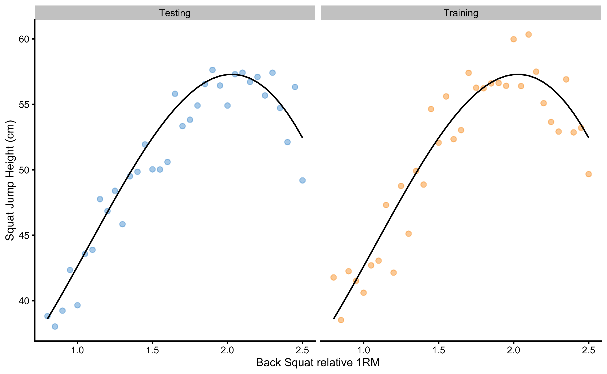
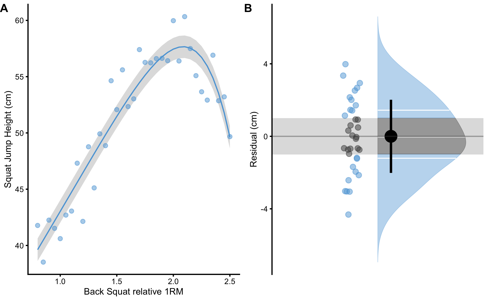
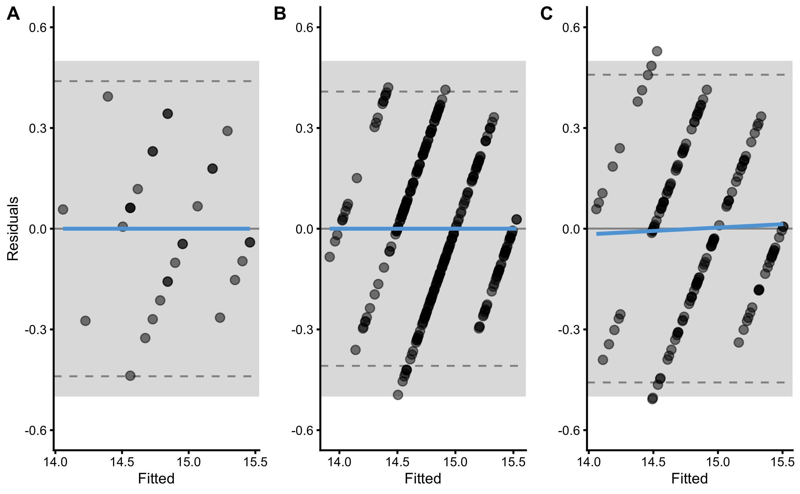

# Prediction

In many disciplines there is a near-exclusive use of the statistical models for causal inference[^causal_vs_explanatory] and the assumption that models with high explanatory power are inherently of high predictive power [@breimanStatisticalModelingTwo2001; @shmueliExplainPredict2010; @yarkoniChoosingPredictionExplanation2017; @hernanSecondChanceGet2019]. There is a constant tug-of-war between prediction versus explanation, and experts are leaning on one side or the other. Some experts warn against over-reliance on explanatory models with poor predictive power [@breimanStatisticalModelingTwo2001; @shmueliExplainPredict2010; @yarkoniChoosingPredictionExplanation2017], whereas some warn against over-reliance on predictive models that lack causal explanatory power that can guide intervention [@hernanSecondChanceGet2019; @pearlBookWhyNew2018; @pearlCausalInferenceStatistics2016; @pearlSevenToolsCausal2019]. 

[^causal_vs_explanatory]: Some authors refer to causal inference as "explanatory" modeling [@breimanStatisticalModelingTwo2001; @shmueliExplainPredict2010; @yarkoniChoosingPredictionExplanation2017], although Miguel Hernan warns against using such a somewhat-misleading term "because causal effects may be quantified while remaining unexplained (randomized trials identify causal effects even if the causal mechanisms that explain them are unknown)" [@hernanSecondChanceGet2019, pp.43]. Andrew Gelman also makes distinctions between *forward causal inference* and *reverse causal inference* that might be useful in distinguishing between identifying causal effects and explaining them [@gelmanCausalityStatisticalLearning2011]. This is elaborated in the [Causal inference] section of this book.   

It is thus important to differentiate between the two and take into account the research question that we are trying to answer. In this book, I define predictive modeling by using definition from Galit Shmueli "as the process of applying a statistical model or data mining algorithm to data for the purpose of predicting new or future observations" [@shmueliExplainPredict2010, pp.291]. Usually this predictive statistical model is treated as a *black box*. Black box approach implies that we are not really interested in underlying mechanism and relationships between the predictor variables, only in predictive performance of the model [@breimanStatisticalModelingTwo2001; @shmueliExplainPredict2010; @yarkoniChoosingPredictionExplanation2017]

Linear regression model from [Describing relationship between two variables] section already introduced predictive question ("If I know someone's YoYoIR1 score, what would be his or her MAS score? Is the prediction within SESOI?") to *complement* the association one ("How is YoYoIR1 associated with MAS?"). This section will continue this quest and introduce essential concepts and caveats of the predictive analysis needed to answer predictive questions.

## Overfitting

To explain a few caveats with predictive modeling, let's take slightly more complex example (although we will come back to YoYoIR1 and MAS relationship later). Imagine we know the *true* relationship between back squat *relative 1RM* (BS)[^1RM_definition] and vertical jump height during a bodyweight squat jump (SJ; measured in cm). This true relationship is usually referred to as *data generating process* (DGP) [@carseyMonteCarloSimulation2013] and one of the aims of causal inference tasks is to uncover parameters and mechanism of DGP from the acquired sample[^DGP]. With predictive tasks this aim is of no direct interest, but rather reliable prediction regarding new or unseen observations. 

[^1RM_definition]: For example, if an athlete lifted 175kg for a single rep in the back squat, and was unable to lift more, this represents his back squat 1RM, or one repetition maximum. Relative 1RM is calculated by dividing 1RM with athlete's bodyweight. For example, an athlete with 175kg 1RM weights 85kg. His relative 1RM is equal to 2.05. 

[^DGP]: Uncovering DGP parameters is not solely the goal of the causal inference (although causal inference task is to uncover or quantify causal mechanism), but also the main goal in the statistical inference where the aim is to quantify uncertainty about the *true* population parameters from the acquired sample. More about this topic in the [Statistical Inference] section.

DGP is usually unknown, but with simulations, such as this one, DGP is known and it is used to generate the sample data. Simulation is thus excellent teaching tool, since one can *play* with the problem and understand how the statistical analysis works, since the true DGP is known and can be compared with estimates [@carseyMonteCarloSimulation2013; @hopkinsUnderstandingStatisticsUsing2007; @rousseletPracticalIntroductionBootstrap2019]. 

DGP is assumed to consist of *systematic component* $f(x)$ and *stochastic component* $\epsilon$ (Equation \@ref(eq:systematic-stochastic)).

$$
\begin{equation}
  Y = f(X) + \epsilon
  (\#eq:systematic-stochastic)
\end{equation}
$$
Systematic component is assumed to be *fixed* in the population (constant from sample to sample) and captures the *true* relationship $f(X)$ among variables in the population (e.g. this can also be termed *signal*), while stochastic component represents *random noise* or *random error*, that varies from sample to sample, although its distribution remains the same. Random error is assumed to be normally distributed with mean of 0 and standard deviation which represents estimated parameter (either with `RMSE` or `RSE`). Thus, `RMSE` or `RSE` are *estimates* of $\epsilon$. 

In our example, the relationship between SJ and BS is expressed with the following Equation \@ref(eq:sj-bs-equation).

$$
\begin{equation}
  \begin{split}
    SJ &= 30 + 15\times BS\times\sin(BS)+\epsilon \\
    \epsilon &\sim \mathcal{N}(0,\,2)
  \end{split}
  (\#eq:sj-bs-equation)
\end{equation}
$$

Systematic component in the DGP is represented with $30 + 15\times BS\times\sin(BS)$, and stochastic component is represented with the *known* random error ($\epsilon$) that is normally distributed with the mean equal to zero and standard deviation equal to 2cm ($\mathcal{N}(0,\,2)$). This random error can be termed *irreducible error* [@jamesIntroductionStatisticalLearning2017], since it is inherent to the true DGP. As will be demonstrated shortly, models that perform better than this irreducible error are said to *overfit*. In other words, models are jumping to the noise.

The objective of causal inference or explanatory modeling is to estimate the $f(X)$ (estimate is indicated with the *hat* symbol: $\hat{f}(x)$) or to understand the underlying DGP. With the predictive analysis, the goal is to find the best estimate of $Y$ or $\hat{y}$. The underlying DGP is treated as a *black box*.  

To demonstrate a concept of overfitting, we are going to generate two samples (N=35 observations) from the DGP with BS ranging from 0.8 to 2.5. These samples are *training* and *testing* sample (Figure \@ref(fig:bs-sj-training-testing)). Training sample is used to *train* the prediction model, while *testing* sample will be used as a *holdout* sample for evaluating model performance on the *unseen* data.  

(\#fig:bs-sj-training-testing)(ref:bs-sj-training-testing-caption)

(ref:bs-sj-training-testing-caption) **Two samples simulated from the known DGP. **Black line represents systematic component of the DGP and it is equal for both training and testing samples. Observations vary in the two samples due stochastic component in the DGP

Model used to predict SJ from BS will be *polynomial linear regression*. Equation \@ref(eq:polynomial-equation) explains first, second, and third degree polynomial linear regression function and provides a form for n-degree polynomials. Please, note that first degree polynomial function represents simple linear regression. 

$$
\begin{equation}
  \begin{split}
    \hat{y_i} &= \hat{\beta}_0 + \hat{\beta}_1 x_i^1 \\
    \hat{y_i} &= \hat{\beta}_0 + \hat{\beta}_1 x_i^1 + \hat{\beta}_2 x_i^2 \\
    \hat{y_i} &= \hat{\beta}_0 + \hat{\beta}_1 x_i^1 + \hat{\beta}_2 x_i^2 + \hat{\beta}_3 x_i^3 \\
    \hat{y_i} &= \hat{\beta}_0 + \hat{\beta}_1 x_i^1 + \dots + \hat{\beta}_n x_i^n
  \end{split}
  (\#eq:polynomial-equation)
\end{equation}
$$

Increasing polynomial degrees increases the *flexibility* of the polynomial regression model, and thus can represent *tuning parameter* that we can select based on the model performance. In other words, we might be interested in finding polynomial degree that minimized model error (or maximize model fit). Figure \@ref(fig:poly-fit-model) contains model performance on the training data for polynomial degrees ranging from 1 to 20.  

(\#fig:poly-fit-model)(ref:poly-fit-model-caption)

(ref:poly-fit-model-caption) **Model fit with varying polynomial degrees. **More degrees equals better model fit

As can be seen from the Figure \@ref(fig:poly-fit-model), the more flexible the model (or the higher the polynomial degree) the better it fits the data. But how do these models perform on the unseen, testing data sample? In order to quantify model performance, `RMSE` metric is used. Figure \@ref(fig:testing-training-poly-errors) demonstrates performance of the polynomial regression model on the training and testing data sample across different polynomial degrees.  

(\#fig:testing-training-poly-errors)(ref:testing-training-poly-errors-caption)

(ref:testing-training-poly-errors-caption) **Testing and training errors across varying polynomial degrees. **Model error is estimated with the `RMSE` metric, while polynomial degree represents tuning or flexibility parameter of the model. As can be noted from the figure, better training performance doesn't imply better testing performance. Vertical dashed line represents the polynomial degree at which testing error is lowest. Polynomial degrees on the right of the vertical dashed line are said to overfit the data, while polynomial degree on the left are said to underfit the data

As can be seen from the Figure \@ref(fig:testing-training-poly-errors), models with higher polynomial degrees tend to overfit (indicated by performance better than the known irreducible error $\epsilon$ visualized with the horizontal line at 2cm). Performance on the training data sample improves as the polynomial degrees increase, which is not the case with the performance on the testing data sample. There is clearly the best polynomial degree that has the best predictive performance on the unseen data. Polynomial degrees on the left of the vertical dashed line are said to *underfit*, while polynomial degrees on the right are said to overfit. 

The take home message is that predictive performance on the training data can be too optimistic, and for evaluating predictive performance of the model, unseen data must be used, otherwise the model might overfit.

## Cross-Validation

In order to evaluate predictive performance of the model, researchers usually remove some percent of data to be used as a testing or holdout sample. Unfortunately, this is not always possible (although it is recommended, particularly to evaluate final model performance, especially when there are multiple models and model tuning). One solution to these problems is *cross-validation* technique [@jamesIntroductionStatisticalLearning2017; @kuhnAppliedPredictiveModeling2018; @yarkoniChoosingPredictionExplanation2017]. There are numerous variations of the cross-validation, but the simplest one is *n-fold* cross validation (Figure 15). N-fold cross validation involve splitting the data into 5 to 10 equal folds and using one fold as a testing or hold-out sample while performing model training on the other folds. This is repeated over N-iteration (in this case 5 to 10) and the model performance is averaged to get *cross-validated model performance*.   

(\#fig:cross-validation)(ref:cross-validation-caption)

(ref:cross-validation-caption) **Cross-Validation**

With predictive analysis and *machine learning*, different model's tuning parameters are evaluated (as well as multiple different models) to estimate the one that gives the best predictive performance. It is thus important to utilize techniques such as cross-validation to avoid overfitting and too optimistic model selection.

Certain models, such as *lasso*, *ridge regression*, and *elastic-net* implement *regularization* parameters that *penalizes* the model complexity and are used as a tuning variable [@jamesIntroductionStatisticalLearning2017; @kuhnAppliedPredictiveModeling2018; @yarkoniChoosingPredictionExplanation2017]. This is useful in situations when there are a lot of predictors, and it is easy to overfit the model. Selecting the best regularization parameter that has the best cross-validated performance helps in simplifying the model and avoiding the overfit. These topics are beyond the scope of this book, and interested readers are directed to references provided. 

### Sample `mean` as the simplest predictive model

We have already discussed in [Sample `mean` as the simplest statistical model] section that sample `mean` can be considered simplest model that describes a particular sample with the lowest `RMSE`. But can it be used for prediction?

Here is an example to demonstrate both sample `mean` as a predictive model, as well as to demonstrate cross-validation technique. Let's assume that we have collected N=10 observations: 15, 19, 28, 28, 30, 57, 71, 88, 95, 97. Sample `mean` is equal to 52.8. If we assume that the sample `mean` represents our prediction for the observations, we can easily calculate *prediction error* for each observation, which is simple difference (column `Error` in the Table \@ref(tab:mean-as-prediction-differences)). 

(ref:mean-as-prediction-differences-caption) **Sample `mean` as prediction with associated prediction errors**

<table>
<caption>(\#tab:mean-as-prediction-differences)(ref:mean-as-prediction-differences-caption)</caption>
 <thead>
  <tr>
   <th style="text-align:right;"> Observed </th>
   <th style="text-align:right;"> Predicted </th>
   <th style="text-align:right;"> Error </th>
   <th style="text-align:right;"> Absolute Error </th>
   <th style="text-align:right;"> Squared Error </th>
  </tr>
 </thead>
<tbody>
  <tr>
   <td style="text-align:right;"> 15 </td>
   <td style="text-align:right;"> 52.8 </td>
   <td style="text-align:right;"> 37.8 </td>
   <td style="text-align:right;"> 37.8 </td>
   <td style="text-align:right;"> 1428.84 </td>
  </tr>
  <tr>
   <td style="text-align:right;"> 19 </td>
   <td style="text-align:right;"> 52.8 </td>
   <td style="text-align:right;"> 33.8 </td>
   <td style="text-align:right;"> 33.8 </td>
   <td style="text-align:right;"> 1142.44 </td>
  </tr>
  <tr>
   <td style="text-align:right;"> 28 </td>
   <td style="text-align:right;"> 52.8 </td>
   <td style="text-align:right;"> 24.8 </td>
   <td style="text-align:right;"> 24.8 </td>
   <td style="text-align:right;"> 615.04 </td>
  </tr>
  <tr>
   <td style="text-align:right;"> 28 </td>
   <td style="text-align:right;"> 52.8 </td>
   <td style="text-align:right;"> 24.8 </td>
   <td style="text-align:right;"> 24.8 </td>
   <td style="text-align:right;"> 615.04 </td>
  </tr>
  <tr>
   <td style="text-align:right;"> 30 </td>
   <td style="text-align:right;"> 52.8 </td>
   <td style="text-align:right;"> 22.8 </td>
   <td style="text-align:right;"> 22.8 </td>
   <td style="text-align:right;"> 519.84 </td>
  </tr>
  <tr>
   <td style="text-align:right;"> 57 </td>
   <td style="text-align:right;"> 52.8 </td>
   <td style="text-align:right;"> -4.2 </td>
   <td style="text-align:right;"> 4.2 </td>
   <td style="text-align:right;"> 17.64 </td>
  </tr>
  <tr>
   <td style="text-align:right;"> 71 </td>
   <td style="text-align:right;"> 52.8 </td>
   <td style="text-align:right;"> -18.2 </td>
   <td style="text-align:right;"> 18.2 </td>
   <td style="text-align:right;"> 331.24 </td>
  </tr>
  <tr>
   <td style="text-align:right;"> 88 </td>
   <td style="text-align:right;"> 52.8 </td>
   <td style="text-align:right;"> -35.2 </td>
   <td style="text-align:right;"> 35.2 </td>
   <td style="text-align:right;"> 1239.04 </td>
  </tr>
  <tr>
   <td style="text-align:right;"> 95 </td>
   <td style="text-align:right;"> 52.8 </td>
   <td style="text-align:right;"> -42.2 </td>
   <td style="text-align:right;"> 42.2 </td>
   <td style="text-align:right;"> 1780.84 </td>
  </tr>
  <tr>
   <td style="text-align:right;"> 97 </td>
   <td style="text-align:right;"> 52.8 </td>
   <td style="text-align:right;"> -44.2 </td>
   <td style="text-align:right;"> 44.2 </td>
   <td style="text-align:right;"> 1953.64 </td>
  </tr>
</tbody>
</table>

Besides simple difference, Table \@ref(tab:mean-as-prediction-differences) provides errors (or losses) using two common *loss functions* (see [Sample `mean` as the simplest statistical model] section in [Description] chapter): *absolute loss* (column `Absolute Error`) and *quadratic loss* (column `Squared Error`). 

We need to *aggregate* these errors or losses into a single metric using the *cost function*. If we calculate the mean of the prediction errors (column `Error` in the Table \@ref(tab:mean-as-prediction-differences)), we are going to get 0. This is because the positive and negative errors cancel each other out for the sample `mean` estimator. This error estimator is often referred to as *mean bias error* (`MBE`) or simply *bias* and is often used in *validity* and *reliability* analysis (see [Validity] and [Reliability] sections). 

If we take the mean of the absolute prediction errors (column `Absolute error` in the Table \@ref(tab:mean-as-prediction-differences)) we are going to get *mean absolute error* (`MAE`) estimator, which is in this example equal to 28.8. 

If we take the mean of the squared prediction errors (column `Squared error` in the Table \@ref(tab:mean-as-prediction-differences)) we are going to get *mean square error* (`MSE`) estimator, often called *variance* in the case of describing sample dispersion. In this example `MSE` is equal to 964.36. To *bring* back `MSE` to the same scale with the observation scale, square root of the `MSE` is taken. This represents *root mean square error* (`RMSE`), which is equal to 31.05. As explained in [Sample `mean` as the simplest statistical model] section, sample `mean` represents statistical model of the central tendency with the lowest `RMSE`. 

Aforementioned error estimators, `MBE`, `MAE`, `MSE`, and `RMSE` can be considered different *cost functions*. Which one should be used[^CLASSIFICATION_ERROR_EST]? As always, it depends [@chaiRootMeanSquare2014]. Assuming Gaussian normal distribution of the errors, `MSE` and `RMSE` have very useful mathematical properties that can be utilized in modeling stochastic or random components (i.e. *random error propagation* and prediction error decomposition in [Bias-Variance decomposition and trade-off] section). This property will be utilized thorough this book and particularly in the [Example of randomized control trial] section when estimating random or stochastic component of the treatment effect. I personally prefer to report multiple estimators, including error estimators, which is also a strategy suggested by @chaiRootMeanSquare2014.

[^CLASSIFICATION_ERROR_EST]: As explained in [Introduction] section, I will mostly focus at variables on continuous ratio scale. Prediction error metrics differ for target variable that is on nominal scale (i.e. *classification* task) and involve estimators such as `accuracy`, `specificity`, `sensitivity`, *area under curve* (`AUC`) [@kuhnAppliedPredictiveModeling2018; @lantzMachineLearningExpert2019].

The are, of course, other loss and cost functions that could be used. For example, one might only use the *maximal error* (`MaxErr`) and *minimal error* (`MinErr`), rather than average. Discussion and review of these different metrics is beyond the scope of this book (for more information please check the package *Metrics* [@R-Metrics] and the following references [@botchkarevNewTypologyDesign2019; @chaiRootMeanSquare2014; @willmottAdvantagesMeanAbsolute2005; @barronGeneralAdaptiveRobust2019]). Figure \@ref(fig:loss-function-metrics-example) visualize the most common loss functions that are used in both model training and as *performance metrics*. It is important to keep in mind that in the case of OLS regression, `MSE` (or `RMSE`) is minimized. It is thus important to make a distinction between cost function used in the optimization and model training (i.e. in OLS, parameters of the model are found so that `MSE` is minimized; in some machine-learning models `Huber loss` or `Rigde loss`[^HUBER_RIDGE] is minimized; see Figure \@ref(fig:loss-function-metrics-example)) versus cost function used as a performance metric (e.g. reporting `pEquivalent`, `MaxErr` or `MinErr` for OLS models).  

[^HUBER_RIDGE]: Although I've used the term *loss* here, these loss functions are also aggregated using `sum` or `mean` to create `Huber cost` or `Ridge cost`. `Huber loss` is a combination of absolute and quadratic losses and it's property is better *robustness* to outliers.

(\#fig:loss-function-metrics-example)(ref:loss-function-metrics-example-caption)

(ref:loss-function-metrics-example-caption) **Common loss functions. A. ** Trellis plot of each loss function. **B.** Plot of all loss functions on a common scale. *Huber loss* is a combination of absolute and quadratic loss. 

The take-away point is to understand that there are multiple performance metrics that can be utilized and it is best to report multiple of them.  

Estimates for `MBE`, `MAE`, `MSE`[^MSE_REMOVED], and `RMSE` represent *training sample* predictive performance since sample `mean` is estimated using this very sample. We are interested how sample `mean`, as predictive model, perform on the unseen data. Cross-validation is one method to estimate model performance on unseen data. Table \@ref(tab:mean-cross-validation) contains 3-fold cross-validation sample used to train the model (in this case estimate sample `mean`) and to evaluate the performance on unseen data.

[^MSE_REMOVED]: `MSE` will be removed from the further analysis and tables since it is equivalent to RMSE, just squared.

(ref:mean-cross-validation-caption) **Example cross-validation using sample `mean` as the prediction model**

<table class="table" style="font-size: 10px; margin-left: auto; margin-right: auto;">
<caption style="font-size: initial !important;">(\#tab:mean-cross-validation)(ref:mean-cross-validation-caption)</caption>
 <thead>
  <tr>
   <th style="text-align:right;"> Fold </th>
   <th style="text-align:left;"> Training sample </th>
   <th style="text-align:right;"> mean </th>
   <th style="text-align:left;"> Testing Sample </th>
   <th style="text-align:right;"> MBE </th>
   <th style="text-align:right;"> MAE </th>
   <th style="text-align:right;"> RMSE </th>
   <th style="text-align:right;"> MinErr </th>
   <th style="text-align:right;"> MaxErr </th>
  </tr>
 </thead>
<tbody>
  <tr>
   <td style="text-align:right;"> 1 </td>
   <td style="text-align:left;"> 15  19  28  --  30  --  71  88  95  -- </td>
   <td style="text-align:right;"> 49.43 </td>
   <td style="text-align:left;"> --  --  --  28  --  57  --  --  --  97 </td>
   <td style="text-align:right;"> -11.24 </td>
   <td style="text-align:right;"> 25.52 </td>
   <td style="text-align:right;"> 30.44 </td>
   <td style="text-align:right;"> -47.57 </td>
   <td style="text-align:right;"> 21.43 </td>
  </tr>
  <tr>
   <td style="text-align:right;"> 2 </td>
   <td style="text-align:left;"> 15  19  --  28  --  57  --  88  --  97 </td>
   <td style="text-align:right;"> 50.67 </td>
   <td style="text-align:left;"> --  --  28  --  30  --  71  --  95  -- </td>
   <td style="text-align:right;"> -5.33 </td>
   <td style="text-align:right;"> 27.00 </td>
   <td style="text-align:right;"> 28.81 </td>
   <td style="text-align:right;"> -44.33 </td>
   <td style="text-align:right;"> 22.67 </td>
  </tr>
  <tr>
   <td style="text-align:right;"> 3 </td>
   <td style="text-align:left;"> --  --  28  28  30  57  71  --  95  97 </td>
   <td style="text-align:right;"> 58.00 </td>
   <td style="text-align:left;"> 15  19  --  --  --  --  --  88  --  -- </td>
   <td style="text-align:right;"> 17.33 </td>
   <td style="text-align:right;"> 37.33 </td>
   <td style="text-align:right;"> 37.73 </td>
   <td style="text-align:right;"> -30.00 </td>
   <td style="text-align:right;"> 43.00 </td>
  </tr>
</tbody>
</table>

Since this is a small sample, we can repeat cross-validation few times. This is called *repeated cross-validation*. Let's repeat 3-folds cross-validation for 5 repeats (Table \@ref(tab:repeated-cross-validation)).

(ref:repeated-cross-validation-caption) **Example repeated cross-validation using sample `mean` as the prediction model**

<table class="table" style="font-size: 10px; margin-left: auto; margin-right: auto;">
<caption style="font-size: initial !important;">(\#tab:repeated-cross-validation)(ref:repeated-cross-validation-caption)</caption>
 <thead>
  <tr>
   <th style="text-align:right;"> Repeat </th>
   <th style="text-align:right;"> Fold </th>
   <th style="text-align:left;"> Training sample </th>
   <th style="text-align:right;"> mean </th>
   <th style="text-align:left;"> Testing Sample </th>
   <th style="text-align:right;"> MBE </th>
   <th style="text-align:right;"> MAE </th>
   <th style="text-align:right;"> RMSE </th>
   <th style="text-align:right;"> MinErr </th>
   <th style="text-align:right;"> MaxErr </th>
  </tr>
 </thead>
<tbody>
  <tr>
   <td style="text-align:right;"> 1 </td>
   <td style="text-align:right;"> 1 </td>
   <td style="text-align:left;"> 15  19  28  --  30  --  71  88  95  -- </td>
   <td style="text-align:right;"> 49.43 </td>
   <td style="text-align:left;"> --  --  --  28  --  57  --  --  --  97 </td>
   <td style="text-align:right;"> -11.24 </td>
   <td style="text-align:right;"> 25.52 </td>
   <td style="text-align:right;"> 30.44 </td>
   <td style="text-align:right;"> -47.57 </td>
   <td style="text-align:right;"> 21.43 </td>
  </tr>
  <tr>
   <td style="text-align:right;"> 1 </td>
   <td style="text-align:right;"> 2 </td>
   <td style="text-align:left;"> 15  19  --  28  --  57  --  88  --  97 </td>
   <td style="text-align:right;"> 50.67 </td>
   <td style="text-align:left;"> --  --  28  --  30  --  71  --  95  -- </td>
   <td style="text-align:right;"> -5.33 </td>
   <td style="text-align:right;"> 27.00 </td>
   <td style="text-align:right;"> 28.81 </td>
   <td style="text-align:right;"> -44.33 </td>
   <td style="text-align:right;"> 22.67 </td>
  </tr>
  <tr>
   <td style="text-align:right;"> 1 </td>
   <td style="text-align:right;"> 3 </td>
   <td style="text-align:left;"> --  --  28  28  30  57  71  --  95  97 </td>
   <td style="text-align:right;"> 58.00 </td>
   <td style="text-align:left;"> 15  19  --  --  --  --  --  88  --  -- </td>
   <td style="text-align:right;"> 17.33 </td>
   <td style="text-align:right;"> 37.33 </td>
   <td style="text-align:right;"> 37.73 </td>
   <td style="text-align:right;"> -30.00 </td>
   <td style="text-align:right;"> 43.00 </td>
  </tr>
  <tr>
   <td style="text-align:right;"> 2 </td>
   <td style="text-align:right;"> 1 </td>
   <td style="text-align:left;"> --  19  28  --  30  57  71  88  --  -- </td>
   <td style="text-align:right;"> 48.83 </td>
   <td style="text-align:left;"> 15  --  --  28  --  --  --  --  95  97 </td>
   <td style="text-align:right;"> -9.92 </td>
   <td style="text-align:right;"> 37.25 </td>
   <td style="text-align:right;"> 38.83 </td>
   <td style="text-align:right;"> -48.17 </td>
   <td style="text-align:right;"> 33.83 </td>
  </tr>
  <tr>
   <td style="text-align:right;"> 2 </td>
   <td style="text-align:right;"> 2 </td>
   <td style="text-align:left;"> 15  --  28  28  --  57  --  --  95  97 </td>
   <td style="text-align:right;"> 53.33 </td>
   <td style="text-align:left;"> --  19  --  --  30  --  71  88  --  -- </td>
   <td style="text-align:right;"> 1.33 </td>
   <td style="text-align:right;"> 27.50 </td>
   <td style="text-align:right;"> 28.45 </td>
   <td style="text-align:right;"> -34.67 </td>
   <td style="text-align:right;"> 34.33 </td>
  </tr>
  <tr>
   <td style="text-align:right;"> 2 </td>
   <td style="text-align:right;"> 3 </td>
   <td style="text-align:left;"> 15  19  --  28  30  --  71  88  95  97 </td>
   <td style="text-align:right;"> 55.38 </td>
   <td style="text-align:left;"> --  --  28  --  --  57  --  --  --  -- </td>
   <td style="text-align:right;"> 12.87 </td>
   <td style="text-align:right;"> 14.50 </td>
   <td style="text-align:right;"> 19.39 </td>
   <td style="text-align:right;"> -1.63 </td>
   <td style="text-align:right;"> 27.37 </td>
  </tr>
  <tr>
   <td style="text-align:right;"> 3 </td>
   <td style="text-align:right;"> 1 </td>
   <td style="text-align:left;"> --  19  28  28  30  57  71  88  --  -- </td>
   <td style="text-align:right;"> 45.86 </td>
   <td style="text-align:left;"> 15  --  --  --  --  --  --  --  95  97 </td>
   <td style="text-align:right;"> -23.14 </td>
   <td style="text-align:right;"> 43.71 </td>
   <td style="text-align:right;"> 44.66 </td>
   <td style="text-align:right;"> -51.14 </td>
   <td style="text-align:right;"> 30.86 </td>
  </tr>
  <tr>
   <td style="text-align:right;"> 3 </td>
   <td style="text-align:right;"> 2 </td>
   <td style="text-align:left;"> 15  19  --  --  30  --  --  88  95  97 </td>
   <td style="text-align:right;"> 57.33 </td>
   <td style="text-align:left;"> --  --  28  28  --  57  71  --  --  -- </td>
   <td style="text-align:right;"> 11.33 </td>
   <td style="text-align:right;"> 18.17 </td>
   <td style="text-align:right;"> 21.84 </td>
   <td style="text-align:right;"> -13.67 </td>
   <td style="text-align:right;"> 29.33 </td>
  </tr>
  <tr>
   <td style="text-align:right;"> 3 </td>
   <td style="text-align:right;"> 3 </td>
   <td style="text-align:left;"> 15  --  28  28  --  57  71  --  95  97 </td>
   <td style="text-align:right;"> 55.86 </td>
   <td style="text-align:left;"> --  19  --  --  30  --  --  88  --  -- </td>
   <td style="text-align:right;"> 10.19 </td>
   <td style="text-align:right;"> 31.62 </td>
   <td style="text-align:right;"> 31.94 </td>
   <td style="text-align:right;"> -32.14 </td>
   <td style="text-align:right;"> 36.86 </td>
  </tr>
  <tr>
   <td style="text-align:right;"> 4 </td>
   <td style="text-align:right;"> 1 </td>
   <td style="text-align:left;"> --  19  28  --  30  57  71  88  --  97 </td>
   <td style="text-align:right;"> 55.71 </td>
   <td style="text-align:left;"> 15  --  --  28  --  --  --  --  95  -- </td>
   <td style="text-align:right;"> 9.71 </td>
   <td style="text-align:right;"> 35.90 </td>
   <td style="text-align:right;"> 36.37 </td>
   <td style="text-align:right;"> -39.29 </td>
   <td style="text-align:right;"> 40.71 </td>
  </tr>
  <tr>
   <td style="text-align:right;"> 4 </td>
   <td style="text-align:right;"> 2 </td>
   <td style="text-align:left;"> 15  --  --  28  30  --  71  --  95  97 </td>
   <td style="text-align:right;"> 56.00 </td>
   <td style="text-align:left;"> --  19  28  --  --  57  --  88  --  -- </td>
   <td style="text-align:right;"> 8.00 </td>
   <td style="text-align:right;"> 24.50 </td>
   <td style="text-align:right;"> 28.19 </td>
   <td style="text-align:right;"> -32.00 </td>
   <td style="text-align:right;"> 37.00 </td>
  </tr>
  <tr>
   <td style="text-align:right;"> 4 </td>
   <td style="text-align:right;"> 3 </td>
   <td style="text-align:left;"> 15  19  28  28  --  57  --  88  95  -- </td>
   <td style="text-align:right;"> 47.14 </td>
   <td style="text-align:left;"> --  --  --  --  30  --  71  --  --  97 </td>
   <td style="text-align:right;"> -18.86 </td>
   <td style="text-align:right;"> 30.29 </td>
   <td style="text-align:right;"> 33.41 </td>
   <td style="text-align:right;"> -49.86 </td>
   <td style="text-align:right;"> 17.14 </td>
  </tr>
  <tr>
   <td style="text-align:right;"> 5 </td>
   <td style="text-align:right;"> 1 </td>
   <td style="text-align:left;"> 15  19  --  28  --  57  --  88  95  97 </td>
   <td style="text-align:right;"> 57.00 </td>
   <td style="text-align:left;"> --  --  28  --  30  --  71  --  --  -- </td>
   <td style="text-align:right;"> 14.00 </td>
   <td style="text-align:right;"> 23.33 </td>
   <td style="text-align:right;"> 24.26 </td>
   <td style="text-align:right;"> -14.00 </td>
   <td style="text-align:right;"> 29.00 </td>
  </tr>
  <tr>
   <td style="text-align:right;"> 5 </td>
   <td style="text-align:right;"> 2 </td>
   <td style="text-align:left;"> 15  --  28  28  30  --  71  88  95  -- </td>
   <td style="text-align:right;"> 50.71 </td>
   <td style="text-align:left;"> --  19  --  --  --  57  --  --  --  97 </td>
   <td style="text-align:right;"> -6.95 </td>
   <td style="text-align:right;"> 28.10 </td>
   <td style="text-align:right;"> 32.60 </td>
   <td style="text-align:right;"> -46.29 </td>
   <td style="text-align:right;"> 31.71 </td>
  </tr>
  <tr>
   <td style="text-align:right;"> 5 </td>
   <td style="text-align:right;"> 3 </td>
   <td style="text-align:left;"> --  19  28  --  30  57  71  --  --  97 </td>
   <td style="text-align:right;"> 50.33 </td>
   <td style="text-align:left;"> 15  --  --  28  --  --  --  88  95  -- </td>
   <td style="text-align:right;"> -6.17 </td>
   <td style="text-align:right;"> 35.00 </td>
   <td style="text-align:right;"> 35.92 </td>
   <td style="text-align:right;"> -44.67 </td>
   <td style="text-align:right;"> 35.33 </td>
  </tr>
</tbody>
</table>

To calculate cross-validated prediction performance metrics, average of testing `MBE`, `MAE`, `RMSE`, `MinErr`, and `MaxErr` is calculated and reported as `cvMBE`, `cvMAE`, `cvRMSE`, `cvMinErr`, and `cvMaxErr` (Table \@ref(tab:cv-performance-metrics)). Prediction performance metrics don't need to be averaged across cross-validation samples and can be instead estimated by *binding* (or *pooling*) all cross-validated samples together (i.e. target variable and predicted target variable). More about this at the end of this chapter in [Practical example: MAS and YoYoIR1 prediction] section. 

(ref:cv-performance-metrics-caption) **Cross-validated prediction performance metrics (estimators)**

<table>
<caption>(\#tab:cv-performance-metrics)(ref:cv-performance-metrics-caption)</caption>
 <thead>
  <tr>
   <th style="text-align:right;"> cvMBE </th>
   <th style="text-align:right;"> cvMAE </th>
   <th style="text-align:right;"> cvRMSE </th>
   <th style="text-align:right;"> cvMinErr </th>
   <th style="text-align:right;"> cvMaxErr </th>
  </tr>
 </thead>
<tbody>
  <tr>
   <td style="text-align:right;"> 0.21 </td>
   <td style="text-align:right;"> 29.32 </td>
   <td style="text-align:right;"> 31.52 </td>
   <td style="text-align:right;"> -35.29 </td>
   <td style="text-align:right;"> 31.37 </td>
  </tr>
</tbody>
</table>

As can be seen from the Table \@ref(tab:cv-performance-metrics), all performance metrics estimated using repeated cross-validation are larger than the when estimated using the training data (full sample). Utilizing cross-validated estimates of performance (or error) should be used over training estimates when discussing predictive performance of the models. Unfortunately, this is almost never the case in sport science literature, where prediction is never estimated on unseen data and the model performance estimates can suffer from over-fitting. 

Using sample `mean` as predictive model represents simplistic example, although this type of model is usually referred to as *baseline* model. Baseline models are used as benchmarks or anchor when discussing performance of more elaborate and complex predictive models. We will come back to these at the end of this section when we will perform predictive analysis of the linear regression model used in [Magnitude-based estimators] section for predicting MAS from YoYoIR1 (and *vice versa*) tests. 

## Bias-Variance decomposition and trade-off

Prediction error can be *decomposed* into two components, *reducible* and *irreducible* error[^error_types]. Reducible error is the error that can be reduced with a better model, while irreducible error is the unknown error inherent to the DGP itself [@jamesIntroductionStatisticalLearning2017]. Reducible error can be further divided into $Bias^2$ and $Variance$ (Figure \@ref(fig:bias-variance) and Equation \@ref(eq:reducible-irreducible)). 

[^error_types]: As it will be explained in [Statistical inference] section, there are two kinds of uncertainty: *aleatory* and *epistemic*. Aleatory uncertainty is inherent randomness and it is usually represented as irreducible error. Epistemic uncertainty is due to the lack of knowledge or information, which can be considered reducible error. In other words, better models or models with more information will be able to reduce prediction error by reducing the reducible or epistemic uncertainty. The upper ceiling of the predictive performance is determined by irreducible error (which is unknown). Please refer to the [Statistical inference] section for more information. 

$$
\begin{equation}
  \begin{split}
    Prediction \; error &= Reducible \; error + Irreducible \; error \\
    Prediction \; error &= (Bias^2 + Variance) + Irreducible \; error
  \end{split}
  (\#eq:reducible-irreducible)
\end{equation}
$$
 
$Bias^2$ represents constant or systematic error, which is introduced by approximating a real-life problem, which may be extremely complicated, by a much simpler model [@jamesIntroductionStatisticalLearning2017]. $Variance$ represents variable or random error, and refers to the amount by which model parameters would change if we estimated it by using a different training data set [@jamesIntroductionStatisticalLearning2017]. 

(\#fig:bias-variance)(ref:bias-variance-caption)

(ref:bias-variance-caption) **Bias and variance decomposition of the error. A. **Visual representation of $Bias^2$ and $Variance$ using the shooting target. **B.** Error can be decomposed to $Bias^2$, $Variance$, and $Irreducible \: error$, where $Bias^2$ represents constant or systematic error and $Variance$ represents variable or random error

To understand this concept, we need to run a simulation using *known* relationship between BS and SJ (see Figure \@ref(fig:bs-sj-training-testing), Figure \@ref(fig:poly-fit-model), and Equation \@ref(eq:sj-bs-equation)). Prediction error decomposition to bias and variance is done for a *single* data point. To do that we need to differentiate between the following variables:

- $x$ predictors. In our case we only have one $x$ predictor - $BS$ and we will use $BS = 1.75$ for this simulation
- $y_{true}$ value for a particular $x$ values. In our case $SJ$ variable represents target variable $y$, which is equal to $SJ = 30 + 15\times BS\times\sin(BS)$ or $SJ=55.83$cm. Both $x$ and $y_{true}$ values are constant across simulations
- $y_{observed}$ represents observed $y$ which differs from $y_{true}$ due stochastic component $\epsilon$. This implies that $y_{observed}$ randomly varies across simulations. The equation for $y_{observed}$ is: $SJ = 30 + 15\times BS\times\sin(BS) + \mathcal{N}(0,\,2)$. Error $\epsilon$ represents irreducible error, because it is inherent to DGP and it is equal to $\mathcal{N}(0,\,2)$. 
- $y_{predicted}$ represents model prediction using the training sample of $x$ and $y_{observed}$ values. 

For every simulation (N=200 simulations in total), the whole sample of N=35 observations is generated from the known DGP. This includes $x$, $y_{true}$, and $y_{observed}$ variables. Polynomial regression models (from 1 to 20 polynomial degrees) are being fitted (or trained) using $x$ predictors (in our case $BS$ variable) and $y_{observed}$ as our target variable. True $y$ ($y_{true}$) is thus unknown to the model, but only to us. After models are trained, we estimate $y_{predicted}$ using $BS = 1.75$, for which the $y_{true}$ is equal to $SJ=55.83$cm. 

Table \@ref(tab:ten-simulations-bias-variance) contains results of the first 10 simulations for 2nd degree polynomial model.  

(ref:ten-simulations-bias-variance-caption) **Results of first 10 simulations for 2nd degree polynomial linear regression model**

<table>
<caption>(\#tab:ten-simulations-bias-variance)(ref:ten-simulations-bias-variance-caption)</caption>
 <thead>
  <tr>
   <th style="text-align:right;"> sim </th>
   <th style="text-align:right;"> model </th>
   <th style="text-align:right;"> x </th>
   <th style="text-align:right;"> y_true </th>
   <th style="text-align:right;"> y_observed </th>
   <th style="text-align:right;"> y_predicted </th>
  </tr>
 </thead>
<tbody>
  <tr>
   <td style="text-align:right;"> 1 </td>
   <td style="text-align:right;"> 2 </td>
   <td style="text-align:right;"> 1.75 </td>
   <td style="text-align:right;"> 55.83 </td>
   <td style="text-align:right;"> 54.65 </td>
   <td style="text-align:right;"> 55.27 </td>
  </tr>
  <tr>
   <td style="text-align:right;"> 2 </td>
   <td style="text-align:right;"> 2 </td>
   <td style="text-align:right;"> 1.75 </td>
   <td style="text-align:right;"> 55.83 </td>
   <td style="text-align:right;"> 53.80 </td>
   <td style="text-align:right;"> 55.34 </td>
  </tr>
  <tr>
   <td style="text-align:right;"> 3 </td>
   <td style="text-align:right;"> 2 </td>
   <td style="text-align:right;"> 1.75 </td>
   <td style="text-align:right;"> 55.83 </td>
   <td style="text-align:right;"> 56.03 </td>
   <td style="text-align:right;"> 55.34 </td>
  </tr>
  <tr>
   <td style="text-align:right;"> 4 </td>
   <td style="text-align:right;"> 2 </td>
   <td style="text-align:right;"> 1.75 </td>
   <td style="text-align:right;"> 55.83 </td>
   <td style="text-align:right;"> 55.71 </td>
   <td style="text-align:right;"> 55.68 </td>
  </tr>
  <tr>
   <td style="text-align:right;"> 5 </td>
   <td style="text-align:right;"> 2 </td>
   <td style="text-align:right;"> 1.75 </td>
   <td style="text-align:right;"> 55.83 </td>
   <td style="text-align:right;"> 55.52 </td>
   <td style="text-align:right;"> 54.91 </td>
  </tr>
  <tr>
   <td style="text-align:right;"> 6 </td>
   <td style="text-align:right;"> 2 </td>
   <td style="text-align:right;"> 1.75 </td>
   <td style="text-align:right;"> 55.83 </td>
   <td style="text-align:right;"> 57.55 </td>
   <td style="text-align:right;"> 55.81 </td>
  </tr>
  <tr>
   <td style="text-align:right;"> 7 </td>
   <td style="text-align:right;"> 2 </td>
   <td style="text-align:right;"> 1.75 </td>
   <td style="text-align:right;"> 55.83 </td>
   <td style="text-align:right;"> 52.03 </td>
   <td style="text-align:right;"> 55.08 </td>
  </tr>
  <tr>
   <td style="text-align:right;"> 8 </td>
   <td style="text-align:right;"> 2 </td>
   <td style="text-align:right;"> 1.75 </td>
   <td style="text-align:right;"> 55.83 </td>
   <td style="text-align:right;"> 56.35 </td>
   <td style="text-align:right;"> 55.92 </td>
  </tr>
  <tr>
   <td style="text-align:right;"> 9 </td>
   <td style="text-align:right;"> 2 </td>
   <td style="text-align:right;"> 1.75 </td>
   <td style="text-align:right;"> 55.83 </td>
   <td style="text-align:right;"> 54.05 </td>
   <td style="text-align:right;"> 54.64 </td>
  </tr>
  <tr>
   <td style="text-align:right;"> 10 </td>
   <td style="text-align:right;"> 2 </td>
   <td style="text-align:right;"> 1.75 </td>
   <td style="text-align:right;"> 55.83 </td>
   <td style="text-align:right;"> 58.16 </td>
   <td style="text-align:right;"> 55.57 </td>
  </tr>
</tbody>
</table>

To estimate reducible error, `MSE` estimator is used (Equation \@ref(eq:MSE-reducible-error).

$$
\begin{equation}
  Reducible \: error = \frac{1}{n_{sim}}\Sigma_{j=1}^{n_{sim}}(y_{predicted_{j,x=1.75}} - y_{true_{x=1.75}})^2
  (\#eq:MSE-reducible-error)
\end{equation}
$$

Reducible error can be decomposed to $Bias^2$ and $Variance$, or systematic error and variable or random error. $Bias^2$ is squared difference between $y_{true}$ and mean of $y_{predicted}$ across simulations (Equation \@ref(eq:bias-equation)). 

$$
\begin{equation}
  Bias^2 = (\frac{1}{n_{sim}}\Sigma_{j=1}^{n_{sim}}(y_{predicted_{j, x=1.75}}) - y_{true_{x=1.75}})^2
  (\#eq:bias-equation)
\end{equation}
$$

$Variance$ represents, pretty much, `SD` of the of the $y_{predicted}$ and it is an estimate of how much the predictions vary across simulations (Equation \@ref(eq:variance-equation)).

$$
\begin{equation}
  Variance = \frac{1}{n_{sim}}\Sigma_{j=1}^{n_{sim}}(\bar{y_{predicted_{x=1.75}}} - y_{predicted_{j, x=1.75}})^2
  (\#eq:variance-equation)
\end{equation}
$$

Reducible error is thus equal to the sum of $Bias^2$ and $Variance$.

If you remember from [Description] section, $Bias^2$ and $Variance$ are nothing more than measure of central tendency (i.e. systematic or constant error) and measure of spread (i.e. variable or random error). Figure \@ref(fig:bias-variance) also illustrates this concept. 

Irreducible error is estimated using `MSE` as well (Equation MSE-irreducible-error).

$$
\begin{equation}
  Irreducible \: error = \frac{1}{n_{sim}}\Sigma_{j=1}^{n_{sim}}(y_{observed_{x=1.75}} - y_{true_{x=1.75}})^2
  (\#eq:MSE-irreducible-error)
\end{equation}
$$

Since we know that the stochastic error in the DGP is normally distributed with SD=2cm, expected irreducible error should be around 4cm (this is because `MSE` is mean squared error, and `RMSE`, which is equivalent to `SD`, is calculated by doing square root of `MSE`). This might not be exactly 4cm due *sampling error* which is the topic of [Statistical inference] section. 

As explained in Equation \@ref(eq:reducible-irreducible), $Prediction \: error$ is equal to sum of $Bias^2$, $Variance$ and $Irreducible \: error$. Table contains estimated aforementioned errors using all 200 simulations for 2nd degree polynomial linear regression.

(ref:example-error-decomposition-caption) **Calculated errors for all 200 simulations for 2nd degree polynomial linear regression**

<table>
<caption>(\#tab:example-error-decomposition)(ref:example-error-decomposition-caption)</caption>
 <thead>
  <tr>
   <th style="text-align:right;"> model </th>
   <th style="text-align:right;"> x </th>
   <th style="text-align:right;"> y_true </th>
   <th style="text-align:right;"> Prediction error </th>
   <th style="text-align:right;"> Bias^2 </th>
   <th style="text-align:right;"> Variance </th>
   <th style="text-align:right;"> Irreducible error </th>
  </tr>
 </thead>
<tbody>
  <tr>
   <td style="text-align:right;"> 2 </td>
   <td style="text-align:right;"> 1.75 </td>
   <td style="text-align:right;"> 55.83 </td>
   <td style="text-align:right;"> 5.17 </td>
   <td style="text-align:right;"> 0.09 </td>
   <td style="text-align:right;"> 0.21 </td>
   <td style="text-align:right;"> 4.87 </td>
  </tr>
</tbody>
</table>

This decomposition of errors is one useful mathematical property when using squared erors that I alluded to in the [Cross-Validation] section when discussing prediction error metrics.

If we perfrom this analysis for each degree of polynomial fit, we will estimate prediction error, as well as $Bias^2$ and $Variance$ across model complexity (i.e. polynomial degrees). This is visualized in the Figure \@ref(fig:bias-variance-simulation). 

(\#fig:bias-variance-simulation)(ref:bias-variance-simulation-caption)

(ref:bias-variance-simulation-caption) **Bias and Variance error decomposition. **$Prediction \: error$ is indicated with the black line, and is decomposed to $Bias^2$, $Variance$, and $Irreducible \: error$. These are represents with areas of different color

Beside decomposition of $Prediction \: error$ to $Bias^2$, $Variance$ and $Irreducible \: error$, it is important to notice the *trade-off* between $Bias^2$ and $Variance$. Linear regression models with lower polynomial degree, particularly 1st degree which is simple linear regression, has higher $Bias^2$ due imposed *linearity* of the model (we can say that linear regression model is more *biased*). As $Bias^2$ decreases with more flexible models (i.e. higher polynomial degree), $Variance$ increase due model being too *jumpy* across simulations. To achieve best prediction (or the lower $Prediction \: error$) a balance between $Bias^2$ and $Variance$ needs to be found, both within a particular model and across models. The *free lunch* theorem [@kuhnAppliedPredictiveModeling2018; @yarkoniChoosingPredictionExplanation2017] states that there is no single model that is the best across all different sets of problems. One needs to evaluate multiple models[^domain_expertise] to estimate which one is the best for a particular problem at hand.

To estimate $Bias^2$ and $Variance$, *true* DGP must be known. Unfortunately, we do not know these for the real world problems, only for simulations. But even when we do not know $y_{true}$ values (and thus $Irreducible \: error$), concepts of $Bias^2$ and $Variance$ can be applied in cross-validation samples (particularly when using multiple repeats) and can estimated using $y_{observed}$. I will provide one such analysis in [Practical example: MAS and YoYoIR1 prediction] section.

[^domain_expertise]: Or to utilize subject matter knowledge needed to select the model. More about this topic can be found in the [Subject matter knowledge] section.

## Interpretability

As explained, predictive models put predictive performance over explanation of the underlying DGP mechanism (which is treated as a black box). However, sometimes we might be interested in which predictor is the most important, how do predictions change when particular predictor changes, or why[^interpretability] model made a particular prediction for a case of interest [@kuhnAppliedPredictiveModeling2018; @molnarInterpretableMachineLearning2018; @ribeiroWhyShouldTrust2016]. Model interpretability can be defined as the degree to which a human can understand the cause of a decision [@millerExplanationArtificialIntelligence2017; @molnarInterpretableMachineLearning2018; @biecekPredictiveModelsExplore2019]. Some models are more inherently interpretable (e.g. linear regression) and some are indeed very complex and hard to interpret (e.g. random forest or neural networks). For this reason, there are *model-agnostic* techniques that can help increase model interpretability.

[^interpretability]: With the recent laws such as European's DGPR, predictive models needs to be able to explain or provide explanation why particular decision or prediction has been made. Christoph Molnar explains the need for model interpretability with one interesting example: "By default, machine learning models pick up biases from the training data. This can turn your machine learning models into racists that discriminate against protected groups. Interpretability is a useful debugging tool for detecting bias in machine learning models. It might happen that the machine learning model's, you have trained for, automatic approval or rejection of credit applications discriminates against a minority. Your main goal is to grant loans only to people who will eventually repay them. The incompleteness of the problem formulation in this case lies in the fact that you not only want to minimize loan defaults, but are also obliged not to discriminate on the basis of certain demographics. This is an additional constraint that is part of your problem formulation (granting loans in a low-risk and compliant way) that is not covered by the loss function the machine learning model was optimized for." [@molnarInterpretableMachineLearning2018, pp.11]

Excellent book and R [@R-base] package by Christoph Molnar [@molnarImlPackageInterpretable2018; @molnarInterpretableMachineLearning2018] demonstrates a few model-agnostic interpretation techniques. One such technique is estimating which predictor is the most important (*variable importance*). One method for estimating variable importance involves *perturbing* one predictor and estimating the change in model performance. The predictor whose perturbing causes the biggest change in model performance can be considered the most important [@kuhnAppliedPredictiveModeling2018; @molnarInterpretableMachineLearning2018]. There are others approaches for estimating variable importance [@RJ-2017-016]. Those interested in further details can also check *vip* [@R-vip] R [@R-base] package.

One might be interested in how the predicted outcome changes when particular predictor changes. Techniques such as *partial dependence plot* (PDP), *individual conditional expectation* (ICE) and *accumulated local effects* (ALE) can be helpful in interpreting the effect of particular predictor on predicted outcome [@molnarImlPackageInterpretable2018; @molnarInterpretableMachineLearning2018; @goldsteinPeekingBlackBox2013; @zhaoCausalInterpretationsBlackBox2019; @R-pdp]. Similar techniques are utilized in [Prediction as a complement to causal inference] section. Interested readers are also directed toward *visreg* [@R-visreg] and *effects* [@R-effects_a; @R-effects_b; @R-effects_c] R [@R-base] packages for more information about visualizing models.

It is important to keep in mind that these model-agnostic explanations should not be automatically treated as causal explanations [@pearlBookWhyNew2018; @pearlSevenToolsCausal2019], but as mere association and descriptive analysis that can still be useful in understanding and interpreting the underlying predictive *black-box*. They are not without problems, such as correlated variables, interactions and other issues [@altmannLimitationsInterpretableMachine2019].

According to Judea Pearl [@pearlBookWhyNew2018; @pearlSevenToolsCausal2019], prediction models should belong to the first level of *ladder of causation*[^LADDER_CAUSATION], which represents simple "curve fitting". Although in under special conditions these techniques can have causal interpretation [@zhaoCausalInterpretationsBlackBox2019]. 

[^LADDER_CAUSATION]: "Pearl's causal meta-model involves a three-level abstraction he calls the ladder of causation. The lowest level, *Association* (seeing/observing), entails the sensing of regularities or patterns in the input data, expressed as correlations. The middle level, *Intervention* (doing), predicts the effects of deliberate actions, expressed as causal relationships. The highest level, *Counterfactuals* (imagining), involves constructing a theory of (part of) the world that explains why specific actions have specific effects and what happens in the absence of such actions" [@wiki:xxx]

The distinctions, similarities and issues between predictive modeling, machine learning and causal inference is currently hot topic in debates between machine learning specialists, statisticians and philosophers of science and it is beyond the scope of this book to delve into the debate. Interested readers are directed towards work by Miguel Hernan [@hernanCausalDiagramsDraw2017; @hernanCausalInference2019; @hernanDoesWaterKill2016; @hernanSecondChanceGet2019; @hernanCWordScientificEuphemisms2018], Judea Pearl [@pearlBookWhyNew2018; @pearlCausalInferenceStatistics2016; @pearlSevenToolsCausal2019; @pearlCausalInferenceStatistics2009], Samantha Kleinberg [@kleinbergWhyGuideFinding2015; @kleinbergCausalityProbabilityTime2018] and others [@wattsExplanationPredictionCausality2018; @saddikiPrimerCausalityData2018; @kleinbergTheoryPredictiveIt2017; @breimanStatisticalModelingTwo2001; @shmueliExplainPredict2010; @yarkoniChoosingPredictionExplanation2017]. The next [Causal Inference] section introduces the causal inference as a specific task of statistical modeling.

## Magnitude-based prediction estimators

Similar to the magnitude-based estimators from [Describing relationship between two variables] section, one can utilize target variable SESOI to get magnitude-based estimates of predictive performance of the model. Rather than utilizing RSE as an estimate of the model fit in the training data, one can utilize *cross-validated RMSE* (`cvRMSE`), `SESOI to cvRMSE`, as well as *cross-validated proportion of practically equivalent residuals* (`cvPPER`) estimators. 

Continuing with the squat jump height and relative squat 1RM example, one can assume that the SESOI in the squat jump is ±1cm. For the sake of example, we can *feature engineer* [@kuhnAppliedPredictiveModeling2018; @kuhnFeatureEngineeringSelection2019] relative squat 1RM variable to include all 20 degree polynomials. This way, we have created 20 predictor variables. To avoid overfitting, *elastic-net model* [@friedmanRegularizationPathsGeneralized2010] implemented in the *caret* R package [@kuhnAppliedPredictiveModeling2018; @kuhnCaretClassificationRegression2018] is utilized, as well as repeated cross-validation involving 3 splits repeated 10 times. Predictive model performance is evaluated by using `cvRMSE`, together with magnitude-based performance estimators (`SESOI to cvRMSE` and `cvPPER`). 

Elastic-net model represents regression method that linearly combines the *L1* and *L2* penalties of the lasso and ridge methods, or *alpha* and *lambda* tuning parameters [@friedmanRegularizationPathsGeneralized2010; @jamesIntroductionStatisticalLearning2017; @kuhnAppliedPredictiveModeling2018]. Total of nine combinations of tuning parameters is evaluated using aforementioned repeated cross-validation, and the model with minimal `cvRMSE` is selected as the best one. Performance metrics of the best model are further reported. Table \@ref(tab:predictive-metrics-mag-based) contains cross-validated best model performance metrics together with model performance on the training data set. 

(ref:predictive-metrics-mag-based-caption) **Common predictive metrics and magnitude-based predictive metrics. **Metrics starting with **cv** indicate cross-validated performance metrics. Metrics without **cv** indicate performance metrics on the training data set, which is often more optimistic

<table>
<caption>(\#tab:predictive-metrics-mag-based)(ref:predictive-metrics-mag-based-caption)</caption>
 <thead>
  <tr>
   <th style="text-align:left;"> SESOI (cm) </th>
   <th style="text-align:right;"> cvRMSE (cm) </th>
   <th style="text-align:right;"> SESOI to cvRMSE </th>
   <th style="text-align:right;"> cvPPER </th>
   <th style="text-align:right;"> RMSE (cm) </th>
   <th style="text-align:right;"> SESOI to RMSE </th>
   <th style="text-align:right;"> PPER </th>
  </tr>
 </thead>
<tbody>
  <tr>
   <td style="text-align:left;"> ±1 </td>
   <td style="text-align:right;"> 2.19 </td>
   <td style="text-align:right;"> 0.91 </td>
   <td style="text-align:right;"> 0.33 </td>
   <td style="text-align:right;"> 1.99 </td>
   <td style="text-align:right;"> 1.01 </td>
   <td style="text-align:right;"> 0.38 </td>
  </tr>
</tbody>
</table>

Utilizing *apriori* known SESOI gives us practical *anchor* to evaluate predictive model performance. Reported `SESOI to cvRMSE` (0.91) as well as `cvPPER` (0.33) indicate very poor predictive performance of the model. In practical terms, utilizing relative squat 1RM doesn't produce practically meaningful predictions given SESOI of ±1cm and the model as well as the data sample utilized. 

Model performance can be visualized using the training data set (Figure \@ref(fig:elastic-net-prediction)). `PPER` estimator, for both cross-validate estimate and training data performance estimate, utilized `SD` of the residuals and provided SESOI. Grey band on panels A and B on Figure \@ref(fig:elastic-net-prediction) represents SESOI, and as can be visually inspected, model residuals are much wider than the SESOI, indicating poor practical predictive performance. 

(\#fig:elastic-net-prediction)(ref:elastic-net-prediction)

(ref:elastic-net-prediction) **Model performance on the training data set. A. **Model with the lowest `cvRMSE` is selected. SESOI is depicted as grey band around the model prediction (blue line). **B.** Residuals scatter plot. Residuals outside of the SESOI band (grey band) indicate prediction which error is practically significant. `PPER` represents proportion of residuals inside the SESOI band

Predictive tasks are focusing on providing the best predictions on the novel or unseen data without much concern about the underlying DGP. Predictive model performance can be evaluated by using magnitude-based approach to give insights into practical significance of the predictions. These magnitude-based prediction estimators, can be used to complement explanatory or causal inference tasks, rather than relying solely on the group-based and average-based estimators. This topic is further discussed in the [Prediction as a complement to causal inference] section.

## Practical example: MAS and YoYoIR1 prediction

In [Describing relationship between two variables] we have used two physical performance tests, MAS and YoYoIR1, to showcase relationship or association between two variables. Besides mere association, we have stepped into the domain of prediction by utilizing magnitude-based estimators such as `PPER` and `SESOI to RMSE`. As you have learned so far in this section, these predictions were made on the training data set. Let's implement concepts learned so far to estimate predictive performance on the unseen data. Why is this important? Although very simple model, we are interested in predicting MAS from YoYoIR1 test score for a new or unseen individual. For this reason, it is important to get estimates of model performance on the unseen athletes. 

### Predicting MAS from YoYoIR1

Let's first estimate predictive performance when predicting MAS scores from the YoYoIR1 score using MAS SESOI ±0.5km/h and linear regression.

Figure \@ref(fig:mas-yoyo-ba) consists of two panels. Panel A depicts scatter plot between YoYoIR1 and MAS scores (black line represents linear model fit). Panel B depicts $y_{predicted}$ (predicted or fitted MAS using simple linear regression; i.e. the black line on the panel A) against the model residuals $y_residual = y_{predicted} - y_{observed}$, or Predicted MAS - MAS. The data points represent model performance on the full training data set.  

(\#fig:mas-yoyo-ba)(ref:mas-yoyo-ba-caption)

(ref:mas-yoyo-ba-caption) **Scatter plot for simple linear regression between MAS and YoYoIR1 using the full training data sample. A. ** Scatter plot between MAS and YoYoIR1 scores. Black line indicates model prediction. **B.** Scatter plot between $y_{predicted}$ (fitted or predicted MAS) against model residual $y_{residual} = y_{predicted} - y_{observed}$, or Predicted MAS - MAS. Dotted lines indicate *Levels of Agreement* (LOA; i.e. upper and lower threshold that contain 95% of residuals distribution) and grey band indicates SESOI. Blue line indicate linear regression fit of the residuals and is used to indicate issues with the model (residuals)

Predictive performance for the full training data set is enlisted in the Table \@ref(tab:mas-yoyo-training-performance). 

(ref:mas-yoyo-training-performance-caption) **Predictive performance using the full training data set**

<table class="table" style="font-size: 10px; margin-left: auto; margin-right: auto;">
<caption style="font-size: initial !important;">(\#tab:mas-yoyo-training-performance)(ref:mas-yoyo-training-performance-caption)</caption>
 <thead>
  <tr>
   <th style="text-align:right;"> MBE </th>
   <th style="text-align:right;"> MAE </th>
   <th style="text-align:right;"> RMSE </th>
   <th style="text-align:right;"> PPER </th>
   <th style="text-align:right;"> SESOI.to.RMSE </th>
   <th style="text-align:right;"> R.squared </th>
   <th style="text-align:right;"> MinErr </th>
   <th style="text-align:right;"> MaxErr </th>
   <th style="text-align:right;"> MaxAbsErr </th>
  </tr>
 </thead>
<tbody>
  <tr>
   <td style="text-align:right;"> 0 </td>
   <td style="text-align:right;"> 0.17 </td>
   <td style="text-align:right;"> 0.21 </td>
   <td style="text-align:right;"> 0.97 </td>
   <td style="text-align:right;"> 4.73 </td>
   <td style="text-align:right;"> 0.74 </td>
   <td style="text-align:right;"> -0.44 </td>
   <td style="text-align:right;"> 0.39 </td>
   <td style="text-align:right;"> 0.44 </td>
  </tr>
</tbody>
</table>

But as already explained, these are not predictive performance estimators for the unseen data. To estimate how the model performs on the unseen data (i.e. unseen athletes in this case), cross-validation is performed using 3 folds and 5 repeats. Estimated predictive performance for every cross-validation sample is enlisted in the Table \@ref(tab:mas-yoyo-cv-performance).

(ref:mas-yoyo-cv-performance-caption) **Predictive performance for every repeated cross-validated sample**

<table class="table" style="font-size: 10px; margin-left: auto; margin-right: auto;">
<caption style="font-size: initial !important;">(\#tab:mas-yoyo-cv-performance)(ref:mas-yoyo-cv-performance-caption)</caption>
 <thead>
  <tr>
   <th style="text-align:left;">   </th>
   <th style="text-align:left;"> fold </th>
   <th style="text-align:right;"> MBE </th>
   <th style="text-align:right;"> MAE </th>
   <th style="text-align:right;"> RMSE </th>
   <th style="text-align:right;"> PPER </th>
   <th style="text-align:right;"> SESOI to RMSE </th>
   <th style="text-align:right;"> R-squared </th>
   <th style="text-align:right;"> MinErr </th>
   <th style="text-align:right;"> MaxErr </th>
   <th style="text-align:right;"> MaxAbsErr </th>
  </tr>
 </thead>
<tbody>
  <tr>
   <td style="text-align:left;"> 1 </td>
   <td style="text-align:left;"> Fold1.Rep1 </td>
   <td style="text-align:right;"> -0.13 </td>
   <td style="text-align:right;"> 0.27 </td>
   <td style="text-align:right;"> 0.29 </td>
   <td style="text-align:right;"> 0.87 </td>
   <td style="text-align:right;"> 3.42 </td>
   <td style="text-align:right;"> 0.62 </td>
   <td style="text-align:right;"> -0.46 </td>
   <td style="text-align:right;"> 0.38 </td>
   <td style="text-align:right;"> 0.46 </td>
  </tr>
  <tr>
   <td style="text-align:left;"> 2 </td>
   <td style="text-align:left;"> Fold1.Rep2 </td>
   <td style="text-align:right;"> -0.04 </td>
   <td style="text-align:right;"> 0.13 </td>
   <td style="text-align:right;"> 0.14 </td>
   <td style="text-align:right;"> 0.99 </td>
   <td style="text-align:right;"> 7.15 </td>
   <td style="text-align:right;"> 0.87 </td>
   <td style="text-align:right;"> -0.22 </td>
   <td style="text-align:right;"> 0.15 </td>
   <td style="text-align:right;"> 0.22 </td>
  </tr>
  <tr>
   <td style="text-align:left;"> 3 </td>
   <td style="text-align:left;"> Fold1.Rep3 </td>
   <td style="text-align:right;"> 0.13 </td>
   <td style="text-align:right;"> 0.24 </td>
   <td style="text-align:right;"> 0.27 </td>
   <td style="text-align:right;"> 0.90 </td>
   <td style="text-align:right;"> 3.74 </td>
   <td style="text-align:right;"> 0.79 </td>
   <td style="text-align:right;"> -0.27 </td>
   <td style="text-align:right;"> 0.49 </td>
   <td style="text-align:right;"> 0.49 </td>
  </tr>
  <tr>
   <td style="text-align:left;"> 4 </td>
   <td style="text-align:left;"> Fold1.Rep4 </td>
   <td style="text-align:right;"> -0.17 </td>
   <td style="text-align:right;"> 0.25 </td>
   <td style="text-align:right;"> 0.28 </td>
   <td style="text-align:right;"> 0.89 </td>
   <td style="text-align:right;"> 3.52 </td>
   <td style="text-align:right;"> 0.41 </td>
   <td style="text-align:right;"> -0.51 </td>
   <td style="text-align:right;"> 0.26 </td>
   <td style="text-align:right;"> 0.51 </td>
  </tr>
  <tr>
   <td style="text-align:left;"> 5 </td>
   <td style="text-align:left;"> Fold1.Rep5 </td>
   <td style="text-align:right;"> 0.08 </td>
   <td style="text-align:right;"> 0.20 </td>
   <td style="text-align:right;"> 0.24 </td>
   <td style="text-align:right;"> 0.92 </td>
   <td style="text-align:right;"> 4.20 </td>
   <td style="text-align:right;"> 0.77 </td>
   <td style="text-align:right;"> -0.28 </td>
   <td style="text-align:right;"> 0.46 </td>
   <td style="text-align:right;"> 0.46 </td>
  </tr>
  <tr>
   <td style="text-align:left;"> 6 </td>
   <td style="text-align:left;"> Fold2.Rep1 </td>
   <td style="text-align:right;"> 0.09 </td>
   <td style="text-align:right;"> 0.15 </td>
   <td style="text-align:right;"> 0.19 </td>
   <td style="text-align:right;"> 0.97 </td>
   <td style="text-align:right;"> 5.18 </td>
   <td style="text-align:right;"> 0.87 </td>
   <td style="text-align:right;"> -0.27 </td>
   <td style="text-align:right;"> 0.37 </td>
   <td style="text-align:right;"> 0.37 </td>
  </tr>
  <tr>
   <td style="text-align:left;"> 7 </td>
   <td style="text-align:left;"> Fold2.Rep2 </td>
   <td style="text-align:right;"> 0.05 </td>
   <td style="text-align:right;"> 0.20 </td>
   <td style="text-align:right;"> 0.24 </td>
   <td style="text-align:right;"> 0.93 </td>
   <td style="text-align:right;"> 4.16 </td>
   <td style="text-align:right;"> 0.71 </td>
   <td style="text-align:right;"> -0.31 </td>
   <td style="text-align:right;"> 0.41 </td>
   <td style="text-align:right;"> 0.41 </td>
  </tr>
  <tr>
   <td style="text-align:left;"> 8 </td>
   <td style="text-align:left;"> Fold2.Rep3 </td>
   <td style="text-align:right;"> -0.14 </td>
   <td style="text-align:right;"> 0.18 </td>
   <td style="text-align:right;"> 0.22 </td>
   <td style="text-align:right;"> 0.96 </td>
   <td style="text-align:right;"> 4.65 </td>
   <td style="text-align:right;"> 0.81 </td>
   <td style="text-align:right;"> -0.38 </td>
   <td style="text-align:right;"> 0.18 </td>
   <td style="text-align:right;"> 0.38 </td>
  </tr>
  <tr>
   <td style="text-align:left;"> 9 </td>
   <td style="text-align:left;"> Fold2.Rep4 </td>
   <td style="text-align:right;"> -0.02 </td>
   <td style="text-align:right;"> 0.13 </td>
   <td style="text-align:right;"> 0.17 </td>
   <td style="text-align:right;"> 0.98 </td>
   <td style="text-align:right;"> 5.92 </td>
   <td style="text-align:right;"> 0.75 </td>
   <td style="text-align:right;"> -0.30 </td>
   <td style="text-align:right;"> 0.33 </td>
   <td style="text-align:right;"> 0.33 </td>
  </tr>
  <tr>
   <td style="text-align:left;"> 10 </td>
   <td style="text-align:left;"> Fold2.Rep5 </td>
   <td style="text-align:right;"> -0.07 </td>
   <td style="text-align:right;"> 0.21 </td>
   <td style="text-align:right;"> 0.27 </td>
   <td style="text-align:right;"> 0.89 </td>
   <td style="text-align:right;"> 3.76 </td>
   <td style="text-align:right;"> 0.27 </td>
   <td style="text-align:right;"> -0.50 </td>
   <td style="text-align:right;"> 0.33 </td>
   <td style="text-align:right;"> 0.50 </td>
  </tr>
  <tr>
   <td style="text-align:left;"> 11 </td>
   <td style="text-align:left;"> Fold3.Rep1 </td>
   <td style="text-align:right;"> 0.04 </td>
   <td style="text-align:right;"> 0.13 </td>
   <td style="text-align:right;"> 0.16 </td>
   <td style="text-align:right;"> 0.99 </td>
   <td style="text-align:right;"> 6.27 </td>
   <td style="text-align:right;"> 0.60 </td>
   <td style="text-align:right;"> -0.20 </td>
   <td style="text-align:right;"> 0.31 </td>
   <td style="text-align:right;"> 0.31 </td>
  </tr>
  <tr>
   <td style="text-align:left;"> 12 </td>
   <td style="text-align:left;"> Fold3.Rep2 </td>
   <td style="text-align:right;"> -0.01 </td>
   <td style="text-align:right;"> 0.20 </td>
   <td style="text-align:right;"> 0.24 </td>
   <td style="text-align:right;"> 0.92 </td>
   <td style="text-align:right;"> 4.21 </td>
   <td style="text-align:right;"> 0.54 </td>
   <td style="text-align:right;"> -0.45 </td>
   <td style="text-align:right;"> 0.34 </td>
   <td style="text-align:right;"> 0.45 </td>
  </tr>
  <tr>
   <td style="text-align:left;"> 13 </td>
   <td style="text-align:left;"> Fold3.Rep3 </td>
   <td style="text-align:right;"> 0.02 </td>
   <td style="text-align:right;"> 0.15 </td>
   <td style="text-align:right;"> 0.21 </td>
   <td style="text-align:right;"> 0.95 </td>
   <td style="text-align:right;"> 4.74 </td>
   <td style="text-align:right;"> 0.51 </td>
   <td style="text-align:right;"> -0.44 </td>
   <td style="text-align:right;"> 0.35 </td>
   <td style="text-align:right;"> 0.44 </td>
  </tr>
  <tr>
   <td style="text-align:left;"> 14 </td>
   <td style="text-align:left;"> Fold3.Rep4 </td>
   <td style="text-align:right;"> 0.21 </td>
   <td style="text-align:right;"> 0.23 </td>
   <td style="text-align:right;"> 0.28 </td>
   <td style="text-align:right;"> 0.91 </td>
   <td style="text-align:right;"> 3.57 </td>
   <td style="text-align:right;"> 0.83 </td>
   <td style="text-align:right;"> -0.06 </td>
   <td style="text-align:right;"> 0.53 </td>
   <td style="text-align:right;"> 0.53 </td>
  </tr>
  <tr>
   <td style="text-align:left;"> 15 </td>
   <td style="text-align:left;"> Fold3.Rep5 </td>
   <td style="text-align:right;"> -0.01 </td>
   <td style="text-align:right;"> 0.17 </td>
   <td style="text-align:right;"> 0.19 </td>
   <td style="text-align:right;"> 0.97 </td>
   <td style="text-align:right;"> 5.29 </td>
   <td style="text-align:right;"> 0.82 </td>
   <td style="text-align:right;"> -0.32 </td>
   <td style="text-align:right;"> 0.34 </td>
   <td style="text-align:right;"> 0.34 </td>
  </tr>
</tbody>
</table>

As explained in [Cross-Validation] section, to calculate overall cross-validated performance, the `mean` is calculated for the performance metrics in the Table \@ref(tab:mas-yoyo-cv-performance). Besides reporting the `mean` as the summary for predictive performances across cross-validated samples, `SD`, `min`, and `max` can be reported too. Another method of summarizing predictive performance over cross-validated samples would be to *bind* or *pool* all $y_{observed}$ and $y_{predicted}$ scores from the test samples together and then calculate *overall* predictive performance metrics. These pooled cross_validated $y_{observed}$ and $y_{predicted}$ can also be visualized using the residuals plot (Panel C in Figure \@ref(fig:mas-yoyo-ba-cross-validated)). 

(\#fig:mas-yoyo-ba-cross-validated)(ref:mas-yoyo-ba-cross-validated-caption)

(ref:mas-yoyo-ba-cross-validated-caption) **Residuals plot. A. ** Model residuals using the training data. This is exactly the same as panel B in Figure \@ref(fig:mas-yoyo-ba). **B.** Model residuals using the cross-validated training data. **C.** Model residuals using the cross-validated testing data. 

As can be seen from the panels B and C in Figure \@ref(fig:mas-yoyo-ba-cross-validated), since we have used 5 repeats of the 3-fold cross-validations, each $y_{observed}$ will have 5 assigned $y_{predicted}$ scores. These can be used to estimate $Bias^2$ and $Variance$ as explained in the [Bias-Variance decomposition and trade-off] section. Since we do not know the $y_{true}$ scores, we can only estimate $Bias^2$ and $Variance$ of the model for each $y_{observed}$ using cross-validated $y_{predicted}$. This is, of course, only possible if multiple repeats of cross-validation are performed. It bears repeating that this $Bias^2$ and $Variance$ decomposition of the prediction error using cross-validated $y_{predicted}$ and $y_{observed}$ are **NOT** the same as when using simulation and known DGP as done in [Bias-Variance decomposition and trade-off] section.  

But these can be useful diagnostic tools for checking where the model fails (e.g. what particular observation might be problematic or outlier, as well how does $Bias^2$ and $Variance$ changes across $y_{observed}$ continuum). These two concepts are depicted on Figure \@ref(fig:mas-yoyo-bias-variance-index) and Figure \@ref(fig:mas-yoyo-bias-variance-y-obs). 

(\#fig:mas-yoyo-bias-variance-index)(ref:mas-yoyo-bias-variance-index-caption)

(ref:mas-yoyo-bias-variance-index-caption) **Prediction error ($MSE$), $Bias^2$, and $Variance$ across repeated cross-validated testing data. **X-axis on the panels represents observation *index*, as in $y_{i, observed}$

(\#fig:mas-yoyo-bias-variance-y-obs)(ref:mas-yoyo-bias-variance-y-obs-caption)

(ref:mas-yoyo-bias-variance-y-obs-caption) **Prediction error ($MSE$), $Bias^2$ and $Variance$ across repeated cross-validated testing data. **X-axis on the panels represent $y_{observed}$. Since there might be multiple equal $y_{observed}$, `min` and `max` are used and represent *ribbon* over `mean` (indicated by line)

Since $Bias$ and $Variance$ represent a quantitative summary of the residuals across cross-validations, the residuals and predicted observations across cross-validation testing folds can be visualized in more details as depicted on Figures \@ref(fig:mas-yoyo-bias-cv-prediction-index) and \@ref(fig:mas-yoyo-bias-cv-prediction-observation). 

(\#fig:mas-yoyo-bias-cv-prediction-index)(ref:mas-yoyo-bias-cv-prediction-index-caption)

(ref:mas-yoyo-bias-cv-prediction-index-caption) **Testing prediction residuals across cross-validation folds summarized with cross-bars for every observation.** Cross-bars represent ranges of testing residuals for each observation, while horizontal bar represent mean residual. The length of the bar represents $Variance$, while distance between horizontal dashed line and horizontal line in the cross-bar (i.e. mean residual) represents $Bias$. 

(\#fig:mas-yoyo-bias-cv-prediction-observation)(ref:mas-yoyo-bias-cv-prediction-observation-caption)

(ref:mas-yoyo-bias-cv-prediction-observation-caption) **Testing prediction residuals across cross-validation folds summarized with cross-bars for every observation value.** Cross-bars represent ranges of testing residuals for each observation, while horizontal bar represent mean residual. The length of the bar represents $Variance$, while distance between horizontal dashed line and horizontal line in the cross-bar (i.e. mean residual) represents $Bias$.

Cross-validated, *pooled*, and full training data set predictive performance metrics can be found in the Table \@ref(tab:mas-yoyo-cv-performance-summary). Please note that the *pooled* predictive performance metrics are in the column `testing.pooled`. 

(ref:mas-yoyo-cv-performance-summary-caption) **Predictive performance summary**

<table>
<caption>(\#tab:mas-yoyo-cv-performance-summary)(ref:mas-yoyo-cv-performance-summary-caption)</caption>
 <thead>
  <tr>
   <th style="text-align:left;"> metric </th>
   <th style="text-align:right;"> training </th>
   <th style="text-align:right;"> training.pooled </th>
   <th style="text-align:right;"> testing.pooled </th>
   <th style="text-align:right;"> mean </th>
   <th style="text-align:right;"> SD </th>
   <th style="text-align:right;"> min </th>
   <th style="text-align:right;"> max </th>
  </tr>
 </thead>
<tbody>
  <tr>
   <td style="text-align:left;"> MBE </td>
   <td style="text-align:right;"> 0.00 </td>
   <td style="text-align:right;"> 0.00 </td>
   <td style="text-align:right;"> 0.00 </td>
   <td style="text-align:right;"> 0.00 </td>
   <td style="text-align:right;"> 0.10 </td>
   <td style="text-align:right;"> -0.17 </td>
   <td style="text-align:right;"> 0.21 </td>
  </tr>
  <tr>
   <td style="text-align:left;"> MAE </td>
   <td style="text-align:right;"> 0.17 </td>
   <td style="text-align:right;"> 0.17 </td>
   <td style="text-align:right;"> 0.19 </td>
   <td style="text-align:right;"> 0.19 </td>
   <td style="text-align:right;"> 0.05 </td>
   <td style="text-align:right;"> 0.13 </td>
   <td style="text-align:right;"> 0.27 </td>
  </tr>
  <tr>
   <td style="text-align:left;"> RMSE </td>
   <td style="text-align:right;"> 0.21 </td>
   <td style="text-align:right;"> 0.21 </td>
   <td style="text-align:right;"> 0.23 </td>
   <td style="text-align:right;"> 0.23 </td>
   <td style="text-align:right;"> 0.05 </td>
   <td style="text-align:right;"> 0.14 </td>
   <td style="text-align:right;"> 0.29 </td>
  </tr>
  <tr>
   <td style="text-align:left;"> PPER </td>
   <td style="text-align:right;"> 0.97 </td>
   <td style="text-align:right;"> 0.98 </td>
   <td style="text-align:right;"> 0.97 </td>
   <td style="text-align:right;"> 0.94 </td>
   <td style="text-align:right;"> 0.04 </td>
   <td style="text-align:right;"> 0.87 </td>
   <td style="text-align:right;"> 0.99 </td>
  </tr>
  <tr>
   <td style="text-align:left;"> SESOI to RMSE </td>
   <td style="text-align:right;"> 4.73 </td>
   <td style="text-align:right;"> 4.83 </td>
   <td style="text-align:right;"> 4.33 </td>
   <td style="text-align:right;"> 4.65 </td>
   <td style="text-align:right;"> 1.12 </td>
   <td style="text-align:right;"> 3.42 </td>
   <td style="text-align:right;"> 7.15 </td>
  </tr>
  <tr>
   <td style="text-align:left;"> R-squared </td>
   <td style="text-align:right;"> 0.74 </td>
   <td style="text-align:right;"> 0.75 </td>
   <td style="text-align:right;"> 0.68 </td>
   <td style="text-align:right;"> 0.68 </td>
   <td style="text-align:right;"> 0.18 </td>
   <td style="text-align:right;"> 0.27 </td>
   <td style="text-align:right;"> 0.87 </td>
  </tr>
  <tr>
   <td style="text-align:left;"> MinErr </td>
   <td style="text-align:right;"> -0.44 </td>
   <td style="text-align:right;"> -0.49 </td>
   <td style="text-align:right;"> -0.51 </td>
   <td style="text-align:right;"> -0.33 </td>
   <td style="text-align:right;"> 0.13 </td>
   <td style="text-align:right;"> -0.51 </td>
   <td style="text-align:right;"> -0.06 </td>
  </tr>
  <tr>
   <td style="text-align:left;"> MaxErr </td>
   <td style="text-align:right;"> 0.39 </td>
   <td style="text-align:right;"> 0.42 </td>
   <td style="text-align:right;"> 0.53 </td>
   <td style="text-align:right;"> 0.35 </td>
   <td style="text-align:right;"> 0.10 </td>
   <td style="text-align:right;"> 0.15 </td>
   <td style="text-align:right;"> 0.53 </td>
  </tr>
  <tr>
   <td style="text-align:left;"> MaxAbsErr </td>
   <td style="text-align:right;"> 0.44 </td>
   <td style="text-align:right;"> 0.49 </td>
   <td style="text-align:right;"> 0.53 </td>
   <td style="text-align:right;"> 0.41 </td>
   <td style="text-align:right;"> 0.09 </td>
   <td style="text-align:right;"> 0.22 </td>
   <td style="text-align:right;"> 0.53 </td>
  </tr>
</tbody>
</table>

Summary from the Table \@ref(tab:mas-yoyo-cv-performance-summary) as well as the individual cross-validated sample predictive performance from the Table \@ref(tab:mas-yoyo-cv-performance) are visually represented in the Figure \@ref(fig:mas-yoyo-cv-graphical)). 

(\#fig:mas-yoyo-cv-graphical)(ref:mas-yoyo-cv-graphical-caption)

(ref:mas-yoyo-cv-graphical-caption) **Cross-validated model performance. **Dot and line bar indicate `mean`, `min` and `max` of the cross-validated performance. Dotted line indicate model performance on the training data set. 

As can be seen from the Figure \@ref(fig:mas-yoyo-cv-graphical), cross-validated prediction performance metrics do not differ much[^PREDICTION_T_TEST] from the metrics estimated using the full training sample (calculated in [Describing relationship between two variables] section and in the Table \@ref(tab:mas-yoyo-training-performance), and indicated by the dotted horizontal line in the Figure \@ref(fig:mas-yoyo-cv-graphical)). For some more complex models, these differences can be much larger and are clear indication of the model over-fitting. 

Overall, predicting MAS from the YoYoIR1 score, *given* the data collected, SESOI of ±0.5km/h, and linear regression as a model, is practically excellent. Please note that prediction can be practically useful (given SESOI) (`PPER`; CV from 0.87 to 0.99) even when `R-squared` is relatively low (CV from 0.27 to 0.87). And the *vice versa* in some cases. That's the reason why we need to utilize magnitude-based estimators as a complement of contemporary estimators such as `R-squared`, `RSE`, and `RMSE`. 

[^PREDICTION_T_TEST]: As you will learn in [Statistical inference] section, we can perform statistical tests (in this case *t-test*) to check whether the average of the cross-validated performance metric differ from metric estimated on the full training sample.

### Predicting YoYoIR1 from MAS

As shown in [Describing relationship between two variables], predicting YoYoIR1 from MAS scores was not practically useful (or precise enough). But for the sake of completeness, let's perform cross-validated prediction (using 3 folds and 5 repeats). YoYoIR1 SESOI is taken to be ±40m. 

Figure \@ref(fig:yoyo-mas-ba) depicts modified Bland-Altman plot for predictions using the full training data set. Visual inspection demonstrates that many points are outside of SESOI band, indicating poor practically significant (or useful) predictions. 

(\#fig:yoyo-mas-ba)(ref:yoyo-mas-ba-caption)

(ref:yoyo-mas-ba-caption) **Scatter plot for simple linear regression between YoYoIR1 and MAS using the full training data sample. A. ** Scatter plot between YoYoIR1 and MAS scores. Black line indicates model prediction. **B.** Scatter plot between $y_{predicted}$ (fitted or predicted YoYoIR1) against model residual $y_{residual} = y_{predicted} - y_{observed}$, or Predicted YoYoIR1 - YoYoIR1. Dotted lines indicate *Levels of Agreement* (LOA; i.e. upper and lower threshold that contain 95% of residuals distribution) and grey band indicates SESOI. Blue line indicate linear regression fit of the residuals and is used to indicate issues with the model (residuals)

Predictive performance metrics can be found in the Table \@ref(tab:mas-yoyo-cv-performance-summary). As already expected, predicting YoYoIR1 from the MAS score, **given** the data collected, SESOI and linear regression model is not precise enough to be practically useful. Please note that the `R-squared` is very close to `R-squared` from the Table \@ref(tab:mas-yoyo-cv-performance-summary), but the `PPER` is much worse. Another reason to complement contemporary estimators with magnitude-based ones. 

(ref:yoyo-mas-cv-performance-summary-caption) **Predictive performance summary**

<table>
<caption>(\#tab:yoyo-mas-cv-performance-summary)(ref:yoyo-mas-cv-performance-summary-caption)</caption>
 <thead>
  <tr>
   <th style="text-align:left;"> metric </th>
   <th style="text-align:right;"> training </th>
   <th style="text-align:right;"> training.pooled </th>
   <th style="text-align:right;"> testing.pooled </th>
   <th style="text-align:right;"> mean </th>
   <th style="text-align:right;"> SD </th>
   <th style="text-align:right;"> min </th>
   <th style="text-align:right;"> max </th>
  </tr>
 </thead>
<tbody>
  <tr>
   <td style="text-align:left;"> MBE </td>
   <td style="text-align:right;"> 0.00 </td>
   <td style="text-align:right;"> 0.00 </td>
   <td style="text-align:right;"> 3.13 </td>
   <td style="text-align:right;"> 1.95 </td>
   <td style="text-align:right;"> 50.33 </td>
   <td style="text-align:right;"> -96.20 </td>
   <td style="text-align:right;"> 82.14 </td>
  </tr>
  <tr>
   <td style="text-align:left;"> MAE </td>
   <td style="text-align:right;"> 104.69 </td>
   <td style="text-align:right;"> 103.04 </td>
   <td style="text-align:right;"> 112.98 </td>
   <td style="text-align:right;"> 112.59 </td>
   <td style="text-align:right;"> 24.99 </td>
   <td style="text-align:right;"> 66.61 </td>
   <td style="text-align:right;"> 154.76 </td>
  </tr>
  <tr>
   <td style="text-align:left;"> RMSE </td>
   <td style="text-align:right;"> 129.30 </td>
   <td style="text-align:right;"> 127.55 </td>
   <td style="text-align:right;"> 138.73 </td>
   <td style="text-align:right;"> 135.92 </td>
   <td style="text-align:right;"> 26.46 </td>
   <td style="text-align:right;"> 82.62 </td>
   <td style="text-align:right;"> 175.52 </td>
  </tr>
  <tr>
   <td style="text-align:left;"> PPER </td>
   <td style="text-align:right;"> 0.24 </td>
   <td style="text-align:right;"> 0.25 </td>
   <td style="text-align:right;"> 0.23 </td>
   <td style="text-align:right;"> 0.22 </td>
   <td style="text-align:right;"> 0.05 </td>
   <td style="text-align:right;"> 0.17 </td>
   <td style="text-align:right;"> 0.34 </td>
  </tr>
  <tr>
   <td style="text-align:left;"> SESOI to RMSE </td>
   <td style="text-align:right;"> 0.62 </td>
   <td style="text-align:right;"> 0.63 </td>
   <td style="text-align:right;"> 0.58 </td>
   <td style="text-align:right;"> 0.61 </td>
   <td style="text-align:right;"> 0.14 </td>
   <td style="text-align:right;"> 0.46 </td>
   <td style="text-align:right;"> 0.97 </td>
  </tr>
  <tr>
   <td style="text-align:left;"> R-squared </td>
   <td style="text-align:right;"> 0.74 </td>
   <td style="text-align:right;"> 0.74 </td>
   <td style="text-align:right;"> 0.70 </td>
   <td style="text-align:right;"> 0.70 </td>
   <td style="text-align:right;"> 0.14 </td>
   <td style="text-align:right;"> 0.48 </td>
   <td style="text-align:right;"> 0.88 </td>
  </tr>
  <tr>
   <td style="text-align:left;"> MinErr </td>
   <td style="text-align:right;"> -235.93 </td>
   <td style="text-align:right;"> -261.63 </td>
   <td style="text-align:right;"> -253.04 </td>
   <td style="text-align:right;"> -193.59 </td>
   <td style="text-align:right;"> 43.68 </td>
   <td style="text-align:right;"> -253.04 </td>
   <td style="text-align:right;"> -76.70 </td>
  </tr>
  <tr>
   <td style="text-align:left;"> MaxErr </td>
   <td style="text-align:right;"> 284.07 </td>
   <td style="text-align:right;"> 309.00 </td>
   <td style="text-align:right;"> 323.53 </td>
   <td style="text-align:right;"> 225.37 </td>
   <td style="text-align:right;"> 89.69 </td>
   <td style="text-align:right;"> 51.02 </td>
   <td style="text-align:right;"> 323.53 </td>
  </tr>
  <tr>
   <td style="text-align:left;"> MaxAbsErr </td>
   <td style="text-align:right;"> 284.07 </td>
   <td style="text-align:right;"> 309.00 </td>
   <td style="text-align:right;"> 323.53 </td>
   <td style="text-align:right;"> 260.89 </td>
   <td style="text-align:right;"> 44.88 </td>
   <td style="text-align:right;"> 158.47 </td>
   <td style="text-align:right;"> 323.53 </td>
  </tr>
</tbody>
</table>

In the second part of this book, we will get back to this example and estimate predictive performance using different models besides linear regression (like baseline prediction and *regression trees*)
