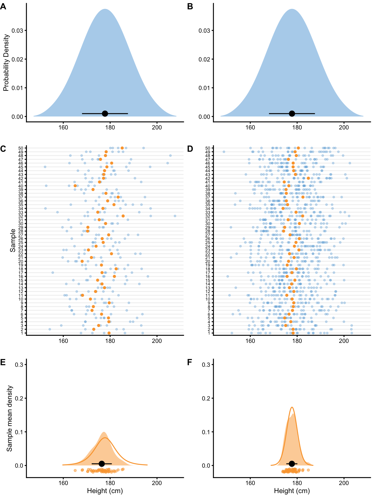

# Frequentist perspective

As already stated, using simulations is outstanding teaching tool [@carseyMonteCarloSimulation2013; @hopkinsUnderstandingStatisticsUsing2007], and also very useful for understanding the frequentist inference as well. Figure \@ref(fig:sampling-distribution-of-the-mean) (Panels A and B) depicts hypothetical male population where mean height $\mu$ is 177.8cm and SD ($\sigma$) is 10.16cm. From this population we are randomly *drawing* N=5 (left side panels on Figure \@ref(fig:sampling-distribution-of-the-mean)) and N=20 (right side panels on Figure \@ref(fig:sampling-distribution-of-the-mean)) individuals for which we estimate the `mean` height. Individuals are represented as blue dots (Panels C and D on Figure \@ref(fig:sampling-distribution-of-the-mean)), whereas estimated `mean` height is depicted as orange dot. Now imagine we repeat this sampling 50 times, calculate the mean for every sample, and then draw the distribution of the sampled means (Panels E an F on Figure \@ref(fig:sampling-distribution-of-the-mean)). This distribution is called *sampling distribution of the `sample mean`* and the `SD` of this distribution is referred to as *standard error* or *sampling error*. Since our estimate of interest is the `mean`, standard deviation of the sampling distribution of the mean is called *standard error of the mean* (`SEM`). On Panels E and F in the Figure \@ref(fig:sampling-distribution-of-the-mean), mean of the sampling `means` is indicated by a black dot, and error bars represent `SEM`.     

(\#fig:sampling-distribution-of-the-mean)(ref:sampling-distribution-of-the-mean-caption)

(ref:sampling-distribution-of-the-mean-caption) **Sampling distribution of the `mean`. A and B. **Distribution of the height in the population. From this population we draw samples. **C and D.** 50 sample are taken with N=5 (panel C) and N=20 (panel D) observations. Each observation is indicated by a blue dot. Calculated `mean`, as a parameter of interest, is indicated by an orange dot. **E and F.** Distribution of collected sample `means` from panels C and D. This distribution of the sample `means` is narrower, indicating higher precision when higher N is used. Black dot indicates the mean of the sample `means`, with error bars indicating `SD` of sample means. Orange line represents hypothetical distribution of the sample `means` when number of samples is infinitely large

As can be seen from the Figure \@ref(fig:sampling-distribution-of-the-mean), the sampling distribution of the `mean` looks like normal distribution. If the number of samples reach very large number or *infinity*, the sampling distribution of the `mean` will eventually be distributed with the `SEM` equal to (Equation \@ref(eq:sem-equation)):

$$
\begin{equation}
  SEM = \frac{\sigma}{\sqrt{N}}
  (\#eq:sem-equation)
\end{equation}
$$

This *theoretical* distribution is overlaid on the acquired sampling distribution from 50 samples in the Figure \@ref(fig:sampling-distribution-of-the-mean) (Panels E and F). Since the true $\sigma$ is not known, sample `SD` is utilized instead, in order to estimate the true `SEM` (Equation \@ref(eq:estimated-sem-equation)):

$$
\begin{equation}
  \hat{SEM} = \frac{SD}{\sqrt{N}}
  (\#eq:estimated-sem-equation)
\end{equation}
$$

The take-home point is that the larger the sample, the smaller the standard error, which is visually seen as narrower sampling distribution (compare N=5 and N=20 sampling distributions on Figure \@ref(fig:sampling-distribution-of-the-mean)). Another conclusion regarding frequentist inference, is that calculated probabilities revolve around sampling distribution of the sample `mean` and other long-frequency sampling distributions. Everything else are details. But as the saying goes, the devil is in the details.

Sampling distributions and equations for standard errors are derived algebraically for most estimators (e.g. `mean`, `SD`, `Cohen's d`), but for some estimators it might be hard to derive them, so other solutions do exist (like *bootstrapping* which will be covered in [Bootstrap] section). For example, sampling distribution of the change score proportions can be very difficult to be derived algebraically [@swintonStatisticalFrameworkInterpret2018]. For some estimators, mean of the long-frequency samples is different than the true population value, thus these estimators are termed *biased estimators*. One example of the biased estimator would be `SD` of the sample where we divide with $N$, instead of $N-1$. Estimators that have the mean of the long-frequency sample estimate equal to the true population parameter are called *unbiased estimators*. 

Although the sampling distribution of the `mean` looks like a normal distribution, it actually belongs to the *Student's t* distribution, which has fatter tails for smaller samples (Figure \@ref(fig:student-distribution)). Besides `mean` and `SD`, Student's t distribution also has *degrees of freedom* (DF) parameters, which is equal to N-1 for the sample `mean`. Normal distribution is equal to Student's t distribution when DF is infinitely large. 

(\#fig:student-distribution)(ref:student-distribution-caption)

(ref:student-distribution-caption) **Student's t-distribution**

Since Student's t distribution is fatter on the tails, critical values that cover 90, 95, and 99% of distribution mass are different than the commonly used ones for the normal distribution. Table \@ref(tab:student-critical-values) contains critical values for different DF. For example, 90% of the sampling distribution will be inside the $\bar{x} \pm 1.64 \times SEM$  interval for the normal distribution, but for Student t with DF=5, 90% of the sampling distribution will be inside the $\bar{x} \pm 2.02 \times SEM$ interval.  

(ref:student-critical-values-caption) **Critical values for Student's t distribution with different degrees of freedom**

<table>
<caption>(\#tab:student-critical-values)(ref:student-critical-values-caption)</caption>
 <thead>
  <tr>
   <th style="text-align:left;">  </th>
   <th style="text-align:right;"> 50% </th>
   <th style="text-align:right;"> 90% </th>
   <th style="text-align:right;"> 95% </th>
   <th style="text-align:right;"> 99% </th>
   <th style="text-align:right;"> 99.9% </th>
  </tr>
 </thead>
<tbody>
  <tr>
   <td style="text-align:left;"> DF=5 </td>
   <td style="text-align:right;"> 0.73 </td>
   <td style="text-align:right;"> 2.02 </td>
   <td style="text-align:right;"> 2.57 </td>
   <td style="text-align:right;"> 4.03 </td>
   <td style="text-align:right;"> 6.87 </td>
  </tr>
  <tr>
   <td style="text-align:left;"> DF=10 </td>
   <td style="text-align:right;"> 0.70 </td>
   <td style="text-align:right;"> 1.81 </td>
   <td style="text-align:right;"> 2.23 </td>
   <td style="text-align:right;"> 3.17 </td>
   <td style="text-align:right;"> 4.59 </td>
  </tr>
  <tr>
   <td style="text-align:left;"> DF=20 </td>
   <td style="text-align:right;"> 0.69 </td>
   <td style="text-align:right;"> 1.72 </td>
   <td style="text-align:right;"> 2.09 </td>
   <td style="text-align:right;"> 2.85 </td>
   <td style="text-align:right;"> 3.85 </td>
  </tr>
  <tr>
   <td style="text-align:left;"> DF=30 </td>
   <td style="text-align:right;"> 0.68 </td>
   <td style="text-align:right;"> 1.70 </td>
   <td style="text-align:right;"> 2.04 </td>
   <td style="text-align:right;"> 2.75 </td>
   <td style="text-align:right;"> 3.65 </td>
  </tr>
  <tr>
   <td style="text-align:left;"> DF=50 </td>
   <td style="text-align:right;"> 0.68 </td>
   <td style="text-align:right;"> 1.68 </td>
   <td style="text-align:right;"> 2.01 </td>
   <td style="text-align:right;"> 2.68 </td>
   <td style="text-align:right;"> 3.50 </td>
  </tr>
  <tr>
   <td style="text-align:left;"> (Normal) </td>
   <td style="text-align:right;"> 0.67 </td>
   <td style="text-align:right;"> 1.64 </td>
   <td style="text-align:right;"> 1.96 </td>
   <td style="text-align:right;"> 2.58 </td>
   <td style="text-align:right;"> 3.29 </td>
  </tr>
</tbody>
</table>

## Null-Hypothesis Significance Testing

There are two approaches to statistical inference, be it frequentist or Bayesian: *hypothesis testing* and *estimation* [@cummingNewStatisticsWhy2014; @kruschkeBayesianNewStatistics2018]. I will focus on the former, although latter will be covered as well. For the frequentist inference, mathematics behind both of these are the same and both involve standard errors. 

*Null-hypothesis significance testing* (NHST) is still one of the most dominant approaches to statistical inference, although heavily criticized (for example see [@cummingNewStatisticsWhy2014; @kruschkeBayesianNewStatistics2018]). In Figure \@ref(fig:sampling-distribution-of-the-mean), we have sampled from the known population, but in practice we don't know the true parameter values in the population, nor we are able to collect data from the whole population (unless it is a small one, but there is no need for statistical inference then, since the whole population is represented in our sample). Thus, we need to use sampled data to make inferences about the population. With NHST we want to *test* sample parameter or estimator (i.e. `mean` in this case) against the null-hypothesis ($H_{0}$). Null-hypothesis usually takes the *no effect* value, but it can take any value of interest for the researcher. 

Although this sounds mouthful, a simple example will make it clearer. Imagine that we do know the true population `mean` height, but in one particular region the `mean` height of the sample differs from the known population `mean`. If we assume that this region belongs to the same population, then we want to test to see how likely are we to sample `mean` we have acquired or more extreme. 

Figure \@ref(fig:null-hypothesis) contains known population `mean` height as the null-hypothesis and estimated probabilities of observing sample `mean` of 180, 182.5, and 185cm (or +2.2, +4.7, +7.2cm difference) *or larger* for sample sizes N=5, N=10 and N=20. Panel A on Figure \@ref(fig:null-hypothesis) depicts *one-sided* approach for estimating probability of observing these sample `mean` heights. One-sided approach is used when we are certain about the direction of the effect. *Two-sided* approach, on the other hand, calculates probability for the effect of the unknown direction. In this example that would be sample `mean` height difference of ±2.2, ±4.7, ±7.2cm or larger. Two-sided approach is depicted on the Panel B (Figure \@ref(fig:null-hypothesis)).   

(\#fig:null-hypothesis)(ref:null-hypothesis-caption)

(ref:null-hypothesis-caption) **Null-hypothesis significance testing. **Assuming null-hypothesis (true parameter value, or parameter value in the population, in this case `mean` or $\mu$) is true, probability of observing sample parameter of a given magnitude or larger, is estimated by calculating proportion of sampling distribution that is over sample parameter value. The larger the sample size, the smaller the width of the sampling distribution. **A.** One-sided approach is used when we are certain about the direction of the effect. **B.** Two-sided approach is used when expected direction of the effect is unknown

The calculated probability of observing sample mean or larger, given null-hypothesis, is called *p-value*. In other words, p-value is the probability of observing data (in this case sample `mean`) given the null hypothesis (Equation \@ref(eq:p-value-equation))

$$
\begin{equation}
  p \; value = p(Data | H{0}) 
  (\#eq:p-value-equation)
\end{equation}
$$

It is easy to interpret p-values as "probability of the null hypothesis (given data)" ($p(H{0}|Data)$), but that is erroneous. This is Bayesian interpretation (also called *inverse probability*) which is quite common, even for the experienced researchers. Unfortunately, p-values cannot be interpreted in such way, but rather as a "probability of data given null hypothesis".  

As you can see from the Figure \@ref(fig:null-hypothesis)), for the same difference in sample `mean` height, different sample sizes will produce different p-values. This is because sampling distribution of the `mean` will be narrower (i.e. smaller `SEM`) as the sample size increase. In other words, for the same effect (in this case sample `mean`), p-value will be smaller as the sample size gets bigger. It is thus important to realize that p-values don't tell us anything about the magnitude of the effect (in this case the difference between the sample `mean` and the known population `mean`).

The procedures of acquiring p-values are called *statistical tests*. With the example above, we are using one variation of the *Student t test*, where we are calculating the test value *t* using the following Equation \@ref(eq:t-test). 

$$
\begin{equation}
  \begin{split}
  t &= \frac{\bar{x} -\mu}{SEM} \\
  \\
  t &= \frac{\bar{x} -\mu}{\frac{SD}{\sqrt{N}}}
  \end{split}
  (\#eq:t-test)
\end{equation}
$$

P-value is then estimated by using the calculated t value and appropriate Student's t distribution (see Figure \@ref(fig:student-distribution)) to calculate the surface area over a particular value of t. This is usually done in the statistical program, or by using tables similar to Table \@ref(tab:student-critical-values) .  

Once the p-value is estimated, we need to decide whether to reject the null-hypothesis or not.  In order to do that, we need to define the error we are willing to accept. This error is called *alpha* (Greek $\alpha$) or *Type I* error and refers to making an error of rejecting the null-hypothesis when null-hypothesis is true. Out of sheer convenience, alpha is set to 0.1 (10% error), 0.05 (5% error) or 0.01 (1% error). 

If p-value is smaller than alpha, we will reject the null-hypothesis and state that the effect has *statistical significance*. The statistical significance has bad wording since it does not imply magnitude of the effect, only that the sample data come from a different population assumed by null-hypothesis.

Take the following example. Let's assume we have sample size of N=20 where sample `mean` is equal to 185cm. Using the known population `mean` (177.8cm) and `SD` (10.16cm), we get that $t=3.17$. Using two-sided test and alpha=0.05, can we reject the null-hypothesis? In order to do this we can refer to Table \@ref(tab:student-critical-values) and check that for DF=20 (which is not exact, but it will serve the purpose), 95% of sampling distribution (which leaves 2.5% on each tail which is equal to 5% alpha) will be within ±2.08. Since calculated $t=3.17$ is over ±2.08, we can reject the null-hypothesis with alpha=0.05. Figure \@ref(fig:null-hypothesis) (Panel B) depicts the exact p-value for this example, which is equal to p=0.005. Statistical software can calculate exact p-values, but before these were available, tables and procedure just describes were used instead. 

## Statistical Power

There is other type of error that we can commit: *Type II* error or *beta* (Greek $\beta$). In order to understand Type II error, we need to assume alternate hypothesis or $H{a}$. Type II error refers to the error we make when we reject the alternate-hypothesis when alternate-hypothesis is true. Type I and Type II error are inversely related - the more we are willing to make Type I errors, the less likely we are going to make Type II errors, and *vice versa* (Table \@ref(tab:error-types)). 

Table: (\#tab:error-types) **Type I and Type II errors**

|                  | True $H_{0}$ | True $H_{a}$ |
|------------------|--------------|--------------|
| Rejected $H_{0}$ |    Type I    |              |
| Rejected $H_{a}$ |              |   Type II    |

It is important to keep in mind that with NHST, we never *accept* any hypothesis, we either reject it or not. For example, we never say "null-hypothesis is accepted (p=0.23)", but rather "null-hypothesis is not rejected (p=0.23)". 

Assuming that alternate-hypothesis is true, probability of rejecting the null-hypothesis is equal to $1-\beta$. This is called *statistical power* and depends on the magnitude of the effect we are aiming to detect (or not-to-reject to correct myself). Figure \@ref(fig:statistical-power) depicts multiple examples of one-sided and two-sided statistical power calculations given the known alpha of 0.05 and null-hypothesis for difference in sample mean height of ±2.5, ±5, and ±7.5cm (+2.5, +5, and +7.5cm for one sided test) for N=5, N=10 and N=20. 

(\#fig:statistical-power)(ref:statistical-power-caption)

(ref:statistical-power-caption) **Statistical power. ** Statistical power is probability of detecting an effect of particular magnitude or larger. Visually, statistical power is dark blue surface and represents probability of rejecting the null-hypothesis given that the alternative hypothesis is true. **A.** One-sided approach. **B.** Two-sided approach

As can be seen from the Figure \@ref(fig:statistical-power), the higher the magnitude of the effect (in this case difference in height `means`), the more likely we are to detect it (by rejecting null-hypothesis). Statistical power is mostly used when planning the studies to estimate sample size needed to detect effects of magnitude of interest (usually using known or observed effect from previous studies, or even SESOI). For example, question such as "How big of a sample do I need to detect 2.5cm difference with 80% power, alpha 0.05 and expected sample SD of 10cm?" is answered by using statistical power analysis. Statistical power, or sample size for needed statistical power can be easily calculated for simple analysis, but for some more elaborate analyses simulations are needed.  

The frequentist approach to statistical inference is all about maintaining accepted error rates, particularly Type I, for both tests and estimates. This can be particularly difficult when *family-wise error rates* need to be controlled, and these can emerge when multiple NHST are done. Some techniques, called p-harking, can also introduce bias in the error rates by *fishing* for p-values (e.g. collecting samples until significant results are found). These topics are beyond the scope of this paper, but one of the reasons why some researchers prefer [Bayesian perspective]. 

## New Statistics: Confidence Intervals and Estimation

Rather than performing NHST, uncertainty of the estimated parameter can be represented with the *confidence interval* (CI). CIs are usually pretty hard to explain and non-intuitive since they do not carry any distributional information [^distribution_information]. It is thus better to refer to CIs as *compatibility intervals* [@gelmanAreConfidenceIntervals2019], since, let's say 95% confidence interval contains all the hypotheses parameter values that would not be rejected by p<0.05 NHST [@kruschkeBayesianNewStatistics2018]. This implies that, in the long-run (when sampling is repeated infinite number of times), 95% confidence interval will capture true parameter value 95% of the time. 

[^distribution_information]: It is quite common to erroneously interpret CIs as Bayesian *credible intervals* [@kruschkeBayesianNewStatistics2018; @mcelreathStatisticalRethinkingBayesian2015].

Assuming N=20 samples come from the population where the true `mean` height is equal to 177.8cm and `SD` is equal to 10.16cm, calculated 95% CIs around sample parameter estimate (in this case sample `mean`), in the long run, will capture true population parameter 95% of the time. Figure \@ref(fig:confidence-intervals) depicts first 100 samples out of total of 1,000 taken from the population with calculated 95% CIs. CIs that missed the true population parameter value are depicted in red. Table \@ref(tab:confidence-intervals-summary) contain the summary for this simulation. If this simulation is repeated for many more times, CIs will capture true population parameter 95% of the time, or in other words, have Type I error of 5%.  

(\#fig:confidence-intervals)(ref:confidence-intervals-caption)

(ref:confidence-intervals-caption) **$95\%$ confidence intervals for the sample `mean`, estimated for 100 samples (N=20 observations) drawn from population of known parameters (population `mean` is indicated by vertical line). **In the long-run, $95\%$ confidence intervals will span the true population value $95\%$ of the time. Confidence intervals that didn't span the true population parameter value are colored in red

<table>
<caption>(\#tab:confidence-intervals-summary)(ref:confidence-intervals-summary)</caption>
 <thead>
  <tr>
   <th style="text-align:right;"> Sample </th>
   <th style="text-align:right;"> Correct % </th>
   <th style="text-align:right;"> Type I Errors % </th>
  </tr>
 </thead>
<tbody>
  <tr>
   <td style="text-align:right;"> 1000 </td>
   <td style="text-align:right;"> 95.9 </td>
   <td style="text-align:right;"> 4.1 </td>
  </tr>
</tbody>
</table>

(ref:confidence-intervals-summary) **Type I errors in 1000 samples**

Similarly to different alphas, CIs can use different levels of confidence, usually 90%, 95%, 99%. As already mentioned, mathematics behind the confidence intervals is equal to mathematics behind NHST. In order to calculate two-sided CIs for the sample mean, the Equation \@ref(eq:ci-equation) is used:

$$
\begin{equation}
  CI = \bar{x} \pm t_{crit} \times \widehat{SEM} 
  (\#eq:ci-equation)
\end{equation}
$$

$T_{crit}$ can be found in the Table \@ref(tab:student-critical-values), where for 95% two-sided confidence and DF=20, is equal to 2.086. Using the example of observed sample mean of 185cm, known sample `SD` (10.16cm) and N=20 (which is equal to DF=19, but for the sake of example DF=20 will be used), calculated 95% confidence interval is equal to 180.26 to 189.74cm. From the compatibility interpretation standpoint, this CI means that the hypotheses with values ranging from 180.26 to 189.74cm, will not be rejected with alpha=0.05. 

Confidence intervals are great solution for visualizing uncertainties around estimates. Figure \@ref(fig:sample-mean-cis) depicts already used example in Figure \@ref(fig:null-hypothesis) (two-sided and one-sided p-values), but this time 95% CIs around the sample `means` are depicted. Please note that in scenarios where 95% CIs cross the null-hypothesis, NHST will yield p>0.05. This means that null-hypothesis is not rejected and results are not statistically significant. CIs can be thus used to visually inspect and conclude whether or not the null-hypothesis would be rejected or not if NHST is performed. 

(\#fig:sample-mean-cis)(ref:sample-mean-cis-caption)

(ref:sample-mean-cis-caption) **$95\%$ Confidence intervals for sample mean.** Null-hypothesis of the population parameter value is indicated by vertical dashed line. If the $95\%$ confidence interval doesn't touch or cross the null-hypothesis parameter value, p-value is less than 0.05 and effect is statistically significant (given alpha of 0.05). **A.** One-sided confidence intervals. **B.** Two-sided confidence intervals

## Minimum Effect Tests

NHST doesn't tell us anything about the magnitudes of the effect. Just because the test is statistically significant (p<0.05), it's doesn't imply practically meaningful effect. Rather than using null-hypothesis of *no effect*, we can perform numerous one-sided NHSTs by using SESOI thresholds to infer practical significance. These are called *minimum effect tests* (METs) and can distinguish between 6 different conclusions: *lower*, *not-higher*, *equivalent*, *not-lower*, *higher*, and *equivocal* effect. Figure \@ref(fig:effect-magnitudes) depicts how SESOI and CIs can be used to distinguish between these 6 magnitude-based conclusions [@barkerInferenceMagnitudesEffects2008; @sainaniMagnitudeBasedInference2019]. 

(\#fig:effect-magnitudes)(ref:effect-magnitudes-caption)

(ref:effect-magnitudes-caption) **Inference about magnitudes of effects.** Error bars represent confidence intervals around estimate of interest. Adapted and modified from @barkerInferenceMagnitudesEffects2008; @sainaniMagnitudeBasedInference2019

### Individual vs. Parameter SESOI

So far we have used SESOI to infer practically significant differences or changes at the *individual* level. For example, answering what is the practically meaningful difference in height, SESOI was used to calculate proportions and chances of observing individuals with lower, equivalent and higher magnitudes of effects. 

In prediction tasks, SESOI was used to infer practically meaningful prediction error. This helped answering the question regarding whether the individual predictions are within practically equivalent region.

However, apart from using SESOI to infer individual change, difference, and prediction magnitudes, SESOI can also be used to evaluate statistics or parameters against practically significant anchor. For example, in Equation \@ref(eq:diff-to-SESOI), we have divided `mean` group difference with SESOI to create magnitude-based estimator. But here, we assumed that the same magnitude used at the individual level is of equal practical importance at the group level (i.e. aggregate level using the `mean` estimator). For example, individual change of ±5kg might be practically important at the level of the individual, but not at the level of the group (i.e. parameter), and *vice versa*. Usually, they are assumed to be the same (see also [Ergodicity] section). 

Since sample `mean` difference is the estimator of the parameter in the population we are interested in estimating, we tend to use SESOI to give practical anchors for parameters as well. It could be argued that different terms should be used for the parameter SESOI (particularly for standardized estimators such as `Cohen's d`) *versus* individual SESOI. For example, we can use ROPE term for parameters [@kruschkeBayesianDataAnalysis2018; @kruschkeBayesianNewStatistics2018], and SESOI for individual-level magnitude inferences. For practical purposes they are considered equal, although I believe further discussion about this distinction is warranted, but outside the scope of this book. 

### Two one-sided tests of equivalence

Besides testing again null-hypothesis of no-effect, we can use the two one-sided tests (TOST) procedure to test for *equivalence* and reject the presence of the smallest effect size of interest (SESOI) [@lakensEquivalenceTestingPsychological2018; @lakensEquivalenceTestsPractical2017]. TOST involves using two one-sided NHSTs assuming parameter values at SESOI thresholds (Figure \@ref(fig:tost)). Since the TOST produces two p-values, the larger of the two is reported. A conclusion of statistical equivalence is warranted when the larger of the two p-values is smaller than alpha [@lakensEquivalenceTestsPractical2017]. 

From estimation perspective, statistical equivalence at the level of alpha=0.05 can be inferred if the 90% (90% not 95%; it is not a typo) CI falls completely within SESOI band.

(\#fig:tost)(ref:tost-caption)

(ref:tost-caption) **Equivalence test using two one-sided tests (TOST). **Equivalence test involves two NHSTs at SESOI thresholds and calculates two one-sided p-values, out of which a larger one is reported as result. Error bars represent 90% confidence intervals.

### Superiority and Non-Inferiority

Two same NHSTs at SESOI thresholds are utilized to test superiority and non-inferiority of the effects. In other words, we want to conclude whether the effect is higher and/or not-lower than SESOI. To achieve this, two one-sided NHSTs are performed to estimate the probability of observing effect in the positive direction (Figure \@ref(fig:superiority-non-inferiority)). 

(\#fig:superiority-non-inferiority)(ref:superiority-non-inferiority-caption)

(ref:superiority-non-inferiority-caption) **Superiority and Non-Inferiority tests. **Similar to equivalence test using TOST procedure, superiority and non-inferiority tests involve two one-sided NHSTs at SESOI thresholds in the positive direction. Error bars represent 90% confidence intervals.

### Inferiority and Non-Superiority

To test the inferiority and non-superiority of the effects, two one-sided NHSTs are performed to estimate the probability of observing effect in the negative direction (Figure \@ref(fig:inferiority-non-superiority)). 

(\#fig:inferiority-non-superiority)(ref:inferiority-non-superiority-caption)

(ref:inferiority-non-superiority-caption) **Inferiority and Non-Superiority tests. **Similar to equivalence test using TOST procedure, inferiority and non-superiority tests involve two one-sided NHSTs at SESOI thresholds in the negative direction. Error bars represent 90% confidence intervals.

### Inference from METs

The aforementioned METs provide five p-values: for lower (inferiority), not-higher (non-superiority), equivalent (equivalence), not-lower (non-inferiority), and higher (superiority) effect magnitude. These p-values can be used to make magnitude-based inferences about the effects. Figure \@ref(fig:met-results) depicts already used examples to calculate p-values from METs and the final inference on the magnitude of the effect (see Figure \@ref(fig:effect-magnitudes)).

(\#fig:met-results)(ref:met-results-caption)

(ref:met-results-caption) **Minimum Effect Test results. **Error bars represent 90% confidence intervals.

## Magnitude Based Inference

Batterham and Hopkins [@batterhamMakingMeaningfulInferences2006; @hopkinsProgressiveStatisticsStudies2009] proposed novel approach in making meaningful inference about magnitudes, called *magnitude based inference* (MBI). MBI has been recently criticized [@barkerInferenceMagnitudesEffects2008; @borgBayesianMethodsMight2018; @curran-everettMagnitudebasedInferenceGood2018; @hopkinsVindicationMagnitudeBasedInference2018; @nevillCanWeTrust2018; @sainaniMagnitudeBasedInference2019; @sainaniProblemMagnitudebasedInference2018; @welshMagnitudebasedInferenceStatistical2015] for interpreting CIs as Bayesian credible intervals and for not controlling Type I and Type II errors. 

As explained, CIs doesn't contain any probability distribution information about the true parameter. Although CIs, Bayesian *credible intervals* (with flat or non-informative *prior*), and *bootstrap CIs* tend to converge to the approximately same values for very simple tests (such as t-test for the sample `mean`), interpreting CIs established using frequentist approach as Bayesian credible intervals is not valid approach to statistical inference [@sainaniMagnitudeBasedInference2019]. Figure \@ref(fig:mbi) depicts Bayesian interpretation of the confidence intervals used in MBI. 

Using MBI as a simple descriptive approach to interpret CIs can be rationalized, but making inferences from estimated probabilities is not recommended [@caldwellBasicStatisticalConsiderations2019]. If frequentist approaches are used for magnitude-based statistical inference, METs should be used instead.

(\#fig:mbi)(ref:mbi-caption)

(ref:mbi-caption) **Magnitude-based inference use inappropriate Bayesian interpretation of the confidence intervals to calculate lower, equivalent, and higher probabilities of the effect. **Vertical dashed lines represent SESOI.  thresholds. Error bars represent 90% confidence intervals.

There are numerous problems with frequentist inference [@kruschkeBayesianNewStatistics2018; @kruschkeBayesianDataAnalysis2018]. The results are not intuitive and are usually erroneously interpreted from the Bayesian perspective. Error rates need to be controlled for and adjusted when multiple comparisons are made, or when different *stopping* techniques are used, sampling distributions are unknown for some estimators and cannot be derived algebraically. Various assumptions such as assumptions of normality, non-colinearity and others, need to be made and tested for, and for more complex models, such as *hierarchical models*, p-values and CIs are only approximated [@kruschkeBayesianDataAnalysis2018; @kruschkeBayesianNewStatistics2018]. It is beyond this short chapter to delve into more details, regarding the frequentist approach to statistical inference, and readers are directed to references provided in this section. 

