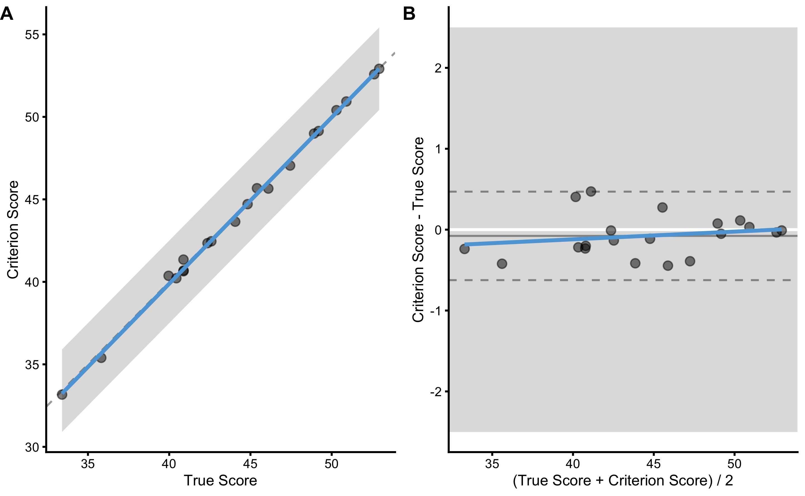
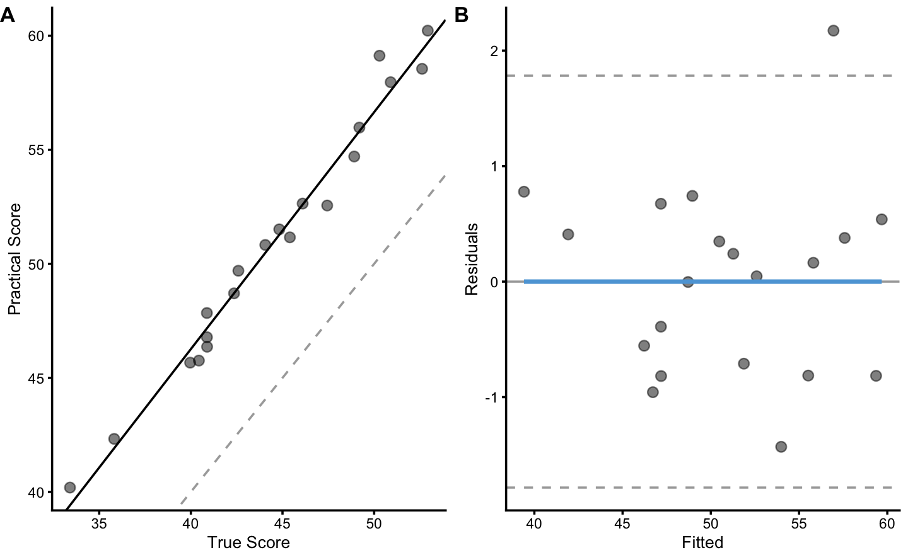
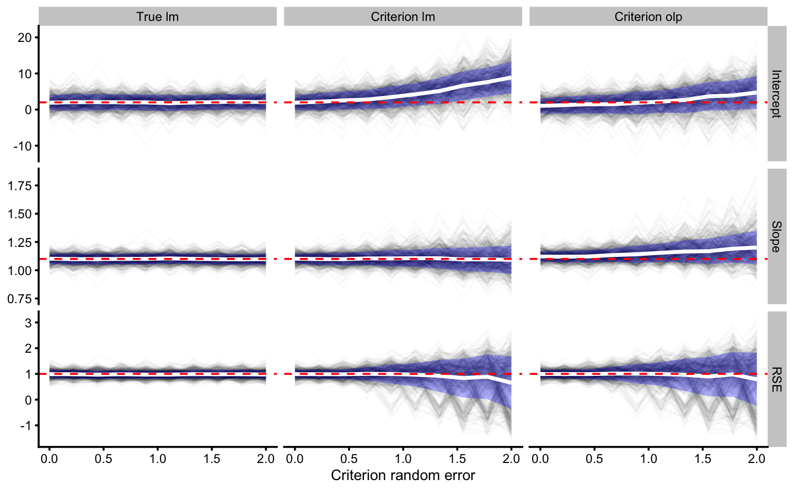

# Validity and Reliability

Although we have *sort-of-touched* validity and reliability topics in the [Measurement Error] chapter, here I will spend more time explaining the concepts and the use of `bmbstats` functions to perform the analysis. As pointed out multiple times thorough this book, simulation and the knowledge of the data generating process (DGP) is very helpful in understanding the analysis and what we are trying to do. To understand validity and reliability analyses, it is thus best to generate the data (i.e. simulate the DGP). 

## Data generation

Let's imagine that we know the *true* vertical jump scores for N=20 individuals. We measure this true score with a *gold standard* device twice (i.e. trial 1 and trial 2). Unfortunately, this *criterion* device is expensive or takes a lot of time, so we have developed a *practical* device that measures vertical jump height much quicker and cheaper. Unfortunately, we do not know the measurement error of this device and we want to estimate how valid and reliable this practical measure is. Luckily for us, we generate the data, so we actually know all the measurement error components (i.e. fixed and proportional bias components of the the systematic error and random error). 

The below code generates the data for both criteriona and practical measures using two trials and N=20 athletes:


```r
require(tidyverse)
require(bmbstats)
require(cowplot)

n_subjects <- 20

criterion_random <- 0.3
practical_fixed <- 2
practical_proportional <- 1.1
practical_random <- 1

set.seed(1667)

agreement_data <- tibble(
  Athlete = paste(
    "Athlete",
    str_pad(
      string = seq(1, n_subjects),
      width = 2,
      pad = "0"
    )
  ),
  True_score = rnorm(n_subjects, 45, 5),
  Criterion_score.trial1 = 0 + (True_score * 1) + rnorm(n_subjects, 0, criterion_random),
  Criterion_score.trial2 = 0 + (True_score * 1) + rnorm(n_subjects, 0, criterion_random),
  Practical_score.trial1 = practical_fixed + (True_score * practical_proportional) + rnorm(n_subjects, 0, practical_random),
  Practical_score.trial2 = practical_fixed + (True_score * practical_proportional) + rnorm(n_subjects, 0, practical_random)
)

head(agreement_data)
#> # A tibble: 6 x 6
#>   Athlete True_score Criterion_score… Criterion_score… Practical_score…
#>   <chr>        <dbl>            <dbl>            <dbl>            <dbl>
#> 1 Athlet…       52.9             52.9             52.9             60.2
#> 2 Athlet…       42.4             42.3             42.2             48.7
#> 3 Athlet…       49.2             49.1             49.5             56.0
#> 4 Athlet…       44.8             44.7             44.8             51.5
#> 5 Athlet…       40.0             40.4             40.1             45.7
#> 6 Athlet…       42.6             42.5             42.2             49.7
#> # … with 1 more variable: Practical_score.trial2 <dbl>
```

The assumption of the above DGP is that true score stays unchanged for trial 1 and trial 2. Thus, the only thing that creates variance in the criterion and practical measures is the random error component of the measurement error. 

It is also assumed that there is no *biological noise* involved in the measurement error.  We will make this example a bit more complex later on, so for now let's stick to this sand box example. 

## Validity

*“How well does the measure measure what it's supposed to measure?”* [@hopkinsBiasBlandAltmanNot2004; @hopkinsSocraticDialogueComparison2010; @hopkinsSpreadsheetsAnalysisValidity2015] is the question validity analysis tries to answer. There are few common approaches to estimate validity of the measurements, with Bland-Altman analysis [@blandStatisticalMethodsAssessing1986; @giavarinaUnderstandingBlandAltman2015] being one of the most used (also referred to as the *method of the differences*), linear regression, and *ordinary least products* (OLP) being a better alternative [@ludbrookLinearRegressionAnalysis2010; @ludbrookPrimerBiomedicalScientists2012; @ludbrookSPECIALARTICLECOMPARING1997; @ludbrookStatisticalTechniquesComparing2002; @mullineauxAssessmentBiasComparing1999]. Since we have simulated the DGP, we know exactly the measurement error components as well as true scores (which we do not know in the *real life*). 

### True vs Criterion

To *re-create* DGP parameters for the criterion measure, we will use the true scores as a predictor, and criterion score (trial 1) as the outcome. Here is the scatter plot:


```r
ggplot(
  agreement_data,
  aes(
    x = True_score,
    y = Criterion_score.trial1
  )
) +
  theme_cowplot(8) +
  geom_point()
```


For the sake of this example, let's assume that SESOI is equal to ±2.5cm (for the criterion score). We are interested in few things: (1) re-create the DGP components, or (2) can we predict the true score from the criterion score (which implies flipping predictor and outcome variables). Most validity research papers in the sports science are concerned with with describing or explaining the validity by trying to re-create the DGP components, while not many are concerned with predictive performance of the model. Let's deal with the descriptive (i.e explanatory) tasks first. 

#### Method of the differences

Using the `bmbstats::plot_pair_BA` function we can generate Bland-Altman plot for the true score and the criterion score:


```r
bmbstats::plot_pair_BA(
  predictor = agreement_data$True_score,
  outcome = agreement_data$Criterion_score.trial1,
  predictor_label = "True Score",
  outcome_label = "Criterion Score",
  SESOI_lower = -2.5,
  SESOI_upper = 2.5
)
```



Panel A in the previous figure depicts simple scatter plot with added *identity line* (dashed line), SESOI band around identity line, and linear regression model (blue line; this could be changed using the `control = bmbstats::plot_contron()` parameter). Panel B depicts the difference between criterion and true score (oy y-axis) and their average (on the x-axis). Using SESOI of ±2.5cm, we can conclude that all the differences fall within the SESOI band, confirming that the criterion measure has outstanding practical validity characteristic. 

How do we re-create the DGP parameters? Well, using Bland-Altman method, both fixed and proportional bias are lumped together in the `bias` (i.e. `mean difference`) estimator, and random error component is estimated using `SD` of the differences. Let's write a simple estimator function to perform method of the differences validity analysis (do not mind the names of the function parameters; I know they make thing more confusing, but bear with me for a second):


```r
differences_method <- function(data,
                               criterion,
                               practical,
                               SESOI_lower = 0,
                               SESOI_upper = 0,
                               na.rm = FALSE) {
  practical_obs <- data[[practical]]
  criterion_obs <- data[[criterion]]

  SESOI_range <- SESOI_upper - SESOI_lower

  diff <- criterion_obs - practical_obs

  n_obs <- length(diff)

  mean_diff <- mean(diff, na.rm = na.rm)
  sd_diff <- sd(diff, na.rm = na.rm)

  PPER <- stats::pt((SESOI_upper - mean_diff) / sd_diff, df = n_obs - 1) -
    stats::pt((SESOI_lower - mean_diff) / sd_diff, df = n_obs - 1)

  c(
    "Mean diff" = mean_diff,
    "SD diff" = sd_diff,
    PPER = PPER
  )
}

# Run the analysis
differences_method(
  data = agreement_data,
  criterion = "Criterion_score.trial1",
  practical = "True_score",
  SESOI_lower = -2.5,
  SESOI_upper = 2.5
)
#>   Mean diff     SD diff        PPER 
#> -0.07726199  0.26125825  0.99999999
```

We do know that the random error for the criterion score is 0.3cm since we have generated the data, and `SD diff` is our estimate of that parameter. Let's perform bootstrap method to get confidence intervals for these estimators using `bmbstats::validity_analysis` function with `differences_method` as a parameter:


```r
difference_validity <- bmbstats::validity_analysis(
  data = agreement_data,
  criterion = "Criterion_score.trial1",
  practical = "True_score",
  SESOI_lower = -2.5,
  SESOI_upper = 2.5,
  estimator_function = differences_method,
  control = model_control(seed = 1667)
)

difference_validity
#> Bootstrap with 2000 resamples and 95% bca confidence intervals.
#> 
#>  estimator       value      lower      upper
#>  Mean diff -0.07726199 -0.1768739 0.04312759
#>    SD diff  0.26125825  0.1964889 0.34579624
#>       PPER  0.99999999  0.9999993 1.00000000
```

As can be seen in the results, 95% CIs for the `SD diff` captures the true DGP parameter value for the random error of the criterion measure.

#### Linear Regression method

Another approach involves using simple linear regression method, where `RSE` is used to estimate `PPER` estimator. Using linear regression we can estimate the intercept (i.e. fixed bias), slope (i.e. proportional bias), and random error (i.e. `RSE`). Before writing the estimators function, let's plot the relationship using `bmbstats::plot_pair_lm`:


```r
bmbstats::plot_pair_lm(
  predictor = agreement_data$True_score,
  outcome = agreement_data$Criterion_score.trial1,
  predictor_label = "True Score",
  outcome_label = "Criterion Score",
  SESOI_lower = -2.5,
  SESOI_upper = 2.5
)
```


The linear regression parameters are used as estimates of the measurement error:


```r
lm_method <- function(data,
                      criterion,
                      practical,
                      SESOI_lower = 0,
                      SESOI_upper = 0,
                      na.rm = FALSE) {
  practical_obs <- data[[practical]]
  criterion_obs <- data[[criterion]]

  SESOI_range <- SESOI_upper - SESOI_lower

  lm_model <- lm(criterion_obs ~ practical_obs)

  n_obs <- length(criterion_obs)

  intercept <- coef(lm_model)[[1]]
  slope <- coef(lm_model)[[2]]
  rse <- summary(lm_model)$sigma

  # This is very close to 0, but will use it nonetheless
  mean_diff <- mean(residuals(lm_model))

  PPER <- stats::pt((SESOI_upper - mean_diff) / rse, df = n_obs - 1) -
    stats::pt((SESOI_lower - mean_diff) / rse, df = n_obs - 1)

  c(
    "Intercept" = intercept,
    "Slope" = slope,
    "RSE" = rse,
    PPER = PPER
  )
}

# Run the analysis
lm_method(
  data = agreement_data,
  criterion = "Criterion_score.trial1",
  practical = "True_score",
  SESOI_lower = -2.5,
  SESOI_upper = 2.5
)
#>  Intercept      Slope        RSE       PPER 
#> -0.4518909  1.0084198  0.2643645  1.0000000
```

We will use `bmbstats::validity_analysis` to get 95% CIs around the estimates:


```r
lm_validity <- bmbstats::validity_analysis(
  data = agreement_data,
  criterion = "Criterion_score.trial1",
  practical = "True_score",
  SESOI_lower = -2.5,
  SESOI_upper = 2.5,
  estimator_function = lm_method,
  control = model_control(seed = 1667)
)

lm_validity
#> Bootstrap with 2000 resamples and 95% bca confidence intervals.
#> 
#>  estimator      value      lower     upper
#>  Intercept -0.4518909 -1.0759400 0.8336904
#>      Slope  1.0084198  0.9825368 1.0220937
#>        RSE  0.2643645  0.1859689 0.3575745
#>       PPER  1.0000000  0.9999988 1.0000000
```

Since we know the DGP behind the criterion measure, we can confirm that fixed bias estimate (i.e. intercept) CI captured 0, proportional bias (i.e. slope) captured 1 and that random error (i.e. `RSE`) captured 0.3. We have thus managed to re-create DGP parameters using simple linear regression. 

We can also perform NHST for fixed and proportional bias, and random error (`RSE`):


```r
bmbstats::bootstrap_NHST(
  lm_validity,
  estimator = "Intercept",
  null_hypothesis = 0,
  test = "two.sided"
)
#> Null-hypothesis significance test for the `Intercept` estimator
#> Bootstrap result: Intercept=-0.452, 95% CI [-1.076, 0.834]
#> H0=0, test: two.sided
#> p=0.262
```


```r
bmbstats::bootstrap_NHST(
  lm_validity,
  estimator = "Slope",
  null_hypothesis = 1,
  test = "two.sided"
)
#> Null-hypothesis significance test for the `Slope` estimator
#> Bootstrap result: Slope=1.008, 95% CI [0.983, 1.022]
#> H0=1, test: two.sided
#> p=0.322
```


```r
bmbstats::bootstrap_NHST(
  lm_validity,
  estimator = "RSE",
  null_hypothesis = criterion_random,
  test = "two.sided"
)
#> Null-hypothesis significance test for the `RSE` estimator
#> Bootstrap result: RSE=0.264, 95% CI [0.186, 0.358]
#> H0=0.3, test: two.sided
#> p=0.427
```

Please notice the similarity between `SD diff` from the method of differences and `RSE` estimator, both of which are estimates of the random error of the measurement error:


```r
rbind(
  difference_validity$estimators[2, ],
  lm_validity$estimators[3, ]
)
#>   estimator     value     lower     upper
#> 2   SD diff 0.2612583 0.1964889 0.3457962
#> 3       RSE 0.2643645 0.1859689 0.3575745
```

#### OLP method

Ordinary least product approach calculates the residuals using product between y-residual $y - \hat{y}$ and x-residual $x - \hat{x}$. This method is used more in reliability analysis when we do not know which variable is predictor and which is the outcome or target, but it can be used with the validity analysis as well. OLP method doesn't assume that the x-variable is without random error, which in this example doesn't help since we are using the true score (and the true score is without random error). But it is useful *exactly* for this reason for the real-world analysis when both variables (x and y) have random error involved. Here is a quote from Ludbrook 1997 paper [@ludbrookSPECIALARTICLECOMPARING1997, pp.194]:

>"It is an important assumption of OLS regression that whereas the values of Y in the population that has been sampled are attended by error, those of X are not. Strictly, this can be so only if the X values are categorical: for instance, conditions, treatments or places. However, most statistical theorists follow the advice of Berkson, which is that if the X values have been fixed in advance by the experimenter (e.g. by specifying times, doses or settings of a pump), then they can be regarded for practical purposes as error-free. When X is error-free, Model I regression analysis is the proper form to use. It includes the well-known OLS regression technique as well as modifications of it, such as weighted least squares (WLS) regression.

>When both X and Y are free to vary and are attended by error, some statisticians allow that Model I regression analysis may still be used if it is certain, on biological grounds, that Y must depend on X and never the reverse. This is the case, for instance, in dose- or stimulus-response relationships. Even then, the Model I regression line should be used for empirical, rather than explanatory, purposes.

>When investigators plan experiments to compare methods of measurement, they must assume that both Y and X will be attended by random error. Moreover, it is impossible to decide which method should be regarded as dependent and which independent and because of this it is wrong to use Model I regression analysis. Instead, one or another form of Model I regression analysis must be used. These are described later."

To plot OLP regression, use `bmbstats::plot_pair_OLP` function. The OLP regression, in this case, looks very close to simple linear regression: 


```r
bmbstats::plot_pair_OLP(
  predictor = agreement_data$True_score,
  outcome = agreement_data$Criterion_score.trial1,
  predictor_label = "True Score",
  outcome_label = "Criterion Score",
  SESOI_lower = -2.5,
  SESOI_upper = 2.5
)
```


The default estimator function in `bmbstats::validity_analysis` (`bmbstats::validity_estimators`) and `bmbstats::reliability_analysis` (`bmbstats::reliability_estimators`; described later) uses OLP method implemented in `bmbstats::OLP_regression` function. Let's check the output:


```r
bmbstats::validity_estimators(
  data = agreement_data,
  criterion = "Criterion_score.trial1",
  practical = "True_score",
  SESOI_lower = -2.5,
  SESOI_upper = 2.5
)
#>  SESOI lower  SESOI upper  SESOI range    Intercept        Slope          RSE 
#>   -2.5000000    2.5000000    5.0000000   -0.5024828    1.0095568    0.2644390 
#>  Pearson's r    R Squared SESOI to RSE         PPER          SDC 
#>    0.9988737    0.9977487   18.9079555    1.0000000    0.5534771
```

Additional estimator in this list is `SDC`. `SDC` is the *smallest detectable change*, and in this case represents the smallest change in the criterion measure for which we have 95% confidence it involves change in the true score. In other words, `SDC` represents a 95% *coverage* in the criterion for the same value of true score. `SDC` is calculated using `RSE` and critical threshold using t-distribution to have a 95% coverage.  

To estimate 95% CIs for these estimators, use the *default* `bmbstats::validity_analysis`:


```r
olp_validity <- bmbstats::validity_analysis(
  data = agreement_data,
  criterion = "Criterion_score.trial1",
  practical = "True_score",
  SESOI_lower = -2.5,
  SESOI_upper = 2.5,
  control = model_control(seed = 1667)
)
#> [1] "All values of t are equal to  2.5 \n Cannot calculate confidence intervals"
#> [1] "All values of t are equal to  5 \n Cannot calculate confidence intervals"

olp_validity
#> Bootstrap with 2000 resamples and 95% bca confidence intervals.
#> 
#>     estimator      value      lower      upper
#>   SESOI lower -2.5000000         NA         NA
#>   SESOI upper  2.5000000         NA         NA
#>   SESOI range  5.0000000         NA         NA
#>     Intercept -0.5024828 -1.1085643  0.7298272
#>         Slope  1.0095568  0.9843866  1.0226211
#>           RSE  0.2644390  0.1859924  0.3579299
#>   Pearson's r  0.9988737  0.9971349  0.9996741
#>     R Squared  0.9977487  0.9942780  0.9993484
#>  SESOI to RSE 18.9079555 13.9917931 27.0040586
#>          PPER  1.0000000  0.9999988  1.0000000
#>           SDC  0.5534771  0.3892867  0.7491559
```

#### What happens if we flip the variables?

In the DGP we have used true scores to generate both criterion and practical measures, thus using true score as predictor (x-variable) and criterion as the outcome (y-variable) is valid approach to re-create the DGP parameters. Please note that `bmbstats::validity_analysis` uses `practical` parameter as predictor (x-variable) and `criterion` parameter as outcome variable (y-variable). 

But in the real life (as we will soon see when using criterion and practical measures) we do not know the true scores and we might be interested in *predicting* criterion from the practical measures. Let's see what happens when we flip the predictor and outcome for all three methods:


```r
difference_validity_flip <- bmbstats::validity_analysis(
  data = agreement_data,
  practical = "Criterion_score.trial1",
  criterion = "True_score",
  SESOI_lower = -2.5,
  SESOI_upper = 2.5,
  estimator_function = differences_method,
  control = model_control(seed = 1667)
)

difference_validity_flip
#> Bootstrap with 2000 resamples and 95% bca confidence intervals.
#> 
#>  estimator      value       lower     upper
#>  Mean diff 0.07726199 -0.04312759 0.1768739
#>    SD diff 0.26125825  0.19648887 0.3457962
#>       PPER 0.99999999  0.99999933 1.0000000
```


```r
lm_validity_flip <- bmbstats::validity_analysis(
  data = agreement_data,
  practical = "Criterion_score.trial1",
  criterion = "True_score",
  SESOI_lower = -2.5,
  SESOI_upper = 2.5,
  estimator_function = lm_method,
  control = model_control(seed = 1667)
)

lm_validity_flip
#> Bootstrap with 2000 resamples and 95% bca confidence intervals.
#> 
#>  estimator     value      lower     upper
#>  Intercept 0.5472786 -0.6599661 1.1190949
#>      Slope 0.9894180  0.9770752 1.0135275
#>        RSE 0.2618619  0.1813661 0.3559808
#>       PPER 1.0000000  0.9999989 1.0000000
```


```r
olp_validity_flip <- bmbstats::validity_analysis(
  data = agreement_data,
  practical = "Criterion_score.trial1",
  criterion = "True_score",
  SESOI_lower = -2.5,
  SESOI_upper = 2.5,
  control = model_control(seed = 1667)
)
#> [1] "All values of t are equal to  2.5 \n Cannot calculate confidence intervals"
#> [1] "All values of t are equal to  5 \n Cannot calculate confidence intervals"

olp_validity_flip
#> Bootstrap with 2000 resamples and 95% bca confidence intervals.
#> 
#>     estimator      value      lower      upper
#>   SESOI lower -2.5000000         NA         NA
#>   SESOI upper  2.5000000         NA         NA
#>   SESOI range  5.0000000         NA         NA
#>     Intercept  0.4977261 -0.7419619  1.0837733
#>         Slope  0.9905337  0.9778841  1.0158849
#>           RSE  0.2619357  0.1812142  0.3560398
#>   Pearson's r  0.9988737  0.9971349  0.9996741
#>     R Squared  0.9977487  0.9942780  0.9993484
#>  SESOI to RSE 19.0886553 14.1755001 27.7275419
#>          PPER  1.0000000  0.9999989  1.0000000
#>           SDC  0.5482377  0.3792856  0.7451999
```

Let's combine the result for the random error estimates so we can compare them all:


```r
rand_err_estimates <- rbind(
  data.frame(outcome = "Criterion", method = "Difference", difference_validity$estimators[2, ]),
  data.frame(outcome = "True", method = "Difference", difference_validity_flip$estimators[2, ]),
  data.frame(outcome = "Criterion", method = "lm", lm_validity$estimators[3, ]),
  data.frame(outcome = "True", method = "lm", lm_validity_flip$estimators[3, ]),
  data.frame(outcome = "Criterion", method = "olp", olp_validity$estimators[6, ]),
  data.frame(outcome = "True", method = "olp", olp_validity_flip$estimators[6, ])
)

print(rand_err_estimates, row.names = FALSE)
#>    outcome     method estimator     value     lower     upper
#>  Criterion Difference   SD diff 0.2612583 0.1964889 0.3457962
#>       True Difference   SD diff 0.2612583 0.1964889 0.3457962
#>  Criterion         lm       RSE 0.2643645 0.1859689 0.3575745
#>       True         lm       RSE 0.2618619 0.1813661 0.3559808
#>  Criterion        olp       RSE 0.2644390 0.1859924 0.3579299
#>       True        olp       RSE 0.2619357 0.1812142 0.3560398
```

As can be seen from the table, the estimates for the random error component of the criterion measure are very similar (although `SD diff` is smaller due dividing by $N-1$, while `RSE` uses $N-k-1$, where k is number of predictors, thus we get $N-2$) regardless of the method and which variable is the predictor and which is outcome. But this is the case since true score is the *true score* without measurement error. Let's see what happens in the *real-world*.

### Practical vs Criterion

In the real-world, we do not know the true scores. We can only use some type of the gold standard measure. In our DGP simulation we have generated both criterion and practical measures using the known true scores and measurement error for the each measure. Let's check if we can re-create DGP parameters for the practical measure (which has both proportional and fixed bias, as well as larger random error than criterion) using the criterion score. Here is the scatter plot of the two:


```r
ggplot(
  agreement_data,
  aes(
    x = True_score,
    y = Practical_score.trial1
  )
) +
  theme_cowplot(8) +
  geom_point()
```


To re-create DGP for the practical measure, we need to use true score as the predictor (since that is how we have generated the practical scores). Let's use the simple linear regression method to do so:


```r
bmbstats::plot_pair_lm(
  predictor = agreement_data$True_score,
  outcome = agreement_data$Practical_score.trial1,
  predictor_label = "True Score",
  outcome_label = "Practical Score"
)
```



And let's estimate the 95% bootstrap confidence intervals:


```r
lm_validity_practical <- bmbstats::validity_analysis(
  data = agreement_data,
  criterion = "Practical_score.trial1",
  practical = "True_score",
  SESOI_lower = NA,
  SESOI_upper = NA,
  estimator_function = lm_method,
  control = model_control(seed = 1667)
)

lm_validity_practical
#> Bootstrap with 2000 resamples and 95% bca confidence intervals.
#> 
#>  estimator     value     lower    upper
#>  Intercept 4.7157542 0.6929173 7.345273
#>      Slope 1.0386315 0.9758422 1.132740
#>        RSE 0.8518886 0.6168049 1.304054
#>       PPER        NA        NA       NA
```

In our DGP, we have used fixed bias equal to 2cm, proportional bias equal to 1.1, and random error equal to 1cm to generate the practical scores. As can be seen from results, our 95% CI captured the true DGP parameter values. 

Unfortunately, we have to use the criterion measure, since we do not know the true scores. Let's check the results:


```r
bmbstats::plot_pair_lm(
  predictor = agreement_data$Criterion_score.trial1,
  outcome = agreement_data$Practical_score.trial1,
  predictor_label = "Criterion Score",
  outcome_label = "Practical Score"
)
```


And let's estimate the bootstrap 95% CIs:


```r
lm_validity_practical_criterion <- bmbstats::validity_analysis(
  data = agreement_data,
  criterion = "Practical_score.trial1",
  practical = "Criterion_score.trial1",
  SESOI_lower = NA,
  SESOI_upper = NA,
  estimator_function = lm_method,
  control = model_control(seed = 1667)
)

lm_validity_practical_criterion
#> Bootstrap with 2000 resamples and 95% bca confidence intervals.
#> 
#>  estimator     value     lower    upper
#>  Intercept 5.3054383 0.8089323 8.054704
#>      Slope 1.0271620 0.9616332 1.126357
#>        RSE 0.9111659 0.7303417 1.224814
#>       PPER        NA        NA       NA
```

Since criterion measure (in this case used as predictor, or x-variable) also contains random error, OLP method can be used instead:


```r
olp_validity_practical_criterion <- bmbstats::validity_analysis(
  data = agreement_data,
  criterion = "Practical_score.trial1",
  practical = "Criterion_score.trial1",
  SESOI_lower = NA,
  SESOI_upper = NA,
  control = model_control(seed = 1667)
)

olp_validity_practical_criterion
#> Bootstrap with 2000 resamples and 95% bca confidence intervals.
#> 
#>     estimator     value      lower     upper
#>   SESOI lower        NA         NA        NA
#>   SESOI upper        NA         NA        NA
#>   SESOI range        NA         NA        NA
#>     Intercept 4.7308268 -0.1090732 7.6594215
#>         Slope 1.0400989  0.9737440 1.1504408
#>           RSE 0.9140125  0.7314260 1.2351099
#>   Pearson's r 0.9875619  0.9763234 0.9935317
#>     R Squared 0.9752786  0.9532061 0.9871048
#>  SESOI to RSE        NA         NA        NA
#>          PPER        NA         NA        NA
#>           SDC 1.9130502  1.5308921 2.5851148
```

Let's combine the three approaches so we can compare them more easily with the true DGP parameter values:


```r
practical_estimators <- rbind(
  data.frame(
    method = "DGP",
    estimator = c("Intercept", "Slope", "RSE"),
    value = c(practical_fixed, practical_proportional, practical_random),
    lower = NA,
    upper = NA
  ),
  data.frame(method = "True lm", lm_validity_practical$estimators[1:3, ]),
  data.frame(method = "Criterion lm", lm_validity_practical_criterion$estimators[1:3, ]),
  data.frame(method = "Criterion olp", olp_validity_practical_criterion$estimators[4:6, ])
)

practical_estimators$method <- factor(
  practical_estimators$method,
  levels = rev(c("DGP", "True lm", "Criterion lm", "Criterion olp"))
)

practical_estimators$estimator <- factor(
  practical_estimators$estimator,
  levels = c("Intercept", "Slope", "RSE")
)

print(practical_estimators, row.names = FALSE)
#>         method estimator     value      lower    upper
#>            DGP Intercept 2.0000000         NA       NA
#>            DGP     Slope 1.1000000         NA       NA
#>            DGP       RSE 1.0000000         NA       NA
#>        True lm Intercept 4.7157542  0.6929173 7.345273
#>        True lm     Slope 1.0386315  0.9758422 1.132740
#>        True lm       RSE 0.8518886  0.6168049 1.304054
#>   Criterion lm Intercept 5.3054383  0.8089323 8.054704
#>   Criterion lm     Slope 1.0271620  0.9616332 1.126357
#>   Criterion lm       RSE 0.9111659  0.7303417 1.224814
#>  Criterion olp Intercept 4.7308268 -0.1090732 7.659421
#>  Criterion olp     Slope 1.0400989  0.9737440 1.150441
#>  Criterion olp       RSE 0.9140125  0.7314260 1.235110
```

Or plot for even more easier comparison (red vertical dashed line represent the true DGP parameter values):


```r
ggplot(
  data = filter(practical_estimators, method != "DGP"),
  aes(y = method, x = value)
) +
  theme_bw(8) +
  geom_errorbarh(aes(xmax = upper, xmin = lower),
    color = "black",
    height = 0
  ) +
  geom_vline(
    data = filter(practical_estimators, method == "DGP"),
    aes(xintercept = value),
    linetype = "dashed", color = "red"
  ) +
  geom_point() +
  xlab("") +
  ylab("") +
  facet_wrap(~estimator, scales = "free_x")
```


To understand how these methods and how their estimates behave when there is random error in the predictor variable (x-value; criterion in this case), let's create a quick simulation (see also the SIMEX procedure explained in the [What to do when we know the error?] section of the [Measurement Error] chapter). The DGP parameters of the practical measure will stay the same, but we will change the random error for the criterion score from 0 (i.e. making it essentially the true score), to double th random error of the practical score. 


```r
simulation_df <- expand.grid(
  simulation = seq(1, 500),
  criterion_random_error = seq(0, 2 * practical_random, length.out = 10)
)

simulation_df <- simulation_df %>%
  pmap_dfr(function(...) {
    current <- tibble(...)

    agreement_data <- tibble(
      True_score = rnorm(n_subjects, 45, 5),
      Criterion_score.trial1 = 0 + (True_score * 1) + rnorm(n_subjects, 0, current$criterion_random_error),
      Practical_score.trial1 = practical_fixed + (True_score * practical_proportional) + rnorm(n_subjects, 0, practical_random),
    )
    
    cbind(current, agreement_data)
  })

head(simulation_df)
#>   simulation criterion_random_error True_score Criterion_score.trial1
#> 1          1                      0   41.44284               41.44284
#> 2          1                      0   42.76338               42.76338
#> 3          1                      0   39.33558               39.33558
#> 4          1                      0   54.14657               54.14657
#> 5          1                      0   42.17742               42.17742
#> 6          1                      0   50.57845               50.57845
#>   Practical_score.trial1
#> 1               47.36111
#> 2               49.30239
#> 3               46.81175
#> 4               62.99236
#> 5               49.52856
#> 6               56.14485
```

Now, for each simulation, we will estimate the DGP parameters (i.e. intercept, slope, and random error) using simple linear regression and OLP regression using criterion as predictor and practical as the outcome variables. 


```r
estimation_wrapper <- function(data) {
  lm_true <- lm_method(
    data = data,
    criterion = "Practical_score.trial1",
    practical = "True_score",
    SESOI_lower = NA,
    SESOI_upper = NA
  )

  lm_criterion <- lm_method(
    data = data,
    criterion = "Practical_score.trial1",
    practical = "Criterion_score.trial1",
    SESOI_lower = NA,
    SESOI_upper = NA
  )

  olp_criterion <- validity_estimators(
    data = data,
    criterion = "Practical_score.trial1",
    practical = "Criterion_score.trial1",
    SESOI_lower = NA,
    SESOI_upper = NA
  )

  data.frame(
    simulation = data$simulation[1],
    criterion_random_error = data$criterion_random_error[1],
    method = c("True lm", "Criterion lm", "Criterion olp"),
    Intercept = c(lm_true[1], lm_criterion[1], olp_criterion[4]),
    Slope = c(lm_true[2], lm_criterion[2], olp_criterion[5]),
    RSE = c(lm_true[3], lm_criterion[3], olp_criterion[6])
  )
}

simulation_results <- simulation_df %>%
  group_by(simulation, criterion_random_error) %>%
  do(estimation_wrapper(.))


head(simulation_results)
#> # A tibble: 6 x 6
#> # Groups:   simulation, criterion_random_error [2]
#>   simulation criterion_random_error method        Intercept Slope   RSE
#>        <int>                  <dbl> <chr>             <dbl> <dbl> <dbl>
#> 1          1                  0     True lm            3.35  1.08 0.949
#> 2          1                  0     Criterion lm       3.35  1.08 0.949
#> 3          1                  0     Criterion olp      2.83  1.09 0.952
#> 4          1                  0.222 True lm            1.68  1.11 0.897
#> 5          1                  0.222 Criterion lm       2.15  1.09 0.832
#> 6          1                  0.222 Criterion olp      1.44  1.11 0.835
```

And now we can plot the results:


```r
simulation_results_long <- gather(simulation_results, "key", "value", -(1:3))

# Join the true DGP values for plotting
simulation_results_long <- left_join(
  simulation_results_long,
  data.frame(
    key = c("Intercept", "Slope", "RSE"),
    DGP = c(practical_fixed, practical_proportional, practical_random)
  ),
  by = "key"
)

simulation_results_long$key <- factor(
  simulation_results_long$key,
  levels = c("Intercept", "Slope", "RSE")
)

simulation_results_long$method <- factor(
  simulation_results_long$method,
  levels = c("True lm", "Criterion lm", "Criterion olp")
)

simulation_results_long_avg <- simulation_results_long %>%
  group_by(method, criterion_random_error, key) %>%
  summarise(
    mean = mean(value),
    upper = mean + (sd(value)),
    lower = mean - (sd(value))
  )

ggplot(
  simulation_results_long,
  aes(x = criterion_random_error, y = value, group = simulation)
) +
  theme_cowplot(8) +
  geom_line(alpha = 0.01) +
  geom_ribbon(
    data = simulation_results_long_avg,
    aes(y = mean, ymin = lower, ymax = upper, group = 1),
    alpha = 0.3, fill = "blue"
  ) +
  geom_line(
    data = simulation_results_long_avg,
    color = "white",
    aes(y = mean, group = 1),
    size = 1) +
  facet_grid(key ~ method, scales = "free") +
  geom_hline(aes(yintercept = DGP), linetype = "dashed", color = "red") +
  ylab(NULL) +
  xlab("Criterion random error")
```


Red dashed horizontal line on the graph indicate the true DGP parameter value, which we want to estimate. Thin black lines (spaghetti anyone?) indicate simulation results across different levels of random error in the criterion measure. These black lines are summarized with `mean` (thick white line) ± `SD` (blue ribbon). 

As can be seen, the effect of changing random error in the criterion measure (predictor; x-value), while keeping the same random error in the practical measure (outcome) affects intercept, slope and random error estimates for criterion linear model and criterion OLP model. Intercept, slope, and `RSE` are only correctly estimated with simple regression model when there is no random error (0 on the x-axis). As the random error increases, both bias (i.e. simulations `mean`) and variance (i.e. simulations `SD`) are increased. 

When it comes to OLP, due to random error in the practical measure, bias is involved in the intercept and slope estimates when there is no random error in the criterion. Intercept and slope are correctly estimated only when criterion has the same amount of random error as in the practical measure. OLP estimated `RSE` suffers the same issues as `RSE` estimated with simple linear model. 
Estimating Type I errors using the bootstrapped CIs would involve slower/longer simulation and will not be considered here. Although I can speculate, as can be seen from the graphs, that these will not be great. 

What can we do? Well, if we know the random error involved in the criterion score (i.e. predictor) we can *adjust* slope coefficient (see *attenuation effect* and slope adjustment explained in great article by Michael Wallace [[@wallaceAnalysisImperfectWorld2020, pp.17]]) or we can perform SIMEX as explained in the [Measurement Error] chapter. Let's repeat the simulation, but now let's use adjusted slope and `RSE`. `RSE` is adjusted by deducting known random error: $adjusted \;RSE^2 = estimated \; RSE^2 - known \; random \; error  ^2$. The problem emerges when known random error is larger from the estimated `RSE`, since we are taking a square root of their squared difference. We thus need to make a function that deals with that:


```r
adjust_RSE <- function(est_RSE, known_error) {
  ifelse(
    est_RSE > known_error,
    sqrt(est_RSE^2 - known_error^2),
    -sqrt(known_error^2 - est_RSE^2)
  )
}
```

Let's summarize our simulation using adjusted slope and `RSE`:


```r
estimation_wrapper <- function(data) {
  
  # Used for slope adjustment
  sd_predictor <- sd(data$Criterion_score.trial1)
  criterion_random_error <- data$criterion_random_error[1]
  
  slope_adj <- (sd_predictor^2 + criterion_random_error^2)/sd_predictor^2
  
  lm_true <- lm_method(
    data = data,
    criterion = "Practical_score.trial1",
    practical = "True_score",
    SESOI_lower = NA,
    SESOI_upper = NA
  )

  lm_criterion <- lm_method(
    data = data,
    criterion = "Practical_score.trial1",
    practical = "Criterion_score.trial1",
    SESOI_lower = NA,
    SESOI_upper = NA
  )

  olp_criterion <- validity_estimators(
    data = data,
    criterion = "Practical_score.trial1",
    practical = "Criterion_score.trial1",
    SESOI_lower = NA,
    SESOI_upper = NA
  )

  data.frame(
    simulation = data$simulation[1],
    criterion_random_error = data$criterion_random_error[1],
    method = c("True lm", "Criterion lm", "Criterion olp"),
    Intercept = c(lm_true[1], lm_criterion[1], olp_criterion[4]),
    Slope = c(
      lm_true[2],
      lm_criterion[2] * slope_adj,
      olp_criterion[5] * slope_adj
      ),
    RSE = c(
      lm_true[3],
      adjust_RSE(lm_criterion[3], criterion_random_error),
      adjust_RSE(olp_criterion[6], criterion_random_error)
      )
  )
}

simulation_results <- simulation_df %>%
  group_by(simulation, criterion_random_error) %>%
  do(estimation_wrapper(.))


head(simulation_results)
#> # A tibble: 6 x 6
#> # Groups:   simulation, criterion_random_error [2]
#>   simulation criterion_random_error method        Intercept Slope   RSE
#>        <int>                  <dbl> <chr>             <dbl> <dbl> <dbl>
#> 1          1                  0     True lm            3.35  1.08 0.949
#> 2          1                  0     Criterion lm       3.35  1.08 0.949
#> 3          1                  0     Criterion olp      2.83  1.09 0.952
#> 4          1                  0.222 True lm            1.68  1.11 0.897
#> 5          1                  0.222 Criterion lm       2.15  1.10 0.802
#> 6          1                  0.222 Criterion olp      1.44  1.11 0.805
```

And we can plot the results of adjusted slope and `RSE`:


```r
simulation_results_long <- gather(simulation_results, "key", "value", -(1:3))

# Join the true DGP values for plotting
simulation_results_long <- left_join(
  simulation_results_long,
  data.frame(
    key = c("Intercept", "Slope", "RSE"),
    DGP = c(practical_fixed, practical_proportional, practical_random)
  ),
  by = "key"
)

simulation_results_long$key <- factor(
  simulation_results_long$key,
  levels = c("Intercept", "Slope", "RSE")
)

simulation_results_long$method <- factor(
  simulation_results_long$method,
  levels = c("True lm", "Criterion lm", "Criterion olp")
)

simulation_results_long_avg <- simulation_results_long %>%
  group_by(method, criterion_random_error, key) %>%
  summarise(
    mean = mean(value),
    upper = mean + (sd(value)),
    lower = mean - (sd(value))
  )

ggplot(
  simulation_results_long,
  aes(x = criterion_random_error, y = value, group = simulation)
) +
  theme_cowplot(8) +
  geom_line(alpha = 0.01) +
  geom_ribbon(
    data = simulation_results_long_avg,
    aes(y = mean, ymin = lower, ymax = upper, group = 1),
    alpha = 0.3, fill = "blue"
  ) +
  geom_line(
    data = simulation_results_long_avg,
    color = "white",
    aes(y = mean, group = 1),
    size = 1) +
  facet_grid(key ~ method, scales = "free") +
  geom_hline(aes(yintercept = DGP), linetype = "dashed", color = "red") +
  ylab(NULL) +
  xlab("Criterion random error")
```



Using the simple linear regression, we managed to adjust the bias of the slope estimate, although variance still increases with increasing criterion random error (which will probably affect the Type I error rates). Adjustment didn't help the OLP estimate slope. Adjusting `RSE` seems to remove the bias for both simple linear regression and OLP, but simulation variance keeps increasing with increase in criterion random error. 

As stated beforehand, to estimate bootstrap CIs Type I error-rates, simulation would need to be much computation intensive, since for each simulation we would need to provide bootstrapped CIs to check their coverage (i.e. if they capture the true DGP parameter value or not). I suggest you try that as an example and leave the computer to run for few hours. Playing with these concepts (and simulations) is very helpful to understand statistics (and appreciate its complexity).

This example indicates that it is not that straight forward to re-create DGP parameters of the practical score using the criterion score, even with the known random error. But, at practitioners are we really interested in estimating DGP parameters of the measures? 

### Prediction approach

Rather than trying to re-create DGP, we might be interested in predictive performance (i.e. on unseen data) of a validity model. In other words, can we predict the criterion measure from the practical measure and with what precision. 

*to be continued*

## Reliability

## Adding biological noise to the data
