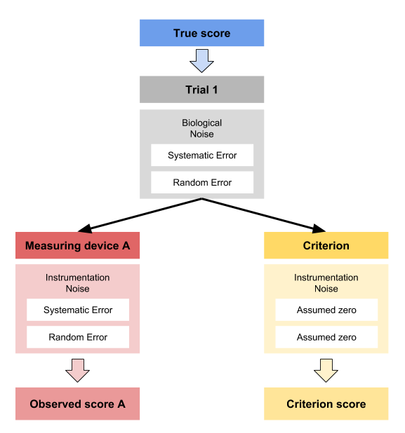
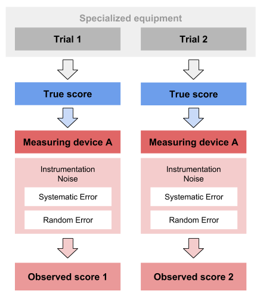

# Validity and Reliability

Although we have *sort-of-touched* validity and reliability topics in the [Measurement Error] chapter, here I will spend more time explaining the concepts and the use of `bmbstats` functions to perform the analysis. As pointed out multiple times thorough this book, simulation and the knowledge of the data generating process (DGP) is very helpful in understanding the analysis and what we are trying to do. To understand validity and reliability analyses, it is thus best to generate the data (i.e. simulate the DGP). 

## Data generation

Let's imagine that we know the *true* vertical jump scores for N=20 individuals. We measure this true score with a *gold standard* device twice (i.e. trial 1 and trial 2). Unfortunately, this *criterion* device is expensive or takes a lot of time, so we have developed a *practical* device that measures vertical jump height much quicker and cheaper. Unfortunately, we do not know the measurement error of this device and we want to estimate how valid and reliable this practical measure is. Luckily for us, we generate the data, so we actually know all the measurement error components (i.e. fixed and proportional bias components of the the systematic error and random error). 

The below code generates the data for both criteriona and practical measures using two trials and N=20 athletes:


```r
require(tidyverse)
require(bmbstats)
require(cowplot)

n_subjects <- 20

criterion_random <- 0.3
practical_fixed <- 2
practical_proportional <- 1.1
practical_random <- 1

set.seed(1667)

agreement_data <- tibble(
  Athlete = paste(
    "Athlete",
    str_pad(
      string = seq(1, n_subjects),
      width = 2,
      pad = "0"
    )
  ),
  True_score = rnorm(n_subjects, 45, 5),
  Criterion_score.trial1 = 0 + (True_score * 1) + rnorm(n_subjects, 0, criterion_random),
  Criterion_score.trial2 = 0 + (True_score * 1) + rnorm(n_subjects, 0, criterion_random),
  Practical_score.trial1 = practical_fixed + (True_score * practical_proportional) + rnorm(n_subjects, 0, practical_random),
  Practical_score.trial2 = practical_fixed + (True_score * practical_proportional) + rnorm(n_subjects, 0, practical_random)
)

head(agreement_data)
#> # A tibble: 6 x 6
#>   Athlete True_score Criterion_score… Criterion_score… Practical_score…
#>   <chr>        <dbl>            <dbl>            <dbl>            <dbl>
#> 1 Athlet…       52.9             52.9             52.9             60.2
#> 2 Athlet…       42.4             42.3             42.2             48.7
#> 3 Athlet…       49.2             49.1             49.5             56.0
#> 4 Athlet…       44.8             44.7             44.8             51.5
#> 5 Athlet…       40.0             40.4             40.1             45.7
#> 6 Athlet…       42.6             42.5             42.2             49.7
#> # … with 1 more variable: Practical_score.trial2 <dbl>
```

The assumption of the above DGP is that true score stays unchanged for trial 1 and trial 2. Thus, the only thing that creates variance in the criterion and practical measures is the random error component of the measurement error. 

It is also assumed that there is no *biological noise* involved in the measurement error.  We will make this example a bit more complex later on, so for now let's stick to this sand box example. 

## Validity

*“How well does the measure measure what it's supposed to measure?”* [@hopkinsBiasBlandAltmanNot2004; @hopkinsSocraticDialogueComparison2010; @hopkinsSpreadsheetsAnalysisValidity2015] is the question validity analysis tries to answer. There are few common approaches to estimate validity of the measurements, with Bland-Altman analysis [@blandStatisticalMethodsAssessing1986; @giavarinaUnderstandingBlandAltman2015] being one of the most used (also referred to as the *method of the differences*), linear regression, and *ordinary least products* (OLP) being a better alternative [@ludbrookLinearRegressionAnalysis2010; @ludbrookPrimerBiomedicalScientists2012; @ludbrookSPECIALARTICLECOMPARING1997; @ludbrookStatisticalTechniquesComparing2002; @mullineauxAssessmentBiasComparing1999]. Since we have simulated the DGP, we know exactly the measurement error components as well as true scores (which we do not know in the *real life*). 

### True vs Criterion

To *re-create* DGP parameters for the criterion measure, we will use the true scores as a predictor, and criterion score (trial 1) as the outcome. Here is the scatter plot:


```r
ggplot(
  agreement_data,
  aes(
    x = True_score,
    y = Criterion_score.trial1
  )
) +
  theme_cowplot(8) +
  geom_point()
```


For the sake of this example, let's assume that SESOI is equal to ±2.5cm (for the criterion score). We are interested in few things: (1) re-create the DGP components, or (2) can we predict the true score from the criterion score (which implies flipping predictor and outcome variables). Most validity research papers in the sports science are concerned with with describing or explaining the validity by trying to re-create the DGP components, while not many are concerned with predictive performance of the model. Let's deal with the descriptive (i.e explanatory) tasks first. 

#### Method of the differences

Using the `bmbstats::plot_pair_BA` function we can generate Bland-Altman plot for the true score and the criterion score:


```r
bmbstats::plot_pair_BA(
  predictor = agreement_data$True_score,
  outcome = agreement_data$Criterion_score.trial1,
  predictor_label = "True Score",
  outcome_label = "Criterion Score",
  SESOI_lower = -2.5,
  SESOI_upper = 2.5
)
```


Panel A in the previous figure depicts simple scatter plot with added *identity line* (dashed line), SESOI band around identity line, and linear regression model (blue line; this could be changed using the `control = bmbstats::plot_contron()` parameter). Panel B depicts the difference between criterion and true score (oy y-axis) and their average (on the x-axis). Using SESOI of ±2.5cm, we can conclude that all the differences fall within the SESOI band, confirming that the criterion measure has outstanding practical validity characteristic. 

How do we re-create the DGP parameters? Well, using Bland-Altman method, both fixed and proportional bias are lumped together in the `bias` (i.e. `mean difference`) estimator, and random error component is estimated using `SD` of the differences. Let's write a simple estimator function to perform method of the differences validity analysis (do not mind the names of the function parameters; I know they make thing more confusing, but bear with me for a second):


```r
differences_method <- function(data,
                               criterion,
                               practical,
                               SESOI_lower = 0,
                               SESOI_upper = 0,
                               na.rm = FALSE) {
  practical_obs <- data[[practical]]
  criterion_obs <- data[[criterion]]

  SESOI_range <- SESOI_upper - SESOI_lower

  diff <- criterion_obs - practical_obs

  n_obs <- length(diff)

  mean_diff <- mean(diff, na.rm = na.rm)
  sd_diff <- sd(diff, na.rm = na.rm)

  PPER <- stats::pt((SESOI_upper - mean_diff) / sd_diff, df = n_obs - 1) -
    stats::pt((SESOI_lower - mean_diff) / sd_diff, df = n_obs - 1)

  c(
    "Mean diff" = mean_diff,
    "SD diff" = sd_diff,
    PPER = PPER
  )
}

# Run the analysis
differences_method(
  data = agreement_data,
  criterion = "Criterion_score.trial1",
  practical = "True_score",
  SESOI_lower = -2.5,
  SESOI_upper = 2.5
)
#>   Mean diff     SD diff        PPER 
#> -0.07726199  0.26125825  0.99999999
```

We do know that the random error for the criterion score is 0.3cm since we have generated the data, and `SD diff` is our estimate of that parameter. Let's perform bootstrap method to get confidence intervals for these estimators using `bmbstats::validity_analysis` function with `differences_method` as a parameter:


```r
difference_validity <- bmbstats::validity_analysis(
  data = agreement_data,
  criterion = "Criterion_score.trial1",
  practical = "True_score",
  SESOI_lower = -2.5,
  SESOI_upper = 2.5,
  estimator_function = differences_method,
  control = model_control(seed = 1667)
)

difference_validity
#> Bootstrap with 2000 resamples and 95% bca confidence intervals.
#> 
#>  estimator       value      lower      upper
#>  Mean diff -0.07726199 -0.1768739 0.04312759
#>    SD diff  0.26125825  0.1964889 0.34579624
#>       PPER  0.99999999  0.9999993 1.00000000
```

As can be seen in the results, 95% CIs for the `SD diff` captures the true DGP parameter value for the random error of the criterion measure.

#### Linear Regression method

Another approach involves using simple linear regression method, where `RSE` is used to estimate `PPER` estimator. Using linear regression we can estimate the intercept (i.e. fixed bias), slope (i.e. proportional bias), and random error (i.e. `RSE`). Before writing the estimators function, let's plot the relationship using `bmbstats::plot_pair_lm`:


```r
bmbstats::plot_pair_lm(
  predictor = agreement_data$True_score,
  outcome = agreement_data$Criterion_score.trial1,
  predictor_label = "True Score",
  outcome_label = "Criterion Score",
  SESOI_lower = -2.5,
  SESOI_upper = 2.5
)
```


The linear regression parameters are used as estimates of the measurement error:


```r
lm_method <- function(data,
                      criterion,
                      practical,
                      SESOI_lower = 0,
                      SESOI_upper = 0,
                      na.rm = FALSE) {
  practical_obs <- data[[practical]]
  criterion_obs <- data[[criterion]]

  SESOI_range <- SESOI_upper - SESOI_lower

  lm_model <- lm(criterion_obs ~ practical_obs)

  n_obs <- length(criterion_obs)

  intercept <- coef(lm_model)[[1]]
  slope <- coef(lm_model)[[2]]
  rse <- summary(lm_model)$sigma

  # This is very close to 0, but will use it nonetheless
  mean_diff <- mean(residuals(lm_model))

  PPER <- stats::pt((SESOI_upper - mean_diff) / rse, df = n_obs - 1) -
    stats::pt((SESOI_lower - mean_diff) / rse, df = n_obs - 1)

  c(
    "Intercept" = intercept,
    "Slope" = slope,
    "RSE" = rse,
    PPER = PPER
  )
}

# Run the analysis
lm_method(
  data = agreement_data,
  criterion = "Criterion_score.trial1",
  practical = "True_score",
  SESOI_lower = -2.5,
  SESOI_upper = 2.5
)
#>  Intercept      Slope        RSE       PPER 
#> -0.4518909  1.0084198  0.2643645  1.0000000
```

We will use `bmbstats::validity_analysis` to get 95% CIs around the estimates:


```r
lm_validity <- bmbstats::validity_analysis(
  data = agreement_data,
  criterion = "Criterion_score.trial1",
  practical = "True_score",
  SESOI_lower = -2.5,
  SESOI_upper = 2.5,
  estimator_function = lm_method,
  control = model_control(seed = 1667)
)

lm_validity
#> Bootstrap with 2000 resamples and 95% bca confidence intervals.
#> 
#>  estimator      value      lower     upper
#>  Intercept -0.4518909 -1.0759400 0.8336904
#>      Slope  1.0084198  0.9825368 1.0220937
#>        RSE  0.2643645  0.1859689 0.3575745
#>       PPER  1.0000000  0.9999988 1.0000000
```

Since we know the DGP behind the criterion measure, we can confirm that fixed bias estimate (i.e. intercept) CI captured 0, proportional bias (i.e. slope) captured 1 and that random error (i.e. `RSE`) captured 0.3. We have thus managed to re-create DGP parameters using simple linear regression. 

We can also perform NHST for fixed and proportional bias, and random error (`RSE`):


```r
bmbstats::bootstrap_NHST(
  lm_validity,
  estimator = "Intercept",
  null_hypothesis = 0,
  test = "two.sided"
)
#> Null-hypothesis significance test for the `Intercept` estimator
#> Bootstrap result: Intercept=-0.452, 95% CI [-1.076, 0.834]
#> H0=0, test: two.sided
#> p=0.262
```


```r
bmbstats::bootstrap_NHST(
  lm_validity,
  estimator = "Slope",
  null_hypothesis = 1,
  test = "two.sided"
)
#> Null-hypothesis significance test for the `Slope` estimator
#> Bootstrap result: Slope=1.008, 95% CI [0.983, 1.022]
#> H0=1, test: two.sided
#> p=0.322
```


```r
bmbstats::bootstrap_NHST(
  lm_validity,
  estimator = "RSE",
  null_hypothesis = criterion_random,
  test = "two.sided"
)
#> Null-hypothesis significance test for the `RSE` estimator
#> Bootstrap result: RSE=0.264, 95% CI [0.186, 0.358]
#> H0=0.3, test: two.sided
#> p=0.427
```

Please notice the similarity between `SD diff` from the method of differences and `RSE` estimator, both of which are estimates of the random error of the measurement error:


```r
rbind(
  difference_validity$estimators[2, ],
  lm_validity$estimators[3, ]
)
#>   estimator     value     lower     upper
#> 2   SD diff 0.2612583 0.1964889 0.3457962
#> 3       RSE 0.2643645 0.1859689 0.3575745
```

#### OLP method

Ordinary least product approach calculates the residuals using product between y-residual $y - \hat{y}$ and x-residual $x - \hat{x}$. This method is used more in reliability analysis when we do not know which variable is predictor and which is the outcome or target, but it can be used with the validity analysis as well. OLP method doesn't assume that the x-variable is without random error, which in this example doesn't help since we are using the true score (and the true score is without random error). But it is useful *exactly* for this reason for the real-world analysis when both variables (x and y) have random error involved. Here is a quote from Ludbrook 1997 paper [@ludbrookSPECIALARTICLECOMPARING1997, pp.194]:

>"It is an important assumption of OLS regression that whereas the values of Y in the population that has been sampled are attended by error, those of X are not. Strictly, this can be so only if the X values are categorical: for instance, conditions, treatments or places. However, most statistical theorists follow the advice of Berkson, which is that if the X values have been fixed in advance by the experimenter (e.g. by specifying times, doses or settings of a pump), then they can be regarded for practical purposes as error-free. When X is error-free, Model I regression analysis is the proper form to use. It includes the well-known OLS regression technique as well as modifications of it, such as weighted least squares (WLS) regression.

>When both X and Y are free to vary and are attended by error, some statisticians allow that Model I regression analysis may still be used if it is certain, on biological grounds, that Y must depend on X and never the reverse. This is the case, for instance, in dose- or stimulus-response relationships. Even then, the Model I regression line should be used for empirical, rather than explanatory, purposes.

>When investigators plan experiments to compare methods of measurement, they must assume that both Y and X will be attended by random error. Moreover, it is impossible to decide which method should be regarded as dependent and which independent and because of this it is wrong to use Model I regression analysis. Instead, one or another form of Model I regression analysis must be used. These are described later."

To plot OLP regression, use `bmbstats::plot_pair_OLP` function. The OLP regression, in this case, looks very close to simple linear regression: 


```r
bmbstats::plot_pair_OLP(
  predictor = agreement_data$True_score,
  outcome = agreement_data$Criterion_score.trial1,
  predictor_label = "True Score",
  outcome_label = "Criterion Score",
  SESOI_lower = -2.5,
  SESOI_upper = 2.5
)
```


Let's write the OLP validity estimators and check the output. OLP regression is implemented in the `bmbstats::OLP_regression` function.


```r
olp_method <- function(data,
                      criterion,
                      practical,
                      SESOI_lower = 0,
                      SESOI_upper = 0,
                      na.rm = FALSE) {
  practical_obs <- data[[practical]]
  criterion_obs <- data[[criterion]]

  SESOI_range <- SESOI_upper - SESOI_lower

  olp_model <- bmbstats::OLP_regression(
    outcome = criterion_obs,
    predictor = practical_obs,
    na.rm = na.rm)

  n_obs <- length(criterion_obs)

  intercept <- olp_model$intercept
  slope <- olp_model$slope
  rse <- olp_model$rse

  PPER <- stats::pt((SESOI_upper) / rse, df = n_obs - 1) -
    stats::pt((SESOI_lower) / rse, df = n_obs - 1)

  c(
    "Intercept" = intercept,
    "Slope" = slope,
    "RSE" = rse,
    PPER = PPER
  )
}


olp_method(
  data = agreement_data,
  criterion = "Criterion_score.trial1",
  practical = "True_score",
  SESOI_lower = -2.5,
  SESOI_upper = 2.5
)
#>  Intercept      Slope        RSE       PPER 
#> -0.5024828  1.0095568  0.2644390  1.0000000
```

To estimate 95% CIs for these estimators, use the *default* `bmbstats::validity_analysis`:


```r
olp_validity <- bmbstats::validity_analysis(
  data = agreement_data,
  criterion = "Criterion_score.trial1",
  practical = "True_score",
  SESOI_lower = -2.5,
  SESOI_upper = 2.5,
  estimator_function = olp_method,
  control = model_control(seed = 1667)
)

olp_validity
#> Bootstrap with 2000 resamples and 95% bca confidence intervals.
#> 
#>  estimator      value      lower     upper
#>  Intercept -0.5024828 -1.1085643 0.7298272
#>      Slope  1.0095568  0.9843866 1.0226211
#>        RSE  0.2644390  0.1859924 0.3579299
#>       PPER  1.0000000  0.9999988 1.0000000
```

#### What happens if we flip the variables?

In the DGP we have used true scores to generate both criterion and practical measures, thus using true score as predictor (x-variable) and criterion as the outcome (y-variable) is valid approach to re-create the DGP parameters. Please note that `bmbstats::validity_analysis` uses `practical` parameter as predictor (x-variable) and `criterion` parameter as outcome variable (y-variable). 

But in the real life (as we will soon see when using criterion and practical measures) we do not know the true scores and we might be interested in *predicting* criterion from the practical measures. Let's see what happens when we flip the predictor and outcome for all three methods:


```r
difference_validity_flip <- bmbstats::validity_analysis(
  data = agreement_data,
  practical = "Criterion_score.trial1",
  criterion = "True_score",
  SESOI_lower = -2.5,
  SESOI_upper = 2.5,
  estimator_function = differences_method,
  control = model_control(seed = 1667)
)

difference_validity_flip
#> Bootstrap with 2000 resamples and 95% bca confidence intervals.
#> 
#>  estimator      value       lower     upper
#>  Mean diff 0.07726199 -0.04312759 0.1768739
#>    SD diff 0.26125825  0.19648887 0.3457962
#>       PPER 0.99999999  0.99999933 1.0000000
```


```r
lm_validity_flip <- bmbstats::validity_analysis(
  data = agreement_data,
  practical = "Criterion_score.trial1",
  criterion = "True_score",
  SESOI_lower = -2.5,
  SESOI_upper = 2.5,
  estimator_function = lm_method,
  control = model_control(seed = 1667)
)

lm_validity_flip
#> Bootstrap with 2000 resamples and 95% bca confidence intervals.
#> 
#>  estimator     value      lower     upper
#>  Intercept 0.5472786 -0.6599661 1.1190949
#>      Slope 0.9894180  0.9770752 1.0135275
#>        RSE 0.2618619  0.1813661 0.3559808
#>       PPER 1.0000000  0.9999989 1.0000000
```


```r
olp_validity_flip <- bmbstats::validity_analysis(
  data = agreement_data,
  practical = "Criterion_score.trial1",
  criterion = "True_score",
  SESOI_lower = -2.5,
  SESOI_upper = 2.5,
  estimator_function = olp_method,
  control = model_control(seed = 1667)
)

olp_validity_flip
#> Bootstrap with 2000 resamples and 95% bca confidence intervals.
#> 
#>  estimator     value      lower     upper
#>  Intercept 0.4977261 -0.7419619 1.0837733
#>      Slope 0.9905337  0.9778841 1.0158849
#>        RSE 0.2619357  0.1812142 0.3560398
#>       PPER 1.0000000  0.9999989 1.0000000
```

Let's combine the result for the random error estimates so we can compare them all:


```r
rand_err_estimates <- rbind(
  data.frame(outcome = "Criterion", method = "Difference", difference_validity$estimators[2, ]),
  data.frame(outcome = "True", method = "Difference", difference_validity_flip$estimators[2, ]),
  data.frame(outcome = "Criterion", method = "lm", lm_validity$estimators[3, ]),
  data.frame(outcome = "True", method = "lm", lm_validity_flip$estimators[3, ]),
  data.frame(outcome = "Criterion", method = "olp", olp_validity$estimators[3, ]),
  data.frame(outcome = "True", method = "olp", olp_validity_flip$estimators[3, ])
)

print(rand_err_estimates, row.names = FALSE)
#>    outcome     method estimator     value     lower     upper
#>  Criterion Difference   SD diff 0.2612583 0.1964889 0.3457962
#>       True Difference   SD diff 0.2612583 0.1964889 0.3457962
#>  Criterion         lm       RSE 0.2643645 0.1859689 0.3575745
#>       True         lm       RSE 0.2618619 0.1813661 0.3559808
#>  Criterion        olp       RSE 0.2644390 0.1859924 0.3579299
#>       True        olp       RSE 0.2619357 0.1812142 0.3560398
```

As can be seen from the table, the estimates for the random error component of the criterion measure are very similar (although `SD diff` is smaller due dividing by $N-1$, while `RSE` uses $N-k-1$, where k is number of predictors, thus we get $N-2$) regardless of the method and which variable is the predictor and which is outcome. But this is the case since true score is the *true score* without measurement error. Let's see what happens in the *real-world*.

### Practical vs Criterion

In the real-world, we do not know the true scores. We can only use some type of the gold standard measure. In our DGP simulation we have generated both criterion and practical measures using the known true scores and measurement error for the each measure.



Let's check if we can re-create DGP parameters for the practical measure (which has both proportional and fixed bias, as well as larger random error than criterion) using the criterion score. Here is the scatter plot of the two:


```r
ggplot(
  agreement_data,
  aes(
    x = True_score,
    y = Practical_score.trial1
  )
) +
  theme_cowplot(8) +
  geom_point()
```


To re-create DGP for the practical measure, we need to use true score as the predictor (since that is how we have generated the practical scores). Let's use the simple linear regression method to do so:


```r
bmbstats::plot_pair_lm(
  predictor = agreement_data$True_score,
  outcome = agreement_data$Practical_score.trial1,
  predictor_label = "True Score",
  outcome_label = "Practical Score"
)
```


And let's estimate the 95% bootstrap confidence intervals:


```r
lm_validity_practical <- bmbstats::validity_analysis(
  data = agreement_data,
  criterion = "Practical_score.trial1",
  practical = "True_score",
  SESOI_lower = NA,
  SESOI_upper = NA,
  estimator_function = lm_method,
  control = model_control(seed = 1667)
)

lm_validity_practical
#> Bootstrap with 2000 resamples and 95% bca confidence intervals.
#> 
#>  estimator     value     lower    upper
#>  Intercept 4.7157542 0.6929173 7.345273
#>      Slope 1.0386315 0.9758422 1.132740
#>        RSE 0.8518886 0.6168049 1.304054
#>       PPER        NA        NA       NA
```

In our DGP, we have used fixed bias equal to 2cm, proportional bias equal to 1.1, and random error equal to 1cm to generate the practical scores. As can be seen from results, our 95% CI captured the true DGP parameter values. 

Unfortunately, we have to use the criterion measure, since we do not know the true scores. Let's check the results:


```r
bmbstats::plot_pair_lm(
  predictor = agreement_data$Criterion_score.trial1,
  outcome = agreement_data$Practical_score.trial1,
  predictor_label = "Criterion Score",
  outcome_label = "Practical Score"
)
```


And let's estimate the bootstrap 95% CIs:


```r
lm_validity_practical_criterion <- bmbstats::validity_analysis(
  data = agreement_data,
  criterion = "Practical_score.trial1",
  practical = "Criterion_score.trial1",
  SESOI_lower = NA,
  SESOI_upper = NA,
  estimator_function = lm_method,
  control = model_control(seed = 1667)
)

lm_validity_practical_criterion
#> Bootstrap with 2000 resamples and 95% bca confidence intervals.
#> 
#>  estimator     value     lower    upper
#>  Intercept 5.3054383 0.8089323 8.054704
#>      Slope 1.0271620 0.9616332 1.126357
#>        RSE 0.9111659 0.7303417 1.224814
#>       PPER        NA        NA       NA
```

Since criterion measure (in this case used as predictor, or x-variable) also contains random error, OLP method can be used instead:


```r
olp_validity_practical_criterion <- bmbstats::validity_analysis(
  data = agreement_data,
  criterion = "Practical_score.trial1",
  practical = "Criterion_score.trial1",
  SESOI_lower = NA,
  SESOI_upper = NA,
  estimator_function = olp_method,
  control = model_control(seed = 1667)
)

olp_validity_practical_criterion
#> Bootstrap with 2000 resamples and 95% bca confidence intervals.
#> 
#>  estimator     value      lower    upper
#>  Intercept 4.7308268 -0.1090732 7.659421
#>      Slope 1.0400989  0.9737440 1.150441
#>        RSE 0.9140125  0.7314260 1.235110
#>       PPER        NA         NA       NA
```

Let's combine the three approaches so we can compare them more easily with the true DGP parameter values:


```r
practical_estimators <- rbind(
  data.frame(
    method = "DGP",
    estimator = c("Intercept", "Slope", "RSE"),
    value = c(practical_fixed, practical_proportional, practical_random),
    lower = NA,
    upper = NA
  ),
  data.frame(method = "True lm", lm_validity_practical$estimators[1:3, ]),
  data.frame(method = "Criterion lm", lm_validity_practical_criterion$estimators[1:3, ]),
  data.frame(method = "Criterion olp", olp_validity_practical_criterion$estimators[1:3, ])
)

practical_estimators$method <- factor(
  practical_estimators$method,
  levels = rev(c("DGP", "True lm", "Criterion lm", "Criterion olp"))
)

practical_estimators$estimator <- factor(
  practical_estimators$estimator,
  levels = c("Intercept", "Slope", "RSE")
)

print(practical_estimators, row.names = FALSE)
#>         method estimator     value      lower    upper
#>            DGP Intercept 2.0000000         NA       NA
#>            DGP     Slope 1.1000000         NA       NA
#>            DGP       RSE 1.0000000         NA       NA
#>        True lm Intercept 4.7157542  0.6929173 7.345273
#>        True lm     Slope 1.0386315  0.9758422 1.132740
#>        True lm       RSE 0.8518886  0.6168049 1.304054
#>   Criterion lm Intercept 5.3054383  0.8089323 8.054704
#>   Criterion lm     Slope 1.0271620  0.9616332 1.126357
#>   Criterion lm       RSE 0.9111659  0.7303417 1.224814
#>  Criterion olp Intercept 4.7308268 -0.1090732 7.659421
#>  Criterion olp     Slope 1.0400989  0.9737440 1.150441
#>  Criterion olp       RSE 0.9140125  0.7314260 1.235110
```

Or plot for even more easier comparison (red vertical dashed line represent the true DGP parameter values):


```r
ggplot(
  data = filter(practical_estimators, method != "DGP"),
  aes(y = method, x = value)
) +
  theme_bw(8) +
  geom_errorbarh(aes(xmax = upper, xmin = lower),
    color = "black",
    height = 0
  ) +
  geom_vline(
    data = filter(practical_estimators, method == "DGP"),
    aes(xintercept = value),
    linetype = "dashed", color = "red"
  ) +
  geom_point() +
  xlab("") +
  ylab("") +
  facet_wrap(~estimator, scales = "free_x")
```


To understand how these methods and how their estimates behave when there is random error in the predictor variable (x-value; criterion in this case), let's create a quick simulation (see also the SIMEX procedure explained in the [What to do when we know the error?] section of the [Measurement Error] chapter). The DGP parameters of the practical measure will stay the same, but we will change the random error for the criterion score from 0 (i.e. making it essentially the true score), to double th random error of the practical score. 


```r
simulation_df <- expand.grid(
  simulation = seq(1, 500),
  criterion_random_error = seq(0, 2 * practical_random, length.out = 10)
)

simulation_df <- simulation_df %>%
  pmap_dfr(function(...) {
    current <- tibble(...)

    agreement_data <- tibble(
      True_score = rnorm(n_subjects, 45, 5),
      Criterion_score.trial1 = 0 + (True_score * 1) + rnorm(n_subjects, 0, current$criterion_random_error),
      Criterion_score.trial2 = 0 + (True_score * 1) + rnorm(n_subjects, 0, current$criterion_random_error),
      Practical_score.trial1 = practical_fixed + (True_score * practical_proportional) + rnorm(n_subjects, 0, practical_random),
      Practical_score.trial2 = practical_fixed + (True_score * practical_proportional) + rnorm(n_subjects, 0, practical_random)
    )
    
    cbind(current, agreement_data)
  })

head(simulation_df)
#>   simulation criterion_random_error True_score Criterion_score.trial1
#> 1          1                      0   41.44284               41.44284
#> 2          1                      0   42.76338               42.76338
#> 3          1                      0   39.33558               39.33558
#> 4          1                      0   54.14657               54.14657
#> 5          1                      0   42.17742               42.17742
#> 6          1                      0   50.57845               50.57845
#>   Criterion_score.trial2 Practical_score.trial1 Practical_score.trial2
#> 1               41.44284               47.36111               47.05610
#> 2               42.76338               49.30239               47.59944
#> 3               39.33558               46.81175               45.48609
#> 4               54.14657               62.99236               62.44907
#> 5               42.17742               49.52856               49.12834
#> 6               50.57845               56.14485               59.70339
```

Now, for each simulation, we will estimate the DGP parameters (i.e. intercept, slope, and random error) using simple linear regression and OLP regression using criterion as predictor and practical as the outcome variables. 


```r
estimation_wrapper <- function(data) {
  lm_true <- lm_method(
    data = data,
    criterion = "Practical_score.trial1",
    practical = "True_score",
    SESOI_lower = NA,
    SESOI_upper = NA
  )

  lm_criterion <- lm_method(
    data = data,
    criterion = "Practical_score.trial1",
    practical = "Criterion_score.trial1",
    SESOI_lower = NA,
    SESOI_upper = NA
  )

  olp_criterion <- olp_method(
    data = data,
    criterion = "Practical_score.trial1",
    practical = "Criterion_score.trial1",
    SESOI_lower = NA,
    SESOI_upper = NA
  )

  data.frame(
    simulation = data$simulation[1],
    criterion_random_error = data$criterion_random_error[1],
    method = c("True lm", "Criterion lm", "Criterion olp"),
    Intercept = c(lm_true[1], lm_criterion[1], olp_criterion[1]),
    Slope = c(lm_true[2], lm_criterion[2], olp_criterion[2]),
    RSE = c(lm_true[3], lm_criterion[3], olp_criterion[3])
  )
}

simulation_results <- simulation_df %>%
  group_by(simulation, criterion_random_error) %>%
  do(estimation_wrapper(.))


head(simulation_results)
#> # A tibble: 6 x 6
#> # Groups:   simulation, criterion_random_error [2]
#>   simulation criterion_random_error method        Intercept Slope   RSE
#>        <int>                  <dbl> <chr>             <dbl> <dbl> <dbl>
#> 1          1                  0     True lm          3.35    1.08 0.949
#> 2          1                  0     Criterion lm     3.35    1.08 0.949
#> 3          1                  0     Criterion olp    2.83    1.09 0.952
#> 4          1                  0.222 True lm         -0.0301  1.14 1.19 
#> 5          1                  0.222 Criterion lm    -0.717   1.16 1.15 
#> 6          1                  0.222 Criterion olp   -1.38    1.17 1.15
```

And now we can plot the results:


```r
simulation_results_long <- gather(simulation_results, "key", "value", -(1:3))

# Join the true DGP values for plotting
simulation_results_long <- left_join(
  simulation_results_long,
  data.frame(
    key = c("Intercept", "Slope", "RSE"),
    DGP = c(practical_fixed, practical_proportional, practical_random)
  ),
  by = "key"
)

simulation_results_long$key <- factor(
  simulation_results_long$key,
  levels = c("Intercept", "Slope", "RSE")
)

simulation_results_long$method <- factor(
  simulation_results_long$method,
  levels = c("True lm", "Criterion lm", "Criterion olp")
)

simulation_results_long_avg <- simulation_results_long %>%
  group_by(method, criterion_random_error, key) %>%
  summarise(
    mean = mean(value),
    upper = mean + (sd(value)),
    lower = mean - (sd(value))
  )

ggplot(
  simulation_results_long,
  aes(x = criterion_random_error, y = value, group = simulation)
) +
  theme_cowplot(8) +
  geom_line(alpha = 0.02) +
  geom_ribbon(
    data = simulation_results_long_avg,
    aes(y = mean, ymin = lower, ymax = upper, group = 1),
    alpha = 0.3, fill = "blue"
  ) +
  geom_line(
    data = simulation_results_long_avg,
    color = "white",
    aes(y = mean, group = 1),
    size = 1) +
  facet_grid(key ~ method, scales = "free") +
  geom_hline(aes(yintercept = DGP), linetype = "dashed", color = "red") +
  ylab(NULL) +
  xlab("Criterion random error")
```


Red dashed horizontal line on the graph indicate the true DGP parameter value, which we want to estimate. Thin black lines (spaghetti anyone?) indicate simulation results across different levels of random error in the criterion measure. These black lines are summarized with `mean` (thick white line) ± `SD` (blue ribbon). 

As can be seen, the effect of changing random error in the criterion measure (predictor; x-value), while keeping the same random error in the practical measure (outcome) affects intercept, slope and random error estimates for criterion linear model and criterion OLP model. Intercept, slope, and `RSE` are only correctly estimated with simple regression model when there is no random error (0 on the x-axis). As the random error increases, both bias (i.e. simulations `mean`) and variance (i.e. simulations `SD`) are increased. 

When it comes to OLP, due to random error in the practical measure, bias is involved in the intercept and slope estimates when there is no random error in the criterion. Intercept and slope are correctly estimated only when criterion has the same amount of random error as in the practical measure. OLP estimated `RSE` suffers the same issues as `RSE` estimated with simple linear model. 
Estimating Type I errors using the bootstrapped CIs would involve slower/longer simulation and will not be considered here. Although I can speculate, as can be seen from the graphs, that these will not be constants, particularly for the biased estimators. 

What can we do? Well, if we know the random error involved in the criterion score (i.e. predictor) we can *adjust* slope coefficient (see *attenuation effect* and slope adjustment explained in great article by Michael Wallace [@wallaceAnalysisImperfectWorld2020, pp.17]) or we can perform SIMEX as explained in the [Measurement Error] chapter. Let's repeat the simulation, but now let's use adjusted slope and `RSE`. `RSE` is adjusted by deducting known random error: $adjusted \;RSE^2 = estimated \; RSE^2 - known \; random \; error  ^2$. The problem emerges when known random error is larger from the estimated `RSE`, since we are taking a square root of their squared difference. We thus need to make a function that deals with that:


```r
adjust_RSE <- function(est_RSE, known_error) {
  ifelse(
    est_RSE > known_error,
    sqrt(est_RSE^2 - known_error^2),
    -sqrt(known_error^2 - est_RSE^2)
  )
}
```

Let's summarize our simulation using adjusted slope and `RSE`:


```r
estimation_wrapper <- function(data) {
  
  # Used for slope adjustment
  sd_predictor <- sd(data$Criterion_score.trial1)
  criterion_random_error <- data$criterion_random_error[1]
  
  slope_adj <- (sd_predictor^2 + criterion_random_error^2)/sd_predictor^2
  
  lm_true <- lm_method(
    data = data,
    criterion = "Practical_score.trial1",
    practical = "True_score",
    SESOI_lower = NA,
    SESOI_upper = NA
  )

  lm_criterion <- lm_method(
    data = data,
    criterion = "Practical_score.trial1",
    practical = "Criterion_score.trial1",
    SESOI_lower = NA,
    SESOI_upper = NA
  )

  olp_criterion <- olp_method(
    data = data,
    criterion = "Practical_score.trial1",
    practical = "Criterion_score.trial1",
    SESOI_lower = NA,
    SESOI_upper = NA
  )

  data.frame(
    simulation = data$simulation[1],
    criterion_random_error = data$criterion_random_error[1],
    method = c("True lm", "Criterion lm", "Criterion olp"),
    Intercept = c(lm_true[1], lm_criterion[1], olp_criterion[1]),
    Slope = c(
      lm_true[2],
      lm_criterion[2] * slope_adj,
      olp_criterion[2] * slope_adj
      ),
    RSE = c(
      lm_true[3],
      adjust_RSE(lm_criterion[3], criterion_random_error),
      adjust_RSE(olp_criterion[3], criterion_random_error)
      )
  )
}

simulation_results <- simulation_df %>%
  group_by(simulation, criterion_random_error) %>%
  do(estimation_wrapper(.))


head(simulation_results)
#> # A tibble: 6 x 6
#> # Groups:   simulation, criterion_random_error [2]
#>   simulation criterion_random_error method        Intercept Slope   RSE
#>        <int>                  <dbl> <chr>             <dbl> <dbl> <dbl>
#> 1          1                  0     True lm          3.35    1.08 0.949
#> 2          1                  0     Criterion lm     3.35    1.08 0.949
#> 3          1                  0     Criterion olp    2.83    1.09 0.952
#> 4          1                  0.222 True lm         -0.0301  1.14 1.19 
#> 5          1                  0.222 Criterion lm    -0.717   1.16 1.13 
#> 6          1                  0.222 Criterion olp   -1.38    1.17 1.13
```

And we can plot the results of adjusted slope and `RSE`:


```r
simulation_results_long <- gather(simulation_results, "key", "value", -(1:3))

# Join the true DGP values for plotting
simulation_results_long <- left_join(
  simulation_results_long,
  data.frame(
    key = c("Intercept", "Slope", "RSE"),
    DGP = c(practical_fixed, practical_proportional, practical_random)
  ),
  by = "key"
)

simulation_results_long$key <- factor(
  simulation_results_long$key,
  levels = c("Intercept", "Slope", "RSE")
)

simulation_results_long$method <- factor(
  simulation_results_long$method,
  levels = c("True lm", "Criterion lm", "Criterion olp")
)

simulation_results_long_avg <- simulation_results_long %>%
  group_by(method, criterion_random_error, key) %>%
  summarise(
    mean = mean(value),
    upper = mean + (sd(value)),
    lower = mean - (sd(value))
  )

ggplot(
  simulation_results_long,
  aes(x = criterion_random_error, y = value, group = simulation)
) +
  theme_cowplot(8) +
  geom_line(alpha = 0.02) +
  geom_ribbon(
    data = simulation_results_long_avg,
    aes(y = mean, ymin = lower, ymax = upper, group = 1),
    alpha = 0.3, fill = "blue"
  ) +
  geom_line(
    data = simulation_results_long_avg,
    color = "white",
    aes(y = mean, group = 1),
    size = 1) +
  facet_grid(key ~ method, scales = "free") +
  geom_hline(aes(yintercept = DGP), linetype = "dashed", color = "red") +
  ylab(NULL) +
  xlab("Criterion random error")
```


Using the simple linear regression, we managed to adjust the bias of the slope estimate, although variance still increases with increasing criterion random error (which will probably affect the Type I error rates). Adjustment didn't help the OLP estimate slope. Adjusting `RSE` seems to remove the bias for both simple linear regression and OLP, but simulation variance keeps increasing with increase in criterion random error. 

As stated beforehand, to estimate bootstrap CIs Type I error-rates, simulation would need to be much computation intensive, since for each simulation we would need to provide bootstrapped CIs to check their coverage (i.e. if they capture the true DGP parameter value or not). I suggest you try that as an example and leave the computer to run for few hours. Playing with these concepts (and simulations) is very helpful to understand statistics (and appreciate its complexity).

This example indicates that it is not that straight forward to re-create DGP parameters of the practical score using the criterion score, even with the known random error. But, at practitioners are we really interested in estimating DGP parameters of the measures? 

### Prediction approach

Rather than trying to re-create DGP, we might be interested in predictive performance instead. This implies estimating *predictive validity* using *calibration model* (i.e. simple linear regression used so far represent simple calibration model). Sometimes certain measuring devices produce multiple outputs, for example heat, humidity, and pressure readings as well as non-linear readings and we can use all these features as predictors to find a calibration model that provides the best predictive performance. 

In our case, we are interested in predicting criterion measure from practical measure. Rather than using `lm_method` we have written, we can use *default* estimator function `bmbstats::validity_estimators`:


```r
lm_criterion_validity <- bmbstats::validity_analysis(
  data = agreement_data,
  practical = "Practical_score.trial1",
  criterion = "Criterion_score.trial1",
  SESOI_lower = -2.5,
  SESOI_upper = 2.5,
  control = model_control(seed = 1667)
)
#> [1] "All values of t are equal to  2.5 \n Cannot calculate confidence intervals"
#> [1] "All values of t are equal to  5 \n Cannot calculate confidence intervals"

lm_criterion_validity
#> Bootstrap with 2000 resamples and 95% bca confidence intervals.
#> 
#>     estimator      value      lower     upper
#>   SESOI lower -2.5000000         NA        NA
#>   SESOI upper  2.5000000         NA        NA
#>   SESOI range  5.0000000         NA        NA
#>     Intercept -3.9394072 -7.2953389 0.7734320
#>         Slope  0.9494885  0.8579138 1.0168839
#>           RSE  0.8760378  0.7261416 1.1122760
#>   Pearson's r  0.9875619  0.9763234 0.9935317
#>     R Squared  0.9752786  0.9532061 0.9871048
#>  SESOI to RSE  5.7075161  4.4952872 6.8897943
#>          PPER  0.9898416  0.9633314 0.9972420
#>           SDC  1.8335682  1.5198318 2.3280204
```

Additional estimator in this list is `SDC`. `SDC` is the *smallest detectable change* (see [Smallest Detectable Change] section in [Measurement Error] chapter), and in this case represents the smallest change in the practical measure for which we have at least 95% confidence it involves change in the criterion score. In other words, `SDC` represents a 95% *coverage* in the criterion for the same value of practical measure (or same values of the predictors involved, in the case when there is multiple of them). `SDC` is calculated using `RSE` and critical threshold using t-distribution to get a 95% coverage (or simply by multiplying `RSE` with ±1.96).  

This is better seen and understood using the residual graph on the panel B below:


```r
bmbstats::plot_pair_lm(
  predictor = agreement_data$Practical_score.trial1,
  outcome = agreement_data$Criterion_score.trial1,
  predictor_label = "Practical Score",
  outcome_label = "Criterion Score",
  SESOI_lower = -2.5,
  SESOI_upper = 2.5
)
```


`SDC`, or *Level of Agreement* used in Bland-Altman analysis, is depicted with two horizontal dashed lines. Since these lines are within SESOI bands, this implies that practical measure has outstanding practical prediction validity (after calibration with simple linear regression, in this case to correct for fixed and proportional biases). 

"But hold your horses Mladen, we haven't tested model predictions on hold-out or unseen data!" And you are completely right. Let's do that using `bmbstats::cv_model`:


```r
lm_predictive_validity <- bmbstats::cv_model(
  Criterion_score.trial1~Practical_score.trial1,
  data = agreement_data,
  SESOI_lower = -2.5,
  SESOI_upper = 2.5,
  control = model_control(cv_folds = 5, cv_repeats = 10)
)

lm_predictive_validity
#> Training data consists of 2 predictors and 20 observations. Cross-Validation of the model was performed using 10 repeats of 5 folds.
#> 
#> Model performance:
#> 
#>         metric      training training.pooled testing.pooled        mean
#>            MBE  1.882940e-14   -3.925753e-15     0.02821925  0.01349363
#>            MAE  7.209755e-01    7.106871e-01     0.80067569  0.79019212
#>           RMSE  8.310824e-01    8.191433e-01     0.94237977  0.90134710
#>           PPER  9.914445e-01    9.976365e-01     0.99121033  0.91768067
#>  SESOI to RMSE  6.016250e+00    6.103938e+00     5.30571663  5.92631136
#>      R-squared  9.752786e-01    9.759837e-01     0.96824238  0.83850772
#>         MinErr -1.085374e+00   -1.302228e+00    -1.36413113 -0.87328158
#>         MaxErr  1.792261e+00    1.901850e+00     2.34556533  0.99120816
#>      MaxAbsErr  1.792261e+00    1.901850e+00     2.34556533  1.33156462
#>          SD        min        max
#>  0.52102607 -1.0035037  1.0131942
#>  0.21891902  0.2938133  1.4283624
#>  0.23117615  0.4147218  1.5060507
#>  0.05265932  0.6919549  0.9885303
#>  1.61587442  3.3199413 12.0562748
#>  0.56589940 -2.5312392  0.9953966
#>  0.40660854 -1.3641311  0.4769940
#>  0.71495843 -0.2737126  2.3455653
#>  0.43907222  0.7468639  2.3455653
```

If we check `MaxAbsErr` we can also see that the maximal absolute error is below SESOI, even for the unseen data, which is outstanding. Using testing `RMSE` (i.e. mean across CV fold, which is equal to 0.9cm) we can calculate 95% `SDC` multiplying with 1.96 (or simple heuristic is just doubling the value), which gives us 1.8cm. This implies that using calibrated practical measure score (i.e. predicted criterion score), we are able to predict with 95% confidence at least change equal to 1.8cm, which is below our SESOI of 2.5cm. This concludes that calibrated practical measure has outstanding practical predictive validity of the criterion score and can be used in practice. 

### Can we adjust for the know criterion measure random error?

Let's use our simulated data to check what happens to intercept, slope, and `RSE` when changing the random error involved in the criterion (which is now a outcome variable). We can also adjust the estimated `RSE` be deducting known criterion random error. In this case, practical measure will be the predictor (x-variable) and criterion will be outcome (y-variable). Using estimated parameters with true score as outcome variable will be used as a reference.


```r
estimation_wrapper <- function(data) {
  lm_true <- lm_method(
    data = data,
    practical = "Practical_score.trial1",
    criterion = "True_score",
    SESOI_lower = NA,
    SESOI_upper = NA
  )

  lm_criterion <- lm_method(
    data = data,
    practical = "Practical_score.trial1",
    criterion = "Criterion_score.trial1",
    SESOI_lower = NA,
    SESOI_upper = NA
  )

  olp_criterion <- olp_method(
    data = data,
    practical = "Practical_score.trial1",
    criterion = "Criterion_score.trial1",
    SESOI_lower = NA,
    SESOI_upper = NA
  )
  
  data.frame(
    simulation = data$simulation[1],
    criterion_random_error = data$criterion_random_error[1],
    method = c("True lm", "Criterion lm", "Criterion olp",  "Adjusted lm", "Adjusted olp"),
    Intercept = c(lm_true[1], lm_criterion[1], olp_criterion[1], lm_criterion[1], olp_criterion[1]),
    Slope = c(lm_true[2], lm_criterion[2], olp_criterion[2], lm_criterion[2], olp_criterion[2]),
    RSE = c(
      lm_true[3],
      lm_criterion[3],
      olp_criterion[3],
      adjust_RSE(lm_criterion[3], data$criterion_random_error[1]),
      adjust_RSE(olp_criterion[3], data$criterion_random_error[1])
      )
  )
}

simulation_results <- simulation_df %>%
  group_by(simulation, criterion_random_error) %>%
  do(estimation_wrapper(.))


head(simulation_results)
#> # A tibble: 6 x 6
#> # Groups:   simulation, criterion_random_error [2]
#>   simulation criterion_random_error method        Intercept Slope   RSE
#>        <int>                  <dbl> <chr>             <dbl> <dbl> <dbl>
#> 1          1                  0     True lm           -2.10 0.909 0.873
#> 2          1                  0     Criterion lm      -2.10 0.909 0.873
#> 3          1                  0     Criterion olp     -2.60 0.920 0.875
#> 4          1                  0     Adjusted lm       -2.10 0.909 0.873
#> 5          1                  0     Adjusted olp      -2.60 0.920 0.875
#> 6          1                  0.222 True lm            1.24 0.852 1.03
```

And plot the results again:


```r
simulation_results_long <- gather(simulation_results, "key", "value", -(1:3))

simulation_results_long$key <- factor(
  simulation_results_long$key,
  levels = c("Intercept", "Slope", "RSE")
)

simulation_results_long$method <- factor(
  simulation_results_long$method,
  levels = c("True lm", "Criterion lm", "Criterion olp", "Adjusted lm", "Adjusted olp")
)

simulation_results_long_avg <- simulation_results_long %>%
  group_by(method, criterion_random_error, key) %>%
  summarise(
    mean = mean(value),
    upper = mean + (sd(value)),
    lower = mean - (sd(value))
  )

ggplot(
  simulation_results_long,
  aes(x = criterion_random_error, y = value, group = simulation)
) +
  theme_cowplot(8) +
  geom_line(alpha = 0.02) +
  geom_ribbon(
    data = simulation_results_long_avg,
    aes(y = mean, ymin = lower, ymax = upper, group = 1),
    alpha = 0.3, fill = "blue"
  ) +
  geom_line(
    data = simulation_results_long_avg,
    color = "white",
    aes(y = mean, group = 1),
    size = 1) +
  facet_grid(key ~ method, scales = "free") +
  ylab(NULL) +
  xlab("Criterion random error")
```


As can be seen from the figure, `RSE` for the simple linear regression model (where criterion is the outcome and practical is the predictor) climbs up as criterion random error increases. When using adjusted `RSE`, up until the point where criterion has lower or equal random error to a practical score, we are able to correctly adjust `RSE` to give us estimation of the model fit using the true score (which is unknown of course, but we have used known criterion random error). 

As can be seen from the figure as well, OLP method provided biased estimates for slope and intercept.  

### Estimating SESOI for the practical score

So for we have used SESOI of ±2.5cm for both true score and criterion, and it was used to estimate predictive validity of the practical measure (i.e. does residuals fit within SESOI band; i.e. `PPER`). But we can use outcome variable SESOI to estimate SESOI in the predictor. This way we can estimate the SESOI in the predictor that yields SESOI in the criterion. In the case of simple linear regression, this is done by using estimated slope, by simply dividing outcome (i.e. criterion measure) SESOI with estimated slope: 

$$
\begin{aligned}
  SESOI_{outcome} = \beta_1 \times predictor \\
  SESOI_{predictor} = \frac{SESOI_{outcome}}{\beta_1}
\end{aligned}
$$

In our validity model where criterion measure is the outcome and practical measure is the predictor, estimated slope is equal to 0.95, thus practical measure SESOI would be  ±2.63cm. 

This could also be implemented inside the estimator function to provide for bootstrapped confidence intervals. 

## Reliability

For a measure to be valid it also needs to be reliable, but for a measure to be reliable it does not necessary needs to be valid (or at least in non-calibrated way). In essence, reliability is about *reproducibility* and *repeatability*, or how much measure is in agreement with itself. From prediction modeling perspective, reliability is how well measure predicts itself. From explanatory perspective, reliability is about estimating random error within the DGP (i.e. `TE` or typical error). 

How is reliability evaluated? We need to make a distinction between few methods. When we have compared practical measure to criterion, we assumed criterion to be gold standard without measurement error (i.e. true score). If that analysis showed non-valid performance, it automatically implied that the measurement is unreliable. In short, if practical measure cannot predict the criterion or is not in agreement with the criterion, it cannot be reliable. 

Second method is concerned with the scenario when we do not have the criterion or the true score available. Theoretically, we want a measuring instrument of interest to measure the same phenomena multiple times, to check measurement *reproducibility*. This can be achieved in few ways - we might have a special device that produce perfectly repeatable phenomena that is measured multiple times with one unit. This scenario is simulated within our DGP that we have used so far: the true score stays the same across two trial, which is then estimated with criterion and practical measures. 



But that is easily done in simulations, and not so in real life. The other option is to measure with two or more devices of the the same measuring unit. Thus, each trial is measured with two or more devices. The assumption must be made that the random error in each device is the same. Let's see how this plays out with our simulated data.

### Reproducibility

For the purpose of this example, let's assume that true score is measured with two criterion and two practical measuring devices (or measured twice with *perfect repeatability* of the true score). Let's plot these:


```r
ggplot(
  agreement_data,
  aes(
    x = Criterion_score.trial2,
    y = Criterion_score.trial1
  )
) +
  theme_cowplot(8) +
  geom_point() +
  ggtitle("Criterion measure")
```


```r
ggplot(
  agreement_data,
  aes(
    x = Practical_score.trial2,
    y = Practical_score.trial1
  )
) +
  theme_cowplot(8) +
  geom_point() +
  ggtitle("Practical measure")
```


Let's check the reproducibility of the criterion measure. Same as with validity analysis, we can use few methods to estimate reproducibility: (1) method of differences (i.e. Bland-Altman), (2) simple linear regression, and (3) OLP regression. When there are more than two trials, there are few options that can be considered, and the simplest it pairwise analysis (i.e. 2-1, 3-2, 4-3  or all combinations; this technique estimates average reproducibility) or use of *ANOVA* or repeated-measures analysis. These will not be considered in this book. 

We can use the functions that we have written already for the validity analysis. Let's start with the differences analysis by creating Bland-Altman plot:


```r
bmbstats::plot_pair_BA(
  predictor = agreement_data$Criterion_score.trial2,
  outcome = agreement_data$Criterion_score.trial1,
  predictor_label = "Criterion Score Trial1",
  outcome_label = "Criterion Score Trial2",
  SESOI_lower = -2.5,
  SESOI_upper = 2.5
)
```


To provide estimators we will use functions that we have already written:


```r
diff_reporoducibility <- differences_method(
  data = agreement_data,
  criterion = "Criterion_score.trial1",
  practical = "Criterion_score.trial2",
  SESOI_lower = -2.5,
  SESOI_upper = 2.5
)

diff_reporoducibility
#>  Mean diff    SD diff       PPER 
#> 0.05560546 0.30504044 0.99999988
```

Please note the true criterion random error used in the DGP, which is equal to 0.3cm and `SD diff` which is not estimated with `SD diff`, even if they are similar: 0.31 (this is due to sampling error involved in this particular sample). As explained in [Measurement Error], to get the estimate of criterion score random error (i.e. `TE`), we need to divide `SD diff` with $\sqrt{2}$. This is because, random error is involved in both trials, and thus twice in their difference. 

Estimated `TE` is equal to 0.22. If we repeat the validity analysis of the criterion score using true score as predictor, we will get the same and correct estimate:


```r
differences_method(
  data = agreement_data,
  criterion = "Criterion_score.trial1",
  practical = "True_score",
  SESOI_lower = -2.5,
  SESOI_upper = 2.5
)
#>   Mean diff     SD diff        PPER 
#> -0.07726199  0.26125825  0.99999999
```

The next approach is to use simple linear regression:


```r
bmbstats::plot_pair_lm(
  predictor = agreement_data$Criterion_score.trial2,
  outcome = agreement_data$Criterion_score.trial1,
  predictor_label = "Criterion Score Trial1",
  outcome_label = "Criterion Score Trial2",
  SESOI_lower = -2.5,
  SESOI_upper = 2.5
)
```


We can also use the function we wrote to provide validity analysis using simple linear regression:


```r
lm_reporoducibility <- lm_method(
  data = agreement_data,
  criterion = "Criterion_score.trial1",
  practical = "Criterion_score.trial2",
  SESOI_lower = -2.5,
  SESOI_upper = 2.5
)

lm_reporoducibility
#>  Intercept      Slope        RSE       PPER 
#> -0.4298105  1.0109424  0.3075601  0.9999999
```

To estimate `TE`, we again need to divide estimated `RSE` with $\sqrt{2}$. 

THe "problem" with both method of differences and simple linear regression, is that we need to use one variable as predictor and one as the outcome. This is avoided with the OLP approach, although parameters are estimated using one measure as predictor and other as outcome, but as explained previously, product of x- and x-variable residuals are used instead. 

Let's perform the OLP reproducibility plot and analysis using the function we have wrote already:


```r
bmbstats::plot_pair_OLP(
  predictor = agreement_data$Criterion_score.trial2,
  outcome = agreement_data$Criterion_score.trial1,
  predictor_label = "Criterion Score Trial1",
  outcome_label = "Criterion Score Trial2",
  SESOI_lower = -2.5,
  SESOI_upper = 2.5
)
```


```r
olp_reporoducibility <- olp_method(
  data = agreement_data,
  criterion = "Criterion_score.trial1",
  practical = "Criterion_score.trial2",
  SESOI_lower = -2.5,
  SESOI_upper = 2.5
)

olp_reporoducibility
#>  Intercept      Slope        RSE       PPER 
#> -0.4982932  1.0124861  0.3076774  0.9999999
```

In `bmbstats`, reliability is estimated using `bmbstats::reliability_analysis` that uses OLP as the default method implemented in `bmbstats::reliability_estimators` function. Rather than using parameters `criterion` and `practical`, `bmbstats::reliability_analysis` and `bmbstats::reliability_estimators` use `trial1` and `trial2`:


```r
bmbstats::reliability_estimators(
  data = agreement_data,
  trial1 = "Criterion_score.trial1",
  trial2 = "Criterion_score.trial2",
  SESOI_lower = -2.5,
  SESOI_upper = 2.5
)
#>  SESOI lower  SESOI upper  SESOI range    Intercept        Slope          RSE 
#>   -2.5000000    2.5000000    5.0000000   -0.4982932    1.0124861    0.3076774 
#>  Pearson's r    R Squared SESOI to RSE         PPER           TE          SDC 
#>    0.9984753    0.9969529   16.2507895    0.9999999    0.2175607    0.6439761
```

`bmbstats::reliability_estimators` provides additional estimators, including `TE` and `SDC`. To get 95% bootstrap confidence intervals, use:


```r
criterion_reproducibility <- bmbstats::reliability_analysis(
  data = agreement_data,
  trial1 = "Criterion_score.trial1",
  trial2 = "Criterion_score.trial2",
  SESOI_lower = -2.5,
  SESOI_upper = 2.5,
  control = model_control(seed = 1667)
)
#> [1] "All values of t are equal to  2.5 \n Cannot calculate confidence intervals"
#> [1] "All values of t are equal to  5 \n Cannot calculate confidence intervals"

criterion_reproducibility
#> Bootstrap with 2000 resamples and 95% bca confidence intervals.
#> 
#>     estimator      value      lower      upper
#>   SESOI lower -2.5000000         NA         NA
#>   SESOI upper  2.5000000         NA         NA
#>   SESOI range  5.0000000         NA         NA
#>     Intercept -0.4982932 -1.3450623  0.6000301
#>         Slope  1.0124861  0.9888145  1.0317365
#>           RSE  0.3076774  0.2362124  0.4474032
#>   Pearson's r  0.9984753  0.9956386  0.9993848
#>     R Squared  0.9969529  0.9912963  0.9987701
#>  SESOI to RSE 16.2507895 11.2407775 21.2231826
#>          PPER  0.9999999  0.9999782  1.0000000
#>            TE  0.2175607  0.1670274  0.3163618
#>           SDC  0.6439761  0.4943982  0.9364256
```

#### Simulating effects of different levels of random error on reproducibility results

Since we already have generated simulated data, let's check how estimated `TE` behaves using three different analysis methods over varying degrees of random error involved in the criterion score. To represent the intercept for the differences method, I've used `Mean Diff`. 


```r
estimation_wrapper <- function(data) {
  diff_reporoducibility <- differences_method(
  data = data,
  criterion = "Criterion_score.trial1",
  practical = "Criterion_score.trial2",
  SESOI_lower = -2.5,
  SESOI_upper = 2.5
)

  lm_reporoducibility <- lm_method(
  data = data,
  criterion = "Criterion_score.trial1",
  practical = "Criterion_score.trial2",
  SESOI_lower = -2.5,
  SESOI_upper = 2.5
)

  olp_reporoducibility <- olp_method(
  data = data,
  criterion = "Criterion_score.trial1",
  practical = "Criterion_score.trial2",
  SESOI_lower = -2.5,
  SESOI_upper = 2.5
)
  
  data.frame(
    simulation = data$simulation[1],
    criterion_random_error = data$criterion_random_error[1],
    method = c("diff", "lm", "olp"),
    Intercept = c(diff_reporoducibility[1], lm_reporoducibility[1], olp_reporoducibility[1]),
    Slope = c(NA, lm_reporoducibility[2], olp_reporoducibility[2]),
    TE = c(diff_reporoducibility[2], lm_reporoducibility[3], olp_reporoducibility[3]) / sqrt(2)
  )
}

simulation_results <- simulation_df %>%
  group_by(simulation, criterion_random_error) %>%
  do(estimation_wrapper(.))


head(simulation_results)
#> # A tibble: 6 x 6
#> # Groups:   simulation, criterion_random_error [2]
#>   simulation criterion_random_error method Intercept  Slope       TE
#>        <int>                  <dbl> <chr>      <dbl>  <dbl>    <dbl>
#> 1          1                  0     diff    0.       NA     0.      
#> 2          1                  0     lm     -1.27e-14  1.    3.40e-16
#> 3          1                  0     olp     0.        1     0.      
#> 4          1                  0.222 diff   -8.06e- 2 NA     2.52e- 1
#> 5          1                  0.222 lm      1.12e+ 0  0.974 2.30e- 1
#> 6          1                  0.222 olp     1.06e+ 0  0.975 2.30e- 1
```

And we can finally plot the results: 


```r
simulation_results_long <- gather(simulation_results, "key", "value", -(1:3))

# Join the true DGP values for plotting
simulation_results_long <- left_join(
  simulation_results_long,
  data.frame(
    key = c("Intercept", "Slope", "TE"),
    DGP = c(0, 1, NA)
  ),
  by = "key"
)

simulation_results_long$key <- factor(
  simulation_results_long$key,
  levels = c("Intercept", "Slope", "TE")
)

simulation_results_long$method <- factor(
  simulation_results_long$method,
  levels = c("diff", "lm", "olp")
)

simulation_results_long_avg <- simulation_results_long %>%
  group_by(method, criterion_random_error, key) %>%
  summarise(
    mean = mean(value),
    upper = mean + (sd(value)),
    lower = mean - (sd(value))
  )

ggplot(
  simulation_results_long,
  aes(x = criterion_random_error, y = value, group = simulation)
) +
  theme_cowplot(8) +
  geom_line(alpha = 0.02) +
  geom_ribbon(
    data = simulation_results_long_avg,
    aes(y = mean, ymin = lower, ymax = upper, group = 1),
    alpha = 0.3, fill = "blue"
  ) +
  geom_line(
    data = simulation_results_long_avg,
    color = "white",
    aes(y = mean, group = 1),
    size = 1) +
  facet_grid(key ~ method, scales = "free") +
  geom_hline(aes(yintercept = DGP), linetype = "dashed", color = "red") +
  ylab(NULL) +
  xlab("Criterion random error")
```


Although all three methods are good in estimating `TE`, only OLP should be used when estimating reproducibility fixed and proportional biases (i.e. intercept and slope; which are simulated to be 0 and 1 respectively, since both criterion measure trials have same fixed and proportional biases against the true score). Again, this recommendation is given under the assumption that the random error involved in two units/trials is the same. 

#### Reproducibility of the practical measure

Let's quickly perform the reproducibility of the practical measure as well. SESOI for the practical measure will be equal to SESOI of the true and practical (i.e. 2.5cm) multiplied by practical proportional bias ($1.1 \times 2.5$cm). We can either use this know and true DGP relationship, or use estimated practical measure SESOI from the validity analysis. 


```r
bmbstats::plot_pair_OLP(
  predictor = agreement_data$Practical_score.trial2,
  outcome = agreement_data$Practical_score.trial1,
  predictor_label = "Practical Score Trial1",
  outcome_label = "Practical Score Trial2",
  SESOI_lower = -2.5 * practical_proportional,
  SESOI_upper = 2.5 * practical_proportional
)
```


```r
practical_reproducibility <- bmbstats::reliability_analysis(
  data = agreement_data,
  trial1 = "Practical_score.trial1",
  trial2 = "Practical_score.trial2",
  SESOI_lower = -2.5 * practical_proportional,
  SESOI_upper = 2.5 * practical_proportional,
  control = model_control(seed = 1667)
)
#> [1] "All values of t are equal to  2.75 \n Cannot calculate confidence intervals"
#> [1] "All values of t are equal to  5.5 \n Cannot calculate confidence intervals"

practical_reproducibility
#> Bootstrap with 2000 resamples and 95% bca confidence intervals.
#> 
#>     estimator      value      lower     upper
#>   SESOI lower -2.7500000         NA        NA
#>   SESOI upper  2.7500000         NA        NA
#>   SESOI range  5.5000000         NA        NA
#>     Intercept  4.3847186 -2.3423560 8.0714488
#>         Slope  0.9170754  0.8422666 1.0547194
#>           RSE  1.3749629  0.9923160 2.0538771
#>   Pearson's r  0.9718531  0.9378131 0.9877429
#>     R Squared  0.9444984  0.8794861 0.9756338
#>  SESOI to RSE  4.0001078  2.6825278 5.5671995
#>          PPER  0.9400042  0.8036046 0.9875717
#>            TE  0.9722456  0.7016734 1.4523105
#>           SDC  2.8778305  2.0769413 4.2988143
```

#### Uses of reproducibility analyses

There are few uses of reproducibility analyses. If single unit is used over two (or more) trial using specialized equipment, we would tend not to expect any biases involved. If there are biases involved, the preparation and utilization of the measuring devices might be erroneous, or there might be error in the specialized equipment (i.e. indication of *systematic effects*). In either way, we do not want to see fixed nor proportional biases.

If multiple units are used to measure single phenomena, existence of biases might demand that the units needs to be *calibrated*. If that is not possible, this implies that exchange of units for longitudinal monitoring is not recommended (depends on the magnitude of the biases and differences). In plain English - you need to stick to one unit for longitudinal monitoring. Assuming, of course acceptable practical reproducibility (i.e. small `TE`, or `SDC` compared to SESOI). 

To demonstrate this, let's consider the following example. We will have three devices that measure a single true score. Two of these devices (A and B) have same biases against the true score (hence, no biases between them), while one device (device C) has different biases against the true score. 


```r
reproducibility_data <- tibble(
  Athlete = paste(
    "Athlete",
    str_pad(
      string = seq(1, n_subjects),
      width = 2,
      pad = "0"
    )
  ),
  True_score = rnorm(n_subjects, 45, 5),
  Criterion_score_A = 0 + (True_score * 1) + rnorm(n_subjects, 0, criterion_random),
  Criterion_score_B = 0 + (True_score * 1) + rnorm(n_subjects, 0, criterion_random),
  Criterion_score_C = 2.5 + (True_score * 1.5) + rnorm(n_subjects, 0, criterion_random)
)

head(reproducibility_data)
#> # A tibble: 6 x 5
#>   Athlete    True_score Criterion_score_A Criterion_score_B Criterion_score_C
#>   <chr>           <dbl>             <dbl>             <dbl>             <dbl>
#> 1 Athlete 01       41.4              41.4              41.3              64.4
#> 2 Athlete 02       42.8              42.8              42.3              66.5
#> 3 Athlete 03       39.3              39.8              39.4              61.3
#> 4 Athlete 04       54.1              54.6              54.4              83.5
#> 5 Athlete 05       42.2              42.5              42.4              66.0
#> 6 Athlete 06       50.6              50.1              51.2              78.3
```

Rather than using simple linear regression or OLP for plotting the residuals (i.e. calibrating the predictor), we will use the *raw* values using Bland-Altman plot. Here is the plot and the analysis using method of differences:


```r
bmbstats::plot_pair_BA(
  predictor = reproducibility_data$Criterion_score_B,
  outcome = reproducibility_data$Criterion_score_A,
  predictor_label = "Unit B",
  outcome_label = "Unit A",
  SESOI_lower = -2.5,
  SESOI_upper = 2.5
)
```


```r
differences_method(
  data = reproducibility_data,
  criterion = "Criterion_score_A",
  practical = "Criterion_score_B",
  SESOI_lower = -2.5,
  SESOI_upper = 2.5
)
#>  Mean diff    SD diff       PPER 
#> 0.03513462 0.40651806 0.99999335
```

As can be seen from the analysis, `PPER` for these two devices is excellent (and this is *without* calibration), implying that these can be used inter-changeably for longitudinal monitoring. Let's see if that is the case for unit C (comparing it with unit A):


```r
bmbstats::plot_pair_BA(
  predictor = reproducibility_data$Criterion_score_C,
  outcome = reproducibility_data$Criterion_score_A,
  predictor_label = "Unit C",
  outcome_label = "Unit A",
  SESOI_lower = -2.5,
  SESOI_upper = 2.5
)
```


```r
differences_method(
  data = reproducibility_data,
  criterion = "Criterion_score_A",
  practical = "Criterion_score_C",
  SESOI_lower = -2.5,
  SESOI_upper = 2.5
)
#>     Mean diff       SD diff          PPER 
#> -2.415796e+01  2.939988e+00  2.664952e-07
```

Unless we are able to calibrate the unit C, we cannot use it interchangeably with units A and B. But unit C is more than good to be used for measurement - we just need to stick to that unit across time.

### Repeatability

So far, we have assumed no change in the true score across trials, thus no effect of the *biological noise*. In the next data set we are going to measure vertical jump height on two days spread by 7 days for N=20 athletes. We will assume that there is no change in the true score (i.e. no systematic change/effect), but there will be some *biological noise* that will affect the *manifestable performance* (see [Extending the Classical Test Theory] section). This unavoidably presents the question "What is the true score?". Well, in this case we can consider it some individual *stable* level of performance, that varies from day to day due to various factors, such as sleep, nutrition, motivation, circadian rhythms and so forth. Please refer to Borsboom's text for more in depth treatment of the issues with the *true score* concept [@borsboomMeasuringMindConceptual2009].

In this DGP, we will assume that this *stochastic* biological effect (i.e. random error or biological noise) is equal for all individuals (please see the [Ergodicity] section for more information about this assumption) and that there is not systematic effect (i.e. fatigue, learning effects and so forth). 


This vertical jump is measured with our practical measuring unit, that we have shown to be reliable, and for which we have estimated `TE` and `SDC`. 


```r
n_subjects <- 20

practical_proportional <- 1.1
practical_random <- 1
biological_noise <- 2

set.seed(1667)

repeatability_data <- tibble(
  Athlete = paste(
    "Athlete",
    str_pad(
      string = seq(1, n_subjects),
      width = 2,
      pad = "0"
    )
  ),
  True_score.Pre = rnorm(n_subjects, 45, 5),
  True_change = rep(0, n_subjects),
  True_score.Post = True_score.Pre + True_change,
  
  # Add biological noise to true score
  Manifested_score.Pre = True_score.Pre + rnorm(n_subjects, 0, biological_noise),
  Manifested_score.Post = True_score.Post + rnorm(n_subjects, 0, biological_noise),
  Manifested_score.Change = Manifested_score.Post - Manifested_score.Pre,

  # Add measurement of the manifested score
  Measured_score.Pre = practical_fixed + 
    (Manifested_score.Pre * practical_proportional) +
    rnorm(n_subjects, 0, practical_random),
  
  Measured_score.Post = practical_fixed +
    (Manifested_score.Post * practical_proportional) + 
    rnorm(n_subjects, 0, practical_random),
  
  Measured_score.Change = Measured_score.Post - Measured_score.Pre
)

head(repeatability_data)
#> # A tibble: 6 x 10
#>   Athlete True_score.Pre True_change True_score.Post Manifested_scor…
#>   <chr>            <dbl>       <dbl>           <dbl>            <dbl>
#> 1 Athlet…           52.9           0            52.9             52.9
#> 2 Athlet…           42.4           0            42.4             42.3
#> 3 Athlet…           49.2           0            49.2             48.9
#> 4 Athlet…           44.8           0            44.8             44.1
#> 5 Athlet…           40.0           0            40.0             42.7
#> 6 Athlet…           42.6           0            42.6             41.7
#> # … with 5 more variables: Manifested_score.Post <dbl>,
#> #   Manifested_score.Change <dbl>, Measured_score.Pre <dbl>,
#> #   Measured_score.Post <dbl>, Measured_score.Change <dbl>
```

As can be see in the DGP, we have three components: (1) true score, that doesn't change from Pre-test to Post-test, (2) manifested score, that doesn't have systematic effect (i.e. expected or `mean` is equal to 0) but is affected by random biological noise, and (3) measured score that is affected by both biological noise and instrumentation error (vertical jump was measured using the practical measure). 

Let's estimate reliability using each of these scores. Here is the reliability of the manifested score. SESOI for both true and manifested scores is chosen to be ±2.5cm:


```r
bmbstats::plot_pair_OLP(
  predictor = repeatability_data$Manifested_score.Pre,
  outcome = repeatability_data$Manifested_score.Post,
  predictor_label = "Manifested Score Pre-test",
  outcome_label = "Manifested Score Post-test",
  SESOI_lower = -2.5,
  SESOI_upper = 2.5
)
```


```r
manifested_reliability <- bmbstats::reliability_analysis(
  data = repeatability_data,
  trial1 = "Manifested_score.Pre",
  trial2 = "Manifested_score.Post",
  SESOI_lower = -2.5,
  SESOI_upper = 2.5,
  control = model_control(seed = 1667)
)
#> [1] "All values of t are equal to  2.5 \n Cannot calculate confidence intervals"
#> [1] "All values of t are equal to  5 \n Cannot calculate confidence intervals"

manifested_reliability
#> Bootstrap with 2000 resamples and 95% bca confidence intervals.
#> 
#>     estimator      value      lower     upper
#>   SESOI lower -2.5000000         NA        NA
#>   SESOI upper  2.5000000         NA        NA
#>   SESOI range  5.0000000         NA        NA
#>     Intercept -3.4271606 -9.5821430 2.9874926
#>         Slope  1.0870906  0.9387198 1.2275893
#>           RSE  2.1181964  1.6136378 3.0424513
#>   Pearson's r  0.9394992  0.8345656 0.9759104
#>     R Squared  0.8826588  0.6965898 0.9524020
#>  SESOI to RSE  2.3604987  1.6480073 3.1187994
#>          PPER  0.7475330  0.5785637 0.8622366
#>            TE  1.4977911  1.1410142 2.1513380
#>           SDC  4.4334361  3.3773827 6.3679238
```

Unfortunately, we do not know this manifested score, as we do not know the true score. We can only measure manifested score. The estimated `TE` of the practical measure will now contain both instrumentation noise and biological noise. As explained previously, the SESOI for practical is equal to true SESOI multiplied by practical proportional bias ($1.1 \times 2.5$cm):


```r
bmbstats::plot_pair_OLP(
  predictor = repeatability_data$Measured_score.Pre,
  outcome = repeatability_data$Measured_score.Post,
  predictor_label = "Measured Score Pre-test",
  outcome_label = "Measured Score Post-test",
  SESOI_lower = - 2.5 * practical_proportional,
  SESOI_upper = 2.5 * practical_proportional
)
```


```r
measured_reliability <- bmbstats::reliability_analysis(
  data = repeatability_data,
  trial1 = "Measured_score.Pre",
  trial2 = "Measured_score.Post",
  SESOI_lower = -2.5 * practical_proportional,
  SESOI_upper = 2.5 * practical_proportional,
  control = model_control(seed = 1667)
)
#> [1] "All values of t are equal to  2.75 \n Cannot calculate confidence intervals"
#> [1] "All values of t are equal to  5.5 \n Cannot calculate confidence intervals"

measured_reliability
#> Bootstrap with 2000 resamples and 95% bca confidence intervals.
#> 
#>     estimator       value      lower     upper
#>   SESOI lower -2.75000000         NA        NA
#>   SESOI upper  2.75000000         NA        NA
#>   SESOI range  5.50000000         NA        NA
#>     Intercept -0.07812008 -9.5613061 7.5298921
#>         Slope  1.01329856  0.8553983 1.2053227
#>           RSE  2.49420427  1.9646649 3.3307725
#>   Pearson's r  0.92440336  0.8391887 0.9681646
#>     R Squared  0.85452158  0.7042450 0.9373512
#>  SESOI to RSE  2.20511209  1.6537377 2.8007336
#>          PPER  0.71600963  0.5809328 0.8223197
#>            TE  1.76366875  1.3892279 2.3552118
#>           SDC  5.22042954  4.1120910 6.9713869
```

As can be seen from the analysis, now the biological noise is contained (or propagated) to `RSE`, `SDC` and other estimators of the practical measure random error. The random error (`TE`) inside the practical measure is equal to:

$$
  TE^2 = (proportional \; bias \times biological \; noise)^2 + practical \; random \; error ^2 
$$

Estimated biological noise (using manifested analysis `TE`) is equal to 1.5cm (or we could use true DGP value of 2cm), simulated practical random error is equal to 1cm, and the simulated slope is equal to 1.1. Thus expected estimate `TE` of the practical measure is equal to 1.93cm, which is very close to the above estimated `TE` (1.76cm).

### The difference between Reproducibility and Repeatability

What's the difference between the estimate reproducibility and repeatability of the practical measure? Well, with reproducibility we aim to estimate sole instrumentation noise without biological noise/variation. This is done by making sure that the devices are measuring exactly the same phenomena. 

With repeatability, we want to estimate combination of the biological variation and instrumentation noise. Since we have used SESOI defined for reproducibility (i.e. same true score), the magnitude-based estimators were much worse with the repeatability analysis, where biological variation introduced additional stochastic component.

In [Measurement Error] chapter, I have explained that measurement error is the combination of instrumentation noise and biological variation (i.e. repeatability analysis is used to estimate it). I have also explained the use of `SDC` (and `TE`) to interpret individual changes (see [Interpreting individual changes using SESOI and SDC] in the aforementioned chapter). The question is then which `SDC` should be used? The one estimated from reproducibility (or validity analysis), or the one estimated from repeatability (involving biological noise)?

The answer depends on what question we are trying to answer. If we use `SDC` from reproducibility analysis (i.e. pure instrumentation noise) to interpret individual change, we will estimate the uncertainty around manifested performance change. On the other hand, if we use `SDC` from repeatability analysis (i.e. combined biological variation and instrumentation noise), we will estimate uncertainty around true performance change. 

To demonstrate and plot these differences, let's use `bmbstats::observations_MET` that we have introduced in [Measurement error issues] section of the [Descriptive tasks using `bmbstats`] chapter. But before we demonstrate these differences, we need to create few more column inside our simulated DGP - we need to have true score as would be measured by the practical measure (without the practical measure random noise), and manifested score as would be measured by the practical measure (without the practical measure random noise). This needs to be done to deal with practical measure proportional bias. 


```r
repeatability_data <- repeatability_data %>%
  mutate(
    True_score_measured.Pre = practical_fixed + (True_score.Pre * practical_proportional),
    True_score_measured.Post = practical_fixed + (True_score.Post * practical_proportional),
    True_score_measured.Change = True_score_measured.Post - True_score_measured.Pre,
    
    Manifested_score_measured.Pre = practical_fixed + (Manifested_score.Pre * practical_proportional),
    Manifested_score_measured.Post = practical_fixed + (Manifested_score.Post * practical_proportional),
    Manifested_score_measured.Change = Manifested_score_measured.Post - Manifested_score_measured.Pre
  )

head(repeatability_data)
#> # A tibble: 6 x 16
#>   Athlete True_score.Pre True_change True_score.Post Manifested_scor…
#>   <chr>            <dbl>       <dbl>           <dbl>            <dbl>
#> 1 Athlet…           52.9           0            52.9             52.9
#> 2 Athlet…           42.4           0            42.4             42.3
#> 3 Athlet…           49.2           0            49.2             48.9
#> 4 Athlet…           44.8           0            44.8             44.1
#> 5 Athlet…           40.0           0            40.0             42.7
#> 6 Athlet…           42.6           0            42.6             41.7
#> # … with 11 more variables: Manifested_score.Post <dbl>,
#> #   Manifested_score.Change <dbl>, Measured_score.Pre <dbl>,
#> #   Measured_score.Post <dbl>, Measured_score.Change <dbl>,
#> #   True_score_measured.Pre <dbl>, True_score_measured.Post <dbl>,
#> #   True_score_measured.Change <dbl>, Manifested_score_measured.Pre <dbl>,
#> #   Manifested_score_measured.Post <dbl>,
#> #   Manifested_score_measured.Change <dbl>
```

Now let's plot measured change (i.e. difference between measured Post-test and Pre-test using practical measure), together with manifested change (as would be measured with practical measure with no random error). Confidence intervals around measured change represent 95% `SDC` that is calculated using known practical measure random error (i.e. estimated `TE` from reproducibility analysis - the sole instrumentation noise). CIs should capture vertical red lines (manifested change):


```r
measured_change <- bmbstats::observations_MET(
  observations = repeatability_data$Measured_score.Change,
  observations_label = repeatability_data$Athlete,
  measurement_error = practical_random * sqrt(2),
  # Degrees of freedom from the reliability study. Use `Inf` for normal distribution
  df = Inf,
  SESOI_lower = -2.5 * practical_proportional,
  SESOI_upper = 2.5 * practical_proportional,
  
  # Will not use Bonferroni adjustment here
  alpha = 0.05,
  # No adjustment in CIs for plotting
  confidence = 0.95
)

plot(
  measured_change,
  true_observations = repeatability_data$Manifested_score_measured.Change,
  control = plot_control(points_size = 5)) +
  xlim(-8, 9)
```


Our CIs using sole instrumentation noise (I have used DGP parameter, but in real life we can use `TE` from reproducibility analysis) managed to capture manifested change (i.e. true change plus biological variation). 

If we use `TE` from repeatability analysis (i.e. the one that captures both biological variation and instrumentation noise), we will be interested in capturing "true change" (without biological variation):


```r
measured_change <- bmbstats::observations_MET(
  observations = repeatability_data$Measured_score.Change,
  observations_label = repeatability_data$Athlete,
  
  # Use TE from repeatability analysis
  measurement_error = measured_reliability$estimators$value[11] * sqrt(2),
  # Degrees of freedom from the reliability study. Use `Inf` for normal distribution
  df = Inf,
  SESOI_lower = -2.5 * practical_proportional,
  SESOI_upper = 2.5 * practical_proportional,
  
  # Will not use Bonferroni adjustment here
  alpha = 0.05,
  # No adjustment in CIs for plotting
  confidence = 0.95
)

plot(
  measured_change,
  true_observations = repeatability_data$True_score_measured.Change,
  control = plot_control(points_size = 5))
```


Since there is no true change in this DGP, all vertical red lines are aligned at 0. Our CIs in this case represent 95% `SDC` estimated using both biological variation and instrumentation error. 

It is important to remember when analyzing individual change how `TE` or `SDC` are estimated - does it represent sole instrumentation error (i.e. estimated in validity or reproducibility study)  or it represents measurement error combined of biological variation and instrumentation error (i.e. estimated in repeatability study). Ideally, we would need to know instrumentation noise and biological noise. If we know instrumentation noise (from validity or reproducibility study), we can *extract* biological variation (as it would be measured with the practical measure in this case). 

To get biological noise, as it would be measured with the practical measure, let's use the generated columns: 


```r
manifested_measured_reliability <- bmbstats::reliability_analysis(
  data = repeatability_data,
  trial1 = "Manifested_score_measured.Pre",
  trial2 = "Manifested_score_measured.Post",
  SESOI_lower = -2.5 * practical_proportional,
  SESOI_upper = 2.5 * practical_proportional,
  control = model_control(seed = 1667)
)
#> [1] "All values of t are equal to  2.75 \n Cannot calculate confidence intervals"
#> [1] "All values of t are equal to  5.5 \n Cannot calculate confidence intervals"

manifested_measured_reliability
#> Bootstrap with 2000 resamples and 95% bca confidence intervals.
#> 
#>     estimator      value       lower     upper
#>   SESOI lower -2.7500000          NA        NA
#>   SESOI upper  2.7500000          NA        NA
#>   SESOI range  5.5000000          NA        NA
#>     Intercept -3.9440578 -11.0023147 3.4883182
#>         Slope  1.0870906   0.9387198 1.2275893
#>           RSE  2.3300161   1.7750016 3.3466965
#>   Pearson's r  0.9394992   0.8345656 0.9759104
#>     R Squared  0.8826588   0.6965898 0.9524020
#>  SESOI to RSE  2.3604987   1.6480073 3.1187994
#>          PPER  0.7475330   0.5785637 0.8622366
#>            TE  1.6475702   1.2551157 2.3664718
#>           SDC  4.8767797   3.7151210 7.0047162
```

Measured manifested `TE` represents biological noise/variation that would be measured with the practical measure without random error. It is equal to 1.65cm. But we do not know this in the real life and we want to estimate it from the `TE` from repeatability study and know instrumentation noise. 

The estimated `TE` of the practical measure in the repeatability study is equal to 1.76cm. This `TE` contains both biological noise and instrumentation noise. Since we know the instrumentation noise (either from reproducibility or validity study; or from DGP in our case), we can estimate biological error (as would be estimated by practical measure without random error):

$$
\begin{align}
  TE^2 &= Biological^2 + Instrument^2 \\
  Biological^2 &= TE^2 - Instrument^2 \\
  Biological &= \sqrt{TE^2 - Instrument^2}
\end{align}
$$

We thus get the estimate of biological variation to be equal to 1.45cm, which is very close to the above estimate biological variation of 1.65cm. Please note that the difference is due to me using simulation true practical measure random error, rather than estimated in this sample. 

We will continue this topic in the next chapter where we will discuss Randomized Controlled Trials and the Control group will serves as a simple repeatability study that will inform us about uncertainty around true treatment effect. 
