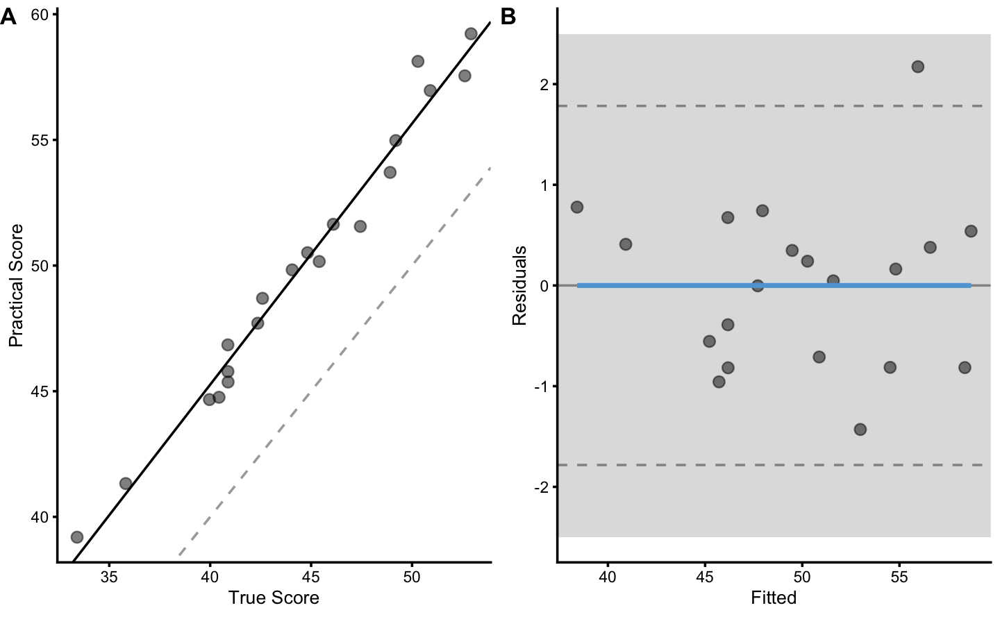

# Validity and Reliability

## Data generation


```r
require(tidyverse)
require(bmbstats)

n_subjects <- 20

criterion_random <- 0.3
practical_fixed <- 1
practical_proportional <- 1.1
practical_random <- 1

set.seed(1667)

agreement_data <- tibble(
  Athlete = paste(
    "Athlete",
    str_pad(
      string = seq(1, n_subjects),
      width = 2,
      pad = "0"
    )
  ),
  True_score = rnorm(n_subjects, 45, 5),
  Criterion_score.trial1 = 0 + True_score * 1 + rnorm(n_subjects, 0, criterion_random),
  Criterion_score.trial2 = 0 + True_score * 1 + rnorm(n_subjects, 0, criterion_random),
  Practical_score.trial1 = practical_fixed + True_score * practical_proportional + rnorm(n_subjects, 0, practical_random),
  Practical_score.trial2 = practical_fixed + True_score * practical_proportional + rnorm(n_subjects, 0, practical_random)
)

head(agreement_data)
#> # A tibble: 6 x 6
#>   Athlete True_score Criterion_score… Criterion_score… Practical_score…
#>   <chr>        <dbl>            <dbl>            <dbl>            <dbl>
#> 1 Athlet…       52.9             52.9             52.9             59.2
#> 2 Athlet…       42.4             42.3             42.2             47.7
#> 3 Athlet…       49.2             49.1             49.5             55.0
#> 4 Athlet…       44.8             44.7             44.8             50.5
#> 5 Athlet…       40.0             40.4             40.1             44.7
#> 6 Athlet…       42.6             42.5             42.2             48.7
#> # … with 1 more variable: Practical_score.trial2 <dbl>
```

## Validity

### True vs Criterion


```r
bmbstats::plot_pair_lm(
  predictor = agreement_data$True_score,
  outcome = agreement_data$Criterion_score.trial1,
  predictor_label = "True Score",
  outcome_label = "Criterion Score",
  SESOI_lower = -2.5,
  SESOI_upper = 2.5
)
```


```r
bmbstats::plot_pair_BA(
  predictor = agreement_data$True_score,
  outcome = agreement_data$Criterion_score.trial1,
  predictor_label = "True Score",
  outcome_label = "Criterion Score",
  SESOI_lower = -2.5,
  SESOI_upper = 2.5
)
```


### True vs Practical


```r
bmbstats::plot_pair_lm(
  predictor = agreement_data$True_score,
  outcome = agreement_data$Practical_score.trial1,
  predictor_label = "True Score",
  outcome_label = "Practical Score",
  SESOI_lower = -2.5,
  SESOI_upper = 2.5
)
```




```r
bmbstats::plot_pair_BA(
  predictor = agreement_data$True_score,
  outcome = agreement_data$Practical_score.trial1,
  predictor_label = "True Score",
  outcome_label = "Practical Score",
  SESOI_lower = -2.5,
  SESOI_upper = 2.5
)
```


### Criterion vs Practical


```r
bmbstats::plot_pair_lm(
  predictor = agreement_data$Criterion_score.trial1,
  outcome = agreement_data$Practical_score.trial1,
  predictor_label = "Criterion Score",
  outcome_label = "Practical Score",
  SESOI_lower = -2.5,
  SESOI_upper = 2.5
)
```


```r
bmbstats::plot_pair_BA(
  predictor = agreement_data$Criterion_score.trial1,
  outcome = agreement_data$Practical_score.trial1,
  predictor_label = "Criterion Score",
  outcome_label = "Practical Score",
  SESOI_lower = -2.5,
  SESOI_upper = 2.5
)
```


## Reliability
