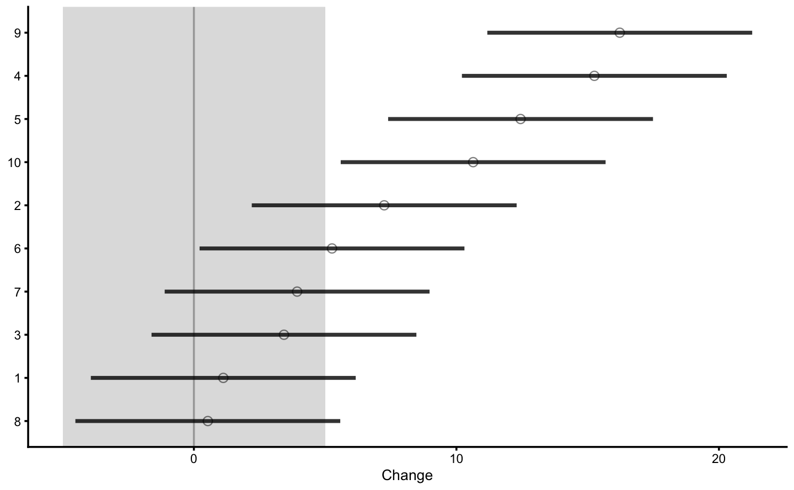

# RCT analysis and prediction in `bmbstats`

In this chapter I will demonstrate how to analyze simple randomized controlled trials (RCTs) from both explanatory and predictive perspectives using `bmbstats` package and functions. As a refresher, please consider re-reading [Causal inference] chapter. 

## Data Generating Process behind RCT

The following image is re-posted from the [Causal inference] chapter, outlining Treatment and Non-Treatment effects. 


Let's consider the following RCT DGP. We have two group (Control and Treatment), each with N=10 athletes, measured twice (Pre-test and Post-test) on the vertical jump height, using a measuring device with a known measurement error (i.e. only instrumentation noise; see [Validity and Reliability] chapter for more info) estimated through validity and reliability studies and equal to 0.5cm. Control group are doing their normal training for 4 weeks, while Treatment group is doing EMS stimulation of their calf muscles on top of their normal training. 

Since this is DGP, we will assume there is no treatment effect nor non-treatment effects. Both Control and Treatment groups will experience normal biological variation in their jump height, which is equal to 1.5cm. Please refer to [Validity and Reliability] chapter for more info about the concepts of true score and measurement error. SESOI for the measured score will be ±5cm (since there is no proportional bias in the measurement, this will also be SESOI for the true score - see previous chapter for more information).


```r
require(tidyverse)
require(bmbstats)
require(cowplot)

set.seed(1667)

n_subjects <- 20


instrumentation_noise <- 0.5
biological_variation <- 1.5

# -------------------------
# Treatment effect
treatment_systematic <- 0
treatment_random <- 0

# Non-treatment effect
non_treatment_systematic <- 0
non_treatment_random <- 0
#-------------------------

RCT_data <- tibble(
  Athlete = paste(
    "Athlete",
    str_pad(
      string = seq(1, n_subjects),
      width = 2,
      pad = "0"
    )
  ),
  Group = rep(c("Treatment", "Control"), length.out = n_subjects),

  # True score
  True_score.Pre = rnorm(n_subjects, 45, 5),

  # Treatment effect
  Treatment_effect = rnorm(n = n_subjects, mean = treatment_systematic, sd = treatment_random),
  Non_treatment_effect = rnorm(n = n_subjects, mean = non_treatment_systematic, sd = non_treatment_random),

  # Calculate the change in true score
  True_score.Change = if_else(
    Group == "Treatment",
    # Treatment group is a sum of treatment and non-treatment effects
    Treatment_effect + Non_treatment_effect,
    # While control group only get non-treatment effects
    Non_treatment_effect
  ),
  True_score.Post = True_score.Pre + True_score.Change,

  # Manifested score
  Manifested_score.Pre = True_score.Pre + rnorm(n_subjects, 0, biological_variation),
  Manifested_score.Post = True_score.Post + rnorm(n_subjects, 0, biological_variation),
  Manifested_score.Change = Manifested_score.Post - Manifested_score.Pre,

  # Measured score
  Measured_score.Pre = Manifested_score.Pre + rnorm(n_subjects, 0, instrumentation_noise),
  Measured_score.Post = Manifested_score.Post + rnorm(n_subjects, 0, instrumentation_noise),
  Measured_score.Change = Measured_score.Post - Measured_score.Pre
)

head(RCT_data)
#> # A tibble: 6 x 13
#>   Athlete Group True_score.Pre Treatment_effect Non_treatment_e…
#>   <chr>   <chr>          <dbl>            <dbl>            <dbl>
#> 1 Athlet… Trea…           52.9                0                0
#> 2 Athlet… Cont…           42.4                0                0
#> 3 Athlet… Trea…           49.2                0                0
#> 4 Athlet… Cont…           44.8                0                0
#> 5 Athlet… Trea…           40.0                0                0
#> 6 Athlet… Cont…           42.6                0                0
#> # … with 8 more variables: True_score.Change <dbl>, True_score.Post <dbl>,
#> #   Manifested_score.Pre <dbl>, Manifested_score.Post <dbl>,
#> #   Manifested_score.Change <dbl>, Measured_score.Pre <dbl>,
#> #   Measured_score.Post <dbl>, Measured_score.Change <dbl>
```

Since we have generated this data, we know that there are no treatment nor non-treatment effects (neither systematic, nor random or variable effects). But let's plot the data.

First let's plot the Pre-test measured scores (vertical jump) distribution:


```r
bmbstats::plot_raincloud(
  RCT_data,
  value = "Measured_score.Pre",
  groups = "Group"
)
```


And the Post-test:


```r
bmbstats::plot_raincloud(
  RCT_data,
  value = "Measured_score.Post",
  groups = "Group"
)
```


And finally measured change scores:


```r
bmbstats::plot_raincloud_SESOI(
  RCT_data,
  value = "Measured_score.Change",
  groups = "Group",
  SESOI_lower = -5,
  SESOI_upper = 5
)
```


From these graphs we can see that there is no difference between group. We have also selected large SESOI taking into account our a-priori knowledge about biological variation and measurement error in the vertical jump height. 

Let's plot the individual change fro athletes from the Treatment group:


```r
bmbstats::plot_pair_changes(
  group_a = RCT_data$Measured_score.Pre,
  group_b = RCT_data$Measured_score.Post,
  group_a_label = "Measured Pre-test",
  group_b_label = "Measured Post-test",
  SESOI_lower = -5,
  SESOI_upper = 5
)
```


## RCT analysis using `bmbstats::RCT_analysis` function

To perform RCT analysis explained in the [Causal inference] chapter, we will use `bmbstats::RCT_analysis` function. `bmbstats::RCT_analysis` function has two built-in estimator function: `bmbstats::RCT_estimators` and `bmbstats::RCT_estimators_simple`. `bmbstats::RCT_estimators` is more extensive and involves individual group analysis, while the `bmbstats::RCT_estimators_simple` only provides estimated treatment and non-treatment effects. 


```r
extensive_RCT <- bmbstats::RCT_analysis(
  data = RCT_data,
  group = "Group",
  treatment_label = "Treatment",
  control_label = "Control",
  pre_test = "Measured_score.Pre",
  post_test = "Measured_score.Post",
  SESOI_lower = -5,
  SESOI_upper = 5,
  control = model_control(seed = 1667)
)
#> [1] "All values of t are equal to  5 \n Cannot calculate confidence intervals"
#> [1] "All values of t are equal to  10 \n Cannot calculate confidence intervals"


extensive_RCT
#> Bootstrap with 2000 resamples and 95% bca confidence intervals.
#> 
#>                           estimator         value         lower       upper
#>                         SESOI lower -5.0000000000            NA          NA
#>                         SESOI upper  5.0000000000            NA          NA
#>                         SESOI range 10.0000000000            NA          NA
#>         Control Group Pre-test mean 45.5109521606  4.331148e+01 48.21036084
#>           Control Group Pre-test SD  3.9597464864  2.855004e+00  5.85827992
#>        Control Group Post-test mean 45.1257775214  4.313070e+01 47.47599410
#>          Control Group Post-test SD  3.5092078780  2.571001e+00  4.87446945
#>       Treatment Group Pre-test mean 42.6896373231  3.865745e+01 46.72775073
#>         Treatment Group Pre-test SD  6.7766398945  4.721891e+00  9.43000440
#>      Treatment Group Post-test mean 42.3426726375  3.847114e+01 46.62049607
#>        Treatment Group Post-test SD  6.8172485979  4.650529e+00  9.42580140
#>                  Pre-test pooled SD  5.5498847059  4.320704e+00  7.42005780
#>           Pre-test Group difference -2.8213148375 -7.699018e+00  1.79257029
#>          Post-test Group difference -2.7831048839 -7.536144e+00  1.92992786
#>           Control Group Change mean -0.3851746392 -1.335798e+00  0.40887509
#>             Control Group Change SD  1.4244343846  9.784351e-01  2.20497980
#>             Control Group Cohen's d -0.0694022776 -2.718276e-01  0.08822495
#>       Control Group Change to SESOI -0.0385174639 -1.335798e-01  0.04088751
#>    Control Group Change SD to SESOI  0.1424434385  9.784351e-02  0.22049798
#>                Control Group pLower  0.0050812820  2.555858e-04  0.04726465
#>           Control Group pEquivalent  0.9927461183  9.394569e-01  0.99960354
#>               Control Group pHigher  0.0021725997  1.041601e-04  0.02120446
#>         Treatment Group Change mean -0.3469646855 -1.414503e+00  0.67665105
#>           Treatment Group Change SD  1.7452275994  1.250376e+00  2.44737128
#>           Treatment Group Cohen's d -0.0625174583 -2.928988e-01  0.13865744
#>     Treatment Group Change to SESOI -0.0346964686 -1.414503e-01  0.06766510
#>  Treatment Group Change SD to SESOI  0.1745227599  1.250376e-01  0.24473713
#>              Treatment Group pLower  0.0128923459  1.054894e-03  0.04971288
#>         Treatment Group pEquivalent  0.9803630085  9.201771e-01  0.99808935
#>             Treatment Group pHigher  0.0067446456  6.362436e-04  0.04797000
#>                    Effect Cohen's d  0.0268246499 -1.133010e+00  1.16779153
#>                   Systematic effect  0.0382099536 -1.285889e+00  1.47903212
#>                       Random effect  1.0083680171 -1.192373e+00  1.89420374
#>          Systematic effect to SESOI  0.0038209954 -1.285889e-01  0.14790321
#>              SESOI to Random effect  9.9170142553 -1.047902e+01 98.30169044
#>                              pLower  0.0003713043  2.406229e-12  0.99977466
#>                         pEquivalent  0.9992167407 -9.939859e-01  1.00000000
#>                             pHigher  0.0004119550  8.728491e-13  0.99975725
```

We can also plot the estimators bootstrap distributions:


```r
plot(extensive_RCT)
```


If we use `bmbstats::RCT_estimators_simple`, we will get much more condensed output: 


```r
simple_RCT <- bmbstats::RCT_analysis(
  data = RCT_data,
  group = "Group",
  treatment_label = "Treatment",
  control_label = "Control",
  pre_test = "Measured_score.Pre",
  post_test = "Measured_score.Post",
  SESOI_lower = -5,
  SESOI_upper = 5,
  estimator_function = bmbstats::RCT_estimators_simple,
  control = model_control(seed = 1667)
)
#> [1] "All values of t are equal to  5 \n Cannot calculate confidence intervals"
#> [1] "All values of t are equal to  10 \n Cannot calculate confidence intervals"


simple_RCT
#> Bootstrap with 2000 resamples and 95% bca confidence intervals.
#> 
#>                   estimator         value         lower      upper
#>                 SESOI lower -5.0000000000            NA         NA
#>                 SESOI upper  5.0000000000            NA         NA
#>                 SESOI range 10.0000000000            NA         NA
#>           Systematic effect  0.0382099536 -1.285889e+00  1.4790321
#>               Random effect  1.0083680171 -1.192373e+00  1.8942037
#>  Systematic effect to SESOI  0.0038209954 -1.285889e-01  0.1479032
#>      SESOI to Random effect  9.9170142553 -1.047902e+01 98.3016904
#>                      pLower  0.0003713043  2.406229e-12  0.9997747
#>                 pEquivalent  0.9992167407 -9.939859e-01  1.0000000
#>                     pHigher  0.0004119550  8.728491e-13  0.9997572
```


```r
plot(simple_RCT)
```


As can be seen, the analysis correctly identified no treatment effect. There is an issue with random treatment effects estimation since is demonstrates distribution with two peaks. This effect is due to random treatment effect being zero and the way the root of the squared differences is calculated to avoid irrational numbers (i.e. taking root of negative number). 

There are additional graphs that can be produced. All graphs can take `control = plot_control` parameter to setup plotting options as explained in the previous chapters. 

Control group Pre- and Post-test distribution:


```r
plot(simple_RCT, type = "control-pre-post")
```


Treatment group Pre- and Post-test distribution:


```r
plot(simple_RCT, type = "treatment-pre-post")
```


Control change graph:


```r
plot(simple_RCT, type = "control-change")
```


Treatment change graph:


```r
plot(simple_RCT, type = "treatment-change")
```


Change graph:


```r
plot(simple_RCT, type = "change")
```


Individual changes in the Control group:


```r
plot(simple_RCT, type = "control-paired-change")
```


Individual changes in the Treatment group:


```r
plot(simple_RCT, type = "treatment-paired-change")
```


Distribution of the change scores:


```r
plot(simple_RCT, type = "change-distribution")
```


Treatment effect distribution:


```r
plot(simple_RCT, type = "effect-distribution")
```


And finally, adjusted treatment responses:


```r
plot(simple_RCT, type = "adjusted-treatment-responses")
```


The adjusted treatment responses are calculated by deducting `mean` Control group change from individual change in the Treatment group (i.e. *adjusted change*). Error-bars represent 95% confidence intervals (i.e. `SDC`) using change `SD` of the Control group. 
The data used to create this graph can be found in the returned object:


```r
head(simple_RCT$extra$treatment_responses)
#>    id     group pre_test post_test     change      SDC change_lower
#> 11  1 Treatment 52.87665  53.06613  0.1894841 3.222294   -3.0328104
#> 12  2 Treatment 48.86917  51.26538  2.3962116 3.222294   -0.8260828
#> 13  3 Treatment 41.83908  39.31947 -2.5196029 3.222294   -5.7418974
#> 14  4 Treatment 43.14467  40.80646 -2.3382079 3.222294   -5.5605023
#> 15  5 Treatment 32.93471  33.26669  0.3319806 3.222294   -2.8903138
#> 16  6 Treatment 34.17358  33.61544 -0.5581425 3.222294   -3.7804369
#>    change_upper adjusted_change adjusted_change_lower adjusted_change_upper
#> 11    3.4117785       0.5746587            -2.6476357              3.796953
#> 12    5.6185061       2.7813863            -0.4409082              6.003681
#> 13    0.7026915      -2.1344283            -5.3567227              1.087866
#> 14    0.8840866      -1.9530332            -5.1753277              1.269261
#> 15    3.5542751       0.7171553            -2.5051392              3.939450
#> 16    2.6641520      -0.1729678            -3.3952623              3.049327
```

We can also plot the un-adjusted treatment responses:


```r
plot(simple_RCT, type = "treatment-responses")
```


Let's re-create this graph using `bmbstats::observations_MET` function since that function also allows us to set Type I error rates and confidence for plotting. 


```r
treatment_group <- filter(
  RCT_data,
  Group == "Treatment"
)

control_group <- filter(
  RCT_data,
  Group == "Control"
)

treatment_responses <- bmbstats::observations_MET(
  observations = treatment_group$Measured_score.Change - mean(control_group$Measured_score.Change),
  observations_label = treatment_group$Athlete,

  # Use control group change as measurement error
  measurement_error = sd(control_group$Measured_score.Change),

  # Degrees of freedom from the reliability study. Use `Inf` for normal distribution
  df = nrow(control_group) - 1,
  SESOI_lower = -5,
  SESOI_upper = 5,

  # Will not use Bonferroni adjustment here
  alpha = 0.05,
  # No adjustment in CIs for plotting
  confidence = 0.95
)

plot(
  treatment_responses,
  true_observations = treatment_group$True_score.Change,
  control = plot_control(points_size = 5)
) +
  xlim(-9, 9)
```


This way, Control group is used as *sort-of* reliability study (see [Repeatability] section in the [Validity and Reliability] chapter) that provides source of information about the non-treatment effect (in this case 0 for both systematic and random components), biological variation and instrumentation noise. This helps us to provide uncertainty intervals around individual treatment (adjusted) effects.

## Adding some effects

The previous example contained no treatment nor non-treatment effects, only biological variation and instrumentation noise. Let's now consider different treatment - plyometric training that has systematic effect of 5cm (`mean` or expected change) and random effect of 5cm. But, since this study is done after the off-season, all athletes experienced systematic effect of 2.5cm and random effect of 1cm only by normal training. This represents non-treatment effect. 

This is the code to generate the data (i.e. DGP):


```r
set.seed(16)

n_subjects <- 20

# These stay the same
instrumentation_noise <- 0.5
biological_variation <- 1.5

# -------------------------
# Treatment effect
treatment_systematic <- 5
treatment_random <- 5

# Non-treatment effect
non_treatment_systematic <- 2.5
non_treatment_random <- 1
#-------------------------

RCT_data <- tibble(
  Athlete = paste(
    "Athlete",
    str_pad(
      string = seq(1, n_subjects),
      width = 2,
      pad = "0"
    )
  ),
  Group = rep(c("Treatment", "Control"), length.out = n_subjects),

  # True score
  True_score.Pre = rnorm(n_subjects, 45, 5),

  # Treatment effect
  Treatment_effect = rnorm(n = n_subjects, mean = treatment_systematic, sd = treatment_random),
  Non_treatment_effect = rnorm(n = n_subjects, mean = non_treatment_systematic, sd = non_treatment_random),

  # Calculate the change in true score
  True_score.Change = if_else(
    Group == "Treatment",
    # Treatment group is a sum of treatment and non-treatment effects
    Treatment_effect + Non_treatment_effect,
    # While control group only get non-treatment effects
    Non_treatment_effect
  ),
  True_score.Post = True_score.Pre + True_score.Change,

  # Manifested score
  Manifested_score.Pre = True_score.Pre + rnorm(n_subjects, 0, biological_variation),
  Manifested_score.Post = True_score.Post + rnorm(n_subjects, 0, biological_variation),
  Manifested_score.Change = Manifested_score.Post - Manifested_score.Pre,

  # Measured score
  Measured_score.Pre = Manifested_score.Pre + rnorm(n_subjects, 0, instrumentation_noise),
  Measured_score.Post = Manifested_score.Post + rnorm(n_subjects, 0, instrumentation_noise),
  Measured_score.Change = Measured_score.Post - Measured_score.Pre
)

head(RCT_data)
#> # A tibble: 6 x 13
#>   Athlete Group True_score.Pre Treatment_effect Non_treatment_e…
#>   <chr>   <chr>          <dbl>            <dbl>            <dbl>
#> 1 Athlet… Trea…           47.4           -3.24              1.17
#> 2 Athlet… Cont…           44.4            3.43              4.57
#> 3 Athlet… Trea…           50.5            4.09              2.74
#> 4 Athlet… Cont…           37.8           12.4               2.15
#> 5 Athlet… Trea…           50.7            0.671             1.87
#> 6 Athlet… Cont…           42.7           12.6               2.78
#> # … with 8 more variables: True_score.Change <dbl>, True_score.Post <dbl>,
#> #   Manifested_score.Pre <dbl>, Manifested_score.Post <dbl>,
#> #   Manifested_score.Change <dbl>, Measured_score.Pre <dbl>,
#> #   Measured_score.Post <dbl>, Measured_score.Change <dbl>
```

Using `bmbstats::RCT_estimators_simple` estimator and `bmbstats::RCT_analysis` functions, let's perform the analysis and generate 95% bootstrap confidence intervals:


```r
simple_RCT <- bmbstats::RCT_analysis(
  data = RCT_data,
  group = "Group",
  treatment_label = "Treatment",
  control_label = "Control",
  pre_test = "Measured_score.Pre",
  post_test = "Measured_score.Post",
  SESOI_lower = -5,
  SESOI_upper = 5,
  estimator_function = bmbstats::RCT_estimators_simple,
  control = model_control(seed = 1667)
)
#> [1] "All values of t are equal to  5 \n Cannot calculate confidence intervals"
#> [1] "All values of t are equal to  10 \n Cannot calculate confidence intervals"


simple_RCT
#> Bootstrap with 2000 resamples and 95% bca confidence intervals.
#> 
#>                   estimator       value        lower     upper
#>                 SESOI lower -5.00000000           NA        NA
#>                 SESOI upper  5.00000000           NA        NA
#>                 SESOI range 10.00000000           NA        NA
#>           Systematic effect  4.42401313  0.937218218 8.4502825
#>               Random effect  5.26248077  3.549738890 7.0563291
#>  Systematic effect to SESOI  0.44240131  0.093721822 0.8450283
#>      SESOI to Random effect  1.90024447 -6.132025557 2.8734665
#>                      pLower  0.05346845  0.007442588 0.1580833
#>                 pEquivalent  0.48890860  0.207267132 0.8265598
#>                     pHigher  0.45762296  0.132962860 0.7926445
```

Here is the estimators bootstrap distribution:


```r
plot(simple_RCT)
```


As can be seen from the results, both systematic and random components of the treatment effects were estimated correctly. We can now plot individual treatment responses: 


```r
plot(simple_RCT, type = "treatment-responses")
```



And we can add the true treatment effects on the plot from the DGP: 


```r
treatment_group <- filter(
  RCT_data,
  Group == "Treatment"
)

control_group <- filter(
  RCT_data,
  Group == "Control"
)

treatment_responses <- bmbstats::observations_MET(
  observations = treatment_group$Measured_score.Change,
  observations_label = treatment_group$Athlete,

  # Use control group change as measurement error
  measurement_error = sd(control_group$Measured_score.Change),

  # Degrees of freedom from the reliability study. Use `Inf` for normal distribution
  df = nrow(control_group) - 1,
  SESOI_lower = -5,
  SESOI_upper = 5,

  # Will not use Bonferroni adjustment here
  alpha = 0.05,
  # No adjustment in CIs for plotting
  confidence = 0.95
)

plot(
  treatment_responses,
  true_observations = treatment_group$True_score.Change,
  control = plot_control(points_size = 5)
) +
  xlim(-10, 28)
```


Adjusted treatment response would deduct `mean` change from the Control group and would show individual effect ONLY with treatment effect (without non-treatment effect). We can use our DGP generated data frame to generate that graph (or to recreate it) and plot true treatment effects:


```r
treatment_responses <- bmbstats::observations_MET(
  
  # Adjustment
  observations = treatment_group$Measured_score.Change - mean(control_group$Measured_score.Change),
  observations_label = treatment_group$Athlete,

  # Use control group change as measurement error
  measurement_error = sd(control_group$Measured_score.Change),

  # Degrees of freedom from the reliability study. Use `Inf` for normal distribution
  df = nrow(control_group) - 1,
  SESOI_lower = -5,
  SESOI_upper = 5,

  # Will not use Bonferroni adjustment here
  alpha = 0.05,
  # No adjustment in CIs for plotting
  confidence = 0.95
)

plot(
  treatment_responses,
  # The true observation now is the DGP Treatment effect only
  true_observations = treatment_group$Treatment_effect,
  control = plot_control(points_size = 5)
) +
  xlim(-10, 28)
```


## What goes inside the *measurement error*?

As already explained, Control group serves as a counter-factual proxy of what would happen to the treatment group if not-receiving the treatment. `SD` of Control group change is used to represent an estimate of uncertainty around individual responses. In our RCT data, `SD` of the Control group measured change is equal to 2.23cm. This is equal to the root of squared sums of non-treatment random effect, biological variation and instrumentation noise. Since biological variation and instrumentation affects the change score twice (at Pre- and Post-test) we get the following:

$$
  SD_{control\;change} = \sqrt{2\times biological\;variation^2 + 2\times instrumentation\;noise^2 + non\;treatment\;random\;effect^2}
$$
If we plug our DGP values, we get the following expected `SD` of the Control group change: 2.45cm. If there is no non-treatment random effect, then `SD` for the control group would only consist of measurement error. 

## Prediction perspective

**To be continued**


```r
set.seed(16)

n_subjects <- 20

# These stay the same
instrumentation_noise <- 0.5
biological_variation <- 1.5

# -------------------------
# Treatment effect
treatment_systematic <- 5
treatment_random <- 5

# Non-treatment effect
non_treatment_systematic <- 2.5
non_treatment_random <- 1
#-------------------------

RCT_data <- tibble(
  Athlete = paste(
    "Athlete",
    str_pad(
      string = seq(1, n_subjects),
      width = 2,
      pad = "0"
    )
  ),
  Group = rep(c("Treatment", "Control"), length.out = n_subjects),

  # Strength covariate
  Squat_1RM_relative = rnorm(n_subjects, 1, 0.4),
  # True score
  True_score.Pre = rnorm(n_subjects, 45, 5),

  # Treatment effect
  Treatment_effect = rnorm(n = n_subjects, mean = treatment_systematic * Squat_1RM_relative, sd = treatment_random),
  Non_treatment_effect = rnorm(n = n_subjects, mean = non_treatment_systematic, sd = non_treatment_random),

  # Calculate the change in true score
  True_score.Change = if_else(
    Group == "Treatment",
    # Treatment group is a sum of treatment and non-treatment effects
    Treatment_effect + Non_treatment_effect,
    # While control group only get non-treatment effects
    Non_treatment_effect
  ),
  True_score.Post = True_score.Pre + True_score.Change,

  # Manifested score
  Manifested_score.Pre = True_score.Pre + rnorm(n_subjects, 0, biological_variation),
  Manifested_score.Post = True_score.Post + rnorm(n_subjects, 0, biological_variation),
  Manifested_score.Change = Manifested_score.Post - Manifested_score.Pre,

  # Measured score
  Measured_score.Pre = Manifested_score.Pre + rnorm(n_subjects, 0, instrumentation_noise),
  Measured_score.Post = Manifested_score.Post + rnorm(n_subjects, 0, instrumentation_noise),
  Measured_score.Change = Measured_score.Post - Measured_score.Pre
)

head(RCT_data)
#> # A tibble: 6 x 14
#>   Athlete Group Squat_1RM_relat… True_score.Pre Treatment_effect
#>   <chr>   <chr>            <dbl>          <dbl>            <dbl>
#> 1 Athlet… Trea…            1.19            36.8           -0.674
#> 2 Athlet… Cont…            0.950           43.4           15.1  
#> 3 Athlet… Trea…            1.44            44.1            8.40 
#> 4 Athlet… Cont…            0.422           52.4            0.366
#> 5 Athlet… Trea…            1.46            40.7            4.14 
#> 6 Athlet… Cont…            0.813           52.6            5.48 
#> # … with 9 more variables: Non_treatment_effect <dbl>, True_score.Change <dbl>,
#> #   True_score.Post <dbl>, Manifested_score.Pre <dbl>,
#> #   Manifested_score.Post <dbl>, Manifested_score.Change <dbl>,
#> #   Measured_score.Pre <dbl>, Measured_score.Post <dbl>,
#> #   Measured_score.Change <dbl>
```


```r
covariate_RCT <- bmbstats::RCT_analysis(
  data = RCT_data,
  group = "Group",
  treatment_label = "Treatment",
  control_label = "Control",
  pre_test = "Measured_score.Pre",
  post_test = "Measured_score.Post",
  SESOI_lower = -5,
  SESOI_upper = 5,
  estimator_function = bmbstats::RCT_estimators_simple,
  control = model_control(seed = 1667)
)
#> [1] "All values of t are equal to  5 \n Cannot calculate confidence intervals"
#> [1] "All values of t are equal to  10 \n Cannot calculate confidence intervals"


covariate_RCT
#> Bootstrap with 2000 resamples and 95% bca confidence intervals.
#> 
#>                   estimator       value         lower      upper
#>                 SESOI lower -5.00000000            NA         NA
#>                 SESOI upper  5.00000000            NA         NA
#>                 SESOI range 10.00000000            NA         NA
#>           Systematic effect  7.66822167   3.177245093 13.3600521
#>               Random effect  7.55715014   4.539982652 12.2200229
#>  Systematic effect to SESOI  0.76682217   0.317724509  1.3360052
#>      SESOI to Random effect  1.32325014 -15.262114004  2.2188971
#>                      pLower  0.06399583   0.009577243  0.3562914
#>                 pEquivalent  0.30208543   0.110950450  0.5977061
#>                     pHigher  0.63391874   0.290351477  0.8781438
```


```r
panel_a <- ggplot(
  RCT_data,
  aes(x = Measured_score.Pre, y = Measured_score.Change, color = Group, fill = Group)) +
  theme_cowplot(8) +
  geom_smooth(method = "lm", se = TRUE, alpha=0.2) +
  geom_point(alpha=0.8) +
  scale_color_manual(values = c(Treatment = "#FAA43A", Control = "#5DA5DA")) +
  scale_fill_manual(values = c(Treatment = "#FAA43A", Control = "#5DA5DA")) +
  theme(legend.position = "none")

panel_b <- ggplot(
  RCT_data,
  aes(x = Squat_1RM_relative, y = Measured_score.Change, color = Group, fill = Group)) +
  theme_cowplot(8) +
  geom_smooth(method = "lm", se = TRUE, alpha=0.2) +
  geom_point(alpha=0.8) +
  scale_color_manual(values = c(Treatment = "#FAA43A", Control = "#5DA5DA")) +
  scale_fill_manual(values = c(Treatment = "#FAA43A", Control = "#5DA5DA")) +
  theme(legend.position = c(0.1,.95)) +
  ylab(NULL)

plot_grid(
  panel_a,
  panel_b,
  labels = c("A", "B"),
  label_size = 10,
  align = "hv",
  axis = "l",
  ncol = 2,
  nrow = 1
)
```


